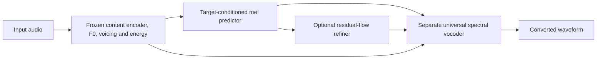
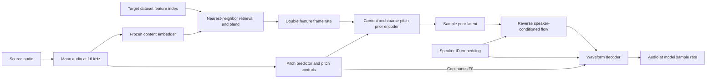
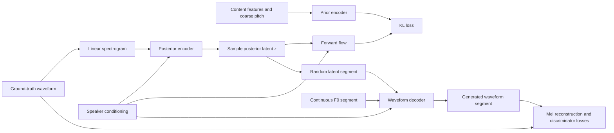
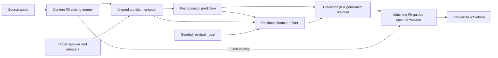
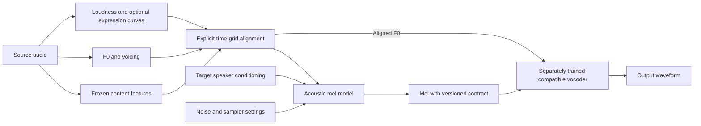

# Applio architecture, training and inference guide

This is the single repository guide for classic RVC and experimental Applio V3. It covers the implemented signal path, shared interface, training stages, package contracts, measured experiments and the public research that informed the design. Commands assume execution from the repository root with Python 3.12.

The research snapshot and initial experiments are dated 5 October 2026. The larger VCTK campaign was running when this guide was consolidated; its protocol is documented separately from completed measurements. Experimental source code is available, but usable production V3 base weights and improved perceptual quality have not been established.

## Contents

- [1. Architecture overview](#overview)
- [2. Code map and implementation reading order](#code-map)
- [3. V3 signal path and representation contracts](#v3-architecture)
- [4. Installation, shared interface and CLI workflow](#workflow)
- [5. Small VCTK experiment and quality limitations](#small-experiment)
- [6. Larger VCTK campaign](#large-experiment)
- [7. Implementation evidence and hardware measurements](#implementation)
- [8. Classic RVC training and inference architecture](#classic)
- [9. V3 design rationale and historical planning](#design)
- [10. Acoustic prototypes and development history](#prototype-research)
- [11. Experimental vocoder implementations and papers](#vocoder-research)
- [12. Related conversion, singing and synthesis systems](#related-systems)
- [13. Frontend, sampling and upstream components](#components)
- [14. Public source provenance and measurement records](#provenance)

<a id="overview"></a>

## 1. Architecture overview

| Responsibility | Classic RVC (v1/v2) | Experimental V3 |
|---|---|---|
| Acoustic representation | Content-conditioned latent representation | Explicit 128-band log-mel |
| Acoustic learning | Conditional variational generator and invertible latent flow | Deterministic predictor, residual flow matching and finite-step shortcuts |
| Waveform synthesis | Decoder trained with the voice generator | Independently trained universal F0-conditioned spectral vocoder |
| Target identity | Speaker conditioning within the generator | Acoustic speaker embedding/adaptation; no vocoder speaker table |
| Retrieval | Optional content-feature index | Not implemented in this V3 path |
| User interface | Existing Training and Inference tabs | Same tabs, architecture-specific settings and stages |
| Compatible weights | Existing v1/v2 packages | New acoustic and vocoder packages with matching contracts |

Classic latent flow and V3 flow matching serve different mathematical roles. The former transforms a learned latent distribution invertibly; the latter learns a time-dependent velocity for acoustic synthesis. A checkpoint cannot switch between them by changing a filename or version label.

V3 splits the problem at a measurable acoustic boundary: source content and pitch plus target conditioning produce mel, then mel and pitch produce PCM. The reference-mel vocoder render isolates waveform-synthesis errors. This separation improves diagnosis and permits acoustic-only target adaptation, but it does not guarantee better quality.

<a id="code-map"></a>

## 2. Code map and implementation reading order

Source modules are organized by responsibility rather than versioned filenames. Neural contracts live in `rvc/configs/neural.py`, algorithms in `rvc/lib/algorithm/acoustic`, training in `rvc/train/acoustic`, and shared preparation/export/evaluation utilities in their existing folders. Gradio adapters use `architecture.py`. Architecture IDs and checkpoint headers retain V3 compatibility.

Start with the contracts, then follow one recording through preparation, staged learning and conversion. The core files contain shape, objective and state-lifetime docstrings beside their implementations.

| Read in order | File | What to follow |
|---|---|---|
| 1 | [`rvc/configs/neural.py`](../rvc/configs/neural.py) | Physical mel semantics, frontend identity, network configuration and compatibility |
| 2 | [`rvc/train/extract/features.py`](../rvc/train/extract/features.py) | Frozen content/pitch extraction and physical observation alignment |
| 3 | [`rvc/train/acoustic/data.py`](../rvc/train/acoustic/data.py) | Recording split, immutable cache, frame crops and masks |
| 4 | [`rvc/lib/algorithm/acoustic/model.py`](../rvc/lib/algorithm/acoustic/model.py) | `condition_input`, `predict`, `flow_loss`, `sample` and EMA |
| 5 | [`rvc/lib/algorithm/acoustic/vocoder.py`](../rvc/lib/algorithm/acoustic/vocoder.py) | Harmonic prior, learned substreams, complex spectra and training critics |
| 6 | [`rvc/lib/algorithm/acoustic/spectral.py`](../rvc/lib/algorithm/acoustic/spectral.py) | Acoustic mel transform versus invertible vocoder substream transform |
| 7 | [`rvc/train/acoustic/trainer.py`](../rvc/train/acoustic/trainer.py) | Stage ownership, statistics, optimizer updates, validation and stopping |
| 8 | [`rvc/train/process/checkpoints.py`](../rvc/train/process/checkpoints.py) | Exact resume versus EMA export and adapter merge |
| 9 | [`rvc/infer/acoustic.py`](../rvc/infer/acoustic.py) | Package checks, source controls and file/live conversion |
| 10 | [`rvc/realtime/streaming.py`](../rvc/realtime/streaming.py) | Per-step history, oscillator phase, absolute noise and synthesis halos |
| 11 | [`rvc/configs/architectures.py`](../rvc/configs/architectures.py) | Metadata discovery and classic/V3 routing |
| 12 | [`core.py`](../core.py), [`tabs/train/architecture.py`](../tabs/train/architecture.py), [`tabs/inference/architecture.py`](../tabs/inference/architecture.py) | CLI services and architecture-specific controls inside the existing UI |

### Tensor and objective conventions

`B` denotes batch size, `T` mel-frame count, `C` content width and `M` mel bands. Cached content is `[T,C]`; batched content is `[B,T,C]`. Acoustic convolutions and mel use `[B,channels,T]`, controls use `[B,T]`, and masks use `[B,1,T]`. The waveform has `T * hop_length` padded samples; the final conversion trims to the original recording length.

The conditioning path projects content, six scalar controls and target speaker identity into a common width. The controls encode relative log-F0, voicing, confidence, confidence validity, energy and a voiced pitch-derived channel. Continuous/observed pitch measurements are retained by the frontend; not every cached observation is a separate acoustic input channel.

Let `y` be normalized reference mel and `p` the predictor output. Predictor training minimizes masked `|p-y|` plus 0.05 times the adjacent-frame difference error. For prediction-centered flow, residual target `r=(y-stop_gradient(p))/s`, where `s` is the fixed per-band residual RMS. Sample Gaussian noise `e`, choose `t`, interpolate `z=(1-t)e+t*r`, and learn velocity `r-e`. Conditioning and predictor branches are frozen during flow and shortcut training.

Shortcut examples use a finite interval `d`: two detached EMA half-steps produce a composed endpoint, and the student learns their mean velocity over the full interval. Ordinary-flow examples remain as anchors. Inference applies Euler updates `z <- z + d*v(z,t,d,condition,p)` and returns `denormalize(p+s*z)`. The direct-mel ablation learns normalized mel instead of the centered residual. Budget zero returns the predictor without a residual sample.

Vocoder learning is independent. Reference log-mel, F0 and voicing produce PCM through harmonic/noise excitation, learned analysis filters, complex-spectral blocks, overlap-add and learned synthesis filters. Waveform-periodic and spectral critics supervise training; mel, multiresolution spectral, adversarial and feature-matching objectives shape the generator. Export contains the generator, not the critics.

### Maintenance boundaries

Keep shape/compatibility checks in the contracts and services, learning objectives in the algorithm/trainer, and widget routing in the UI helpers. Cache identity changes when feature semantics change. New stages initialize from EMA; exact continuation restores the full live training state. Adapter export merges pointwise low-rank updates, avoiding extra inference branches.

Streaming is a stateful execution of the same bounded architecture. Acoustic history belongs to each integration evaluation independently. Vocoder noise is indexed by absolute sample position, oscillator phase is retained, and filter/overlap halos delay only unfinalized output. A new recording resets all state. Offline and bounded frontend profiles remain different package contracts.

Research sections below describe pinned upstream snapshots. Their source-level failures and proposed follow-ups are historical observations, not assertions that the same issues occur in the implemented V3 backend.


<a id="v3-architecture"></a>

## 3. V3 signal path and representation contracts

<a id="v3-architecture-signal-path"></a>

### Signal path



The acoustic model uses aligned 768-channel ContentVec-compatible features, continuous and observed F0, voicing, extractor confidence and log energy. Learned speaker embeddings identify the target voice. Causal gated convolutional blocks predict a 128-channel mel representation. Mel statistics and residual scales are fitted on the training split and remain fixed during inference and adaptation.

<a id="v3-architecture-training-stages"></a>

### Training stages

1. **Predictor:** learn deterministic acoustic structure from the target mel representation.
2. **Vocoder:** train independently from reference mel, F0 and voicing using mel reconstruction, multiresolution spectral loss, adversarial loss and feature matching. Five periodic and three spectral critics supervise waveform synthesis.
3. **Flow:** freeze the predictor and conditioning path, then learn normalized residual flow around the detached prediction.
4. **Shortcut:** retain ordinary-flow anchors while teaching finite integration steps with detached EMA composition targets from two half-step teacher evaluations.
5. **Adaptation:** initialize a new target-speaker vocabulary and train low-rank adapters or the full acoustic model. The universal vocoder remains separate.

The selected default vocoder uses a Nyquist-limited harmonic/noise prior, four learned substreams, causal spectral blocks, native Torch FFT/overlap-add, and learned analysis/synthesis filters. It is an original experimental implementation informed by spectral-vocoder research; it does not load official Wavehax or BigVGAN checkpoints.

<a id="v3-architecture-data-and-packaging"></a>

### Data and packaging

The default acoustic contract is 44.1 kHz, hop 512, FFT 2048, 128 Slaney mel bands, natural logarithm with floor 1e-5, and declared same/reflect padding. The vocoder's substream transform is separate. Feature timestamps follow encoder and pitch observation times; arbitrary tensor-length stretching is not used for alignment.

The local encoder files, layer, pitch implementation/checkpoint, frontend profile, mel semantics and speaker vocabulary are recorded in checkpoint metadata. Acoustic and vocoder packages must have matching mel contracts. Classic v1/v2 packages use their existing inference path and cannot be converted into v3 by renaming files.

Dataset preparation splits whole recordings before segmentation and checks duplicate source hashes. Cached PCM and features have verified hashes. Continuation binds the dataset identity, settings, model/critic weights, optimizers, scaler, EMA and random states. EMA export merges adapters and removes training-only state. Exported packages support inference, not exact continuation.

<a id="v3-architecture-inference-and-streaming"></a>

### Inference and streaming

Budget 0 uses the predictor. Ordinary-flow weights support 8/16/32 refiner evaluations; the 1/2/4 budgets require shortcut training, and 1 remains experimental. Training capability flags are checked at runtime, but a flag does not establish convergence or listening quality.

The bounded frontend uses 250 ms packets, 200 ms feature lookahead and retained past context. Live conversion keeps per-block/per-integration-step acoustic caches, absolute-index noise, oscillator phase and overlap-add state. The vocoder retains a bounded history and five future mel frames, approximately 58 ms at the default hop. These buffers impose latency before compute, device and browser scheduling. Fast synthesis throughput should not be described as low end-to-end latency.

Offline and bounded feature profiles are different contracts. Offline packages are rejected by live inference. File, batch and live conversion share the same model/feature checks. Gradio microphone streaming, a WebSocket API and native audio-device transports are included; physical microphone routing requires separate hardware validation.

<a id="v3-architecture-research-context-and-remaining-work"></a>

### Research context and remaining work

Relevant primary sources include [ContentVec](https://arxiv.org/abs/2204.09224), [Shortcut Models](https://arxiv.org/abs/2410.12557), [Wavehax](https://arxiv.org/abs/2411.06807), and the [multistream/streaming vocoder study](https://arxiv.org/abs/2506.03554). These sources motivate mechanisms and comparisons; their results are not results for this implementation.

Current limitations include short reference training, limited speaker coverage, no matched classic-model comparison, no blinded listening or calibrated identity/intelligibility acceptance, and no universal singing-quality claim. Larger configurations, direct-mel and single-stream ablations, unfamiliar speakers, expressive singing, long-duration audio, microphone operation and multi-GPU throughput require their own evaluation.

### Pretrained vocoder feasibility

A local benchmark evaluated NVIDIA's [BigVGAN v2 44.1 kHz / 128-band / 512-hop checkpoint](https://huggingface.co/nvidia/bigvgan_v2_44khz_128band_512x), using model revision `95a9d1dcb12906c03edd938d77b9333d6ded7dfb` and [official implementation](https://github.com/NVIDIA/BigVGAN) commit `7d2b454564a6c7d014227f635b7423881f14bdac`. The model card declares MIT licensing; retain the upstream notices when integrating it. This candidate matches V3's FFT, Hann window, Slaney magnitude-mel, natural-log floor, sample rate and hop settings. On four matched held-out recordings, the upstream and native mel extractors produced identical tensors after the native frame padding was applied.

Both vocoders rendered the same reference mels and predictor outputs. The native baseline was saved at vocoder update 22,500; the acoustic model was the same trained predictor. Saved baseline audio reproduced the original error measurements before comparison. BigVGAN received no additional training.

| Input to vocoder | Native waveform mel L1 | Pretrained BigVGAN waveform mel L1 |
| --- | ---: | ---: |
| Reference mel | 0.19905 | 0.11759 |
| Predictor mel | 0.46638 | 0.43599 |

This small diagnostic suggests that a pretrained backend could remove the universal-vocoder training stage while retaining the current acoustic model. Lower spectral error does not establish perceptual preference, speaker similarity or singing quality. The native vocoder was still training, so this is an interim comparison rather than a convergence comparison.

The tested BigVGAN generator has 122,152,752 parameters. On CPU with two threads, synthesis took approximately 3.9 seconds per second of audio; timings exclude model loading, feature extraction and acoustic prediction. GPU throughput, memory and streaming latency were not measured. Upstream convolutions use future context, and the generator consumes mel without a separate F0 input. Pitch-conditioned acoustics remain in V3, but pitch-shift and singing behavior need dedicated evaluation. The current streaming implementation depends on the native vocoder's state and halo semantics, so an external backend requires its own buffering contract.

BigVGAN is available as an optional frozen file-inference backend. The package loader uses explicit `vocoder_backend` metadata; older native checkpoints retain their original behavior. The portable Torch graph reproduces the pinned upstream output exactly in a verified short-frame comparison. No custom CUDA compilation or additional dependency file is required. Upstream component notices are retained in `rvc/lib/algorithm/acoustic/bigvgan.LICENSE`.

```powershell
# Download and package the pinned official pretrained release.
python core.py import-vocoder --output-path logs/pretrained_bigvgan/bigvgan_vocoder.pth

# Alternatively, import an already downloaded official generator and config.
python core.py import-vocoder --checkpoint PATH_TO_GENERATOR.pt --config PATH_TO_CONFIG.json --output-path logs/pretrained_bigvgan/bigvgan_vocoder.pth
```

Select the imported package in the existing V3 vocoder dropdown for file inference or voice fine-tuning. Its mel contract must match the acoustic package. Fine-tuning reuses these frozen weights; imported BigVGAN packages cannot initialize native spectral-vocoder training. Live conversion rejects this noncausal backend explicitly. GPU memory, latency across hardware, unfamiliar voices, pitch changes and singing need broader evaluation before changing defaults. The [official Wavehax repository](https://github.com/chomeyama/wavehax) currently describes pretrained releases as planned. The official [Vocos 24 kHz configuration](https://huggingface.co/charactr/vocos-mel-24khz/blob/main/config.yaml) uses a different audio contract and is less direct for the existing 44.1 kHz acoustic model.

The larger local experiment now retains its 30,000-update predictor and 25,000-update native vocoder checkpoint, uses frozen BigVGAN for rendering, and trains only the remaining acoustic flow and shortcut stages. The initial GPU evaluation covered eight diverse and four matched held-out segments. Predictor plus BigVGAN achieved a mean synthesis RTF around 0.09, excluding feature extraction and file I/O; this is throughput rather than streaming latency. Original recordings and cached features were reused unchanged.


<a id="workflow"></a>

## 4. Installation, shared interface and CLI workflow

Start Applio with `python app.py`. In **Training → Model Settings**, select **RVC (v2)** or **Applio v3 (experimental)**. Both use the familiar **Preprocess → Extract → Training → Export** workflow. The sections stay visible; their settings and training units follow the selected architecture. V3 Preprocess saves audio only, without loading feature models. Extract builds the content/pitch/mel caches from that audio.

In **Inference**, select your model in the existing **Voice Model** dropdown. Applio detects its architecture from checkpoint metadata and displays the appropriate controls inside **Advanced Settings**. V3 exposes a separate universal vocoder, matching encoder, refinement budget and sampling settings. Classic inference retains v1/v2 support, retrieval indexes and existing effects. Audio selection, pitch, target speaker, conversion buttons and output remain shared.

The Click interface is `python core.py`. Its existing `preprocess`, `extract`, `train`, `infer` and `batch-infer` commands expose architecture selection. Inference defaults to `--architecture auto`, inspecting the checkpoint. Training/preparation default to classic. `--pth-path` and `--model-path` are aliases. Use `--help` on each command for all options. Classic callback signatures remain unchanged.

<a id="workflow-repository-layout"></a>

### Repository layout

| Responsibility | Location |
|---|---|
| Architecture inspection/routing and model discovery | `rvc/configs/architectures.py` |
| Typed contracts and shared default architecture | `rvc/configs/neural.py` |
| Acoustic predictor, residual flow, shortcuts, adapters | `rvc/lib/algorithm/v3/` |
| Spectral vocoder, transforms and losses | `rvc/lib/algorithm/v3/` |
| Content/F0/energy extraction | `rvc/train/extract/features.py` |
| Recording-disjoint datasets and staged training | `rvc/train/v3/` |
| Checkpoints, EMA export and held-out evaluation | `rvc/train/process/checkpoints.py`, `evaluation.py` |
| File/batch inference and live conversion | `rvc/infer/acoustic.py` |
| Streaming and audio transports | `rvc/realtime/streaming.py`, `transport.py` |
| Gradio controls | `tabs/train/architecture.py`, `tabs/inference/architecture.py` |
| Gradio microphone controls and session routing | `tabs/realtime/realtime.py` |
| Learning experiment and engineering verification | `rvc/lib/tools/corpus_experiment.py`, `verify_architecture.py` |

Artifacts use the existing `logs/<model-name>` convention: `data/manifest.json`, `checkpoints/<stage>/last.pt`, `best.pt`, `metrics.jsonl`, exported acoustic/vocoder `.pth` packages, and `evaluation/` WAV/CSV/JSON results. Binary weights, audio and datasets remain ignored by Git.

### TensorBoard monitoring

Every training run writes TensorBoard events automatically. Classic training uses `logs/<model-name>/eval/`. V3 predictor, vocoder, flow, shortcut and adaptation stages use `logs/<model-name>/checkpoints/<stage>/tensorboard/`, alongside their checkpoints and JSONL metrics. CLI, Gradio and direct trainer calls share the same V3 logging path; no separate metrics-conversion process is needed for new runs.

Launch the shared viewer with `python core.py tensorboard`, the existing TensorBoard button, or the platform's TensorBoard launch script. Select a single training run in the Gradio TensorBoard tab. The focused curve view shows the main loss and validation charts; All diagnostics exposes the remaining metrics. Inspect `train/loss` and `validation/mel_l1` for V3, or the existing `loss/g/*` and `loss/d/*` summaries for classic training. V3 also logs learning rate, AMP scale, gradient norms before clipping and optimizer-update flags; vocoder runs include discriminator loss and critic-update information. Training losses differ between stages and should not be compared as the same objective.

Only rank zero writes summaries. V3 flushes at validation/checkpoint updates and graceful stopping, and closes the writer on completion, failure or generator cancellation. Exact resume retains checkpoint step numbering and purges abandoned future events after the restored step. Classic training flushes epoch summaries and closes the writer before its final process exit. Launching TensorBoard is separate from generating its event logs.

<a id="workflow-prepare-vctk"></a>

### Prepare VCTK

For the reference learning experiment, the provided VCTK directory contained 44,242 supported WAV recordings at 48 kHz. VCTK is not bundled with this repository; please obtain a permitted copy separately. Preparation reads the sources without modifying them, resamples to the fixed 44.1 kHz v3 contract, chooses recording-disjoint validation before segmentation, and hashes feature/audio caches. The one `.raw` file is excluded.

```powershell
python core.py preprocess --architecture v3 --model-name vctk_v3 --dataset-path DATASET_DIRECTORY --speaker p225 --speaker p226 --speaker p227 --speaker p228 --recordings-per-speaker 48
python core.py extract --architecture v3 --model-name vctk_v3 --device cuda
```

Omit speaker/cap options to prepare all supported recordings. Selection is deterministic under `--seed`; `--validation-fraction` defaults to 0.1 and `--segment-seconds` to 4. Preprocess runs on CPU and writes `data/audio_manifest.json` and resampled audio. Extract reads those saved segments, verifies their hashes and writes the train-ready `data/manifest.json`. Frontend settings such as `--encoder-path`, `--pitch-extractor`, `--profile` and `--device` belong to Extract. Matching feature caches are reused; changing the frontend does not require resampling again. Preparation output must stay outside the original dataset tree. Existing combined-preparation datasets and checkpoints remain supported; the internal `run_acoustic_prepare_script` service supports combined preparation when needed.

The content encoder is local, pinned to official Applio resource revision `70ed563897504c756ec94067c12c902c4fd42025`. Default directory: `rvc/models/embedders/contentvec`. `core.py download-encoder` downloads the pinned configuration/weights without executing remote Python. Swift F0 is the default; RMVPE requires `--pitch-extractor rmvpe --pitch-path PATH`. `--profile bounded` matches the live frontend; `offline` is a separate contract and cannot be used for live streaming.

<a id="workflow-train-resume-and-export"></a>

### Train, resume and export

V3 needs compatible acoustic and universal-vocoder weights. Classic RVC generators cannot initialize it. For scratch training, predictor and vocoder are required; ordinary flow and shortcut are optional refinement stages. The following budgets are short learning tests, not convergence recipes:

```powershell
# One action trains the required parts and exports both packages.
python core.py train --architecture v3 --model-name vctk_v3 --device cuda

# Advanced: individual stages and optional refinement.
python core.py train --architecture v3 --model-name vctk_v3 --stage predictor --steps 1000 --device cuda
python core.py train --architecture v3 --model-name vctk_v3 --stage vocoder --steps 2000 --device cuda
python core.py train --architecture v3 --model-name vctk_v3 --stage flow --base-model logs/vctk_v3/checkpoints/predictor/best.pt --steps 500 --device cuda
python core.py train --architecture v3 --model-name vctk_v3 --stage shortcut --base-model logs/vctk_v3/checkpoints/flow/best.pt --steps 500 --device cuda
python core.py export-model --checkpoint logs/vctk_v3/checkpoints/shortcut/best.pt --output-path logs/vctk_v3/vctk_v3_acoustic.pth
python core.py export-model --checkpoint logs/vctk_v3/checkpoints/vocoder/best.pt --output-path logs/vctk_v3/vctk_v3_vocoder.pth
```

In **Model Settings**, choose **Fine-tune a pretrained model (LoRA)** for a new voice. Select an exported pretrained acoustic model and compatible universal vocoder, then preprocess your recordings, extract features and click **Start Training**. Preprocessing adopts the base model's mel settings; extraction adopts its full frontend contract and checks the encoder identity. Fine-tuning trains LoRA adapters and the new speaker embedding, reuses the frozen universal vocoder, resumes its own saved progress and exports a standalone acoustic package with merged adapters. Predictor-only bases are supported; flow/shortcut adapters are trained only when those capabilities exist in the base. The vocoder is referenced rather than copied or overwritten. No pretrained package is selected automatically: wait for a usable pretrained export or supply compatible weights.

Choose **Train from scratch** to train the predictor and vocoder automatically and export both packages. **Advanced stage training** exposes optional refiners and individual stages. The shared starting recipe uses 10,000 updates, batch size 2, checkpoint interval 1,000, automatic device/precision and LoRA rank 8. These are starting values, not established quality optima. Increase the duration for longer runs, or batch size when memory permits. Fine-tuning and complete scratch training use the duration as a target and resume saved progress. Use a new model name for each voice/dataset. **Live training progress** follows GUI, CLI and background jobs without starting another job.

V3 uses one default architecture across hardware: the acoustic model has conditioning/predictor/refiner widths 256/256/384 and predictor/refiner depths 6/8; the vocoder uses 64 channels, 8 blocks and 4 streams. These defaults are defined in `rvc/configs/neural.py`. Existing checkpoints supply their saved architecture when loading base weights or resuming.

GUI and CLI training defaults are batch 2, crop 128, automatic precision, AdamW at 0.0002, EMA 0.999, checkpoint interval 1,000, and seed 1234. Automatic precision uses BF16 on supported CUDA GPUs, FP16 with gradient scaling on other CUDA GPUs, and FP32 on CPU. Explicit BF16/FP16/FP32 remain available in advanced settings. Classic CLI batch remains 8. There is no learning-rate scheduler.

Increase batch size when memory permits; reduce it if training runs out of memory. Gradient accumulation increases effective batch without retaining every activation graph: effective batch is batch size × accumulation steps × training ranks. This controls training memory without selecting a different network for each GPU. Changing batch or accumulation starts a new training recipe and is incompatible with exact resume. Advanced CLI users can pass `--config PATH` for architecture research when training from scratch; the regular GUI uses the shared defaults.

Use `--resume PATH` for exact continuation with unchanged dataset/phase/batch/crop/precision/learning rate/seed. `--steps N` means N **additional** updates. Resume restores optimizer, critics, scaler, EMA and per-rank RNG. `--base-model PATH` starts a new stage or adaptation from EMA weights; it differs from exact resume. Choose one of these options. GUI Stop saves `last.pt` after the current complete update. Export merges adapters and writes inference-only EMA packages; these cannot exactly resume training.

For a new target, prepare its recordings under a separate model name with the same encoder/pitch/frontend contract. Train `--stage adapt --base-model BASE --adaptation lora` (default rank 8) or `--adaptation full`. Adaptation uses a new speaker vocabulary and keeps the vocoder separate. Multi-process training uses `torchrun ... core.py train --architecture v3 ...`, with NCCL where available and Gloo fallback.

<a id="workflow-infer-and-evaluate"></a>

### Infer and evaluate

```powershell
python core.py infer --architecture v3 --input-path INPUT.wav --output-path OUTPUT.wav --pth-path logs/vctk_v3/vctk_v3_acoustic.pth --vocoder-path logs/vctk_v3/vctk_v3_vocoder.pth --sid 0 --refinement-steps 0 --device cuda
python core.py batch-infer --architecture v3 --input-folder INPUT_DIR --output-folder OUTPUT_DIR --pth-path logs/vctk_v3/vctk_v3_acoustic.pth --vocoder-path logs/vctk_v3/vctk_v3_vocoder.pth --refinement-steps 0 --device cuda
python core.py evaluate --manifest logs/vctk_v3/data/manifest.json --pth-path logs/vctk_v3/vctk_v3_acoustic.pth --vocoder-path logs/vctk_v3/vctk_v3_vocoder.pth --output-dir logs/vctk_v3/evaluation --budget 0 --budget 2 --budget 4 --budget 8 --budget 16 --limit 8 --device cuda
```

Speaker IDs follow the manifest/package speaker list. `core.py model-information --pth-path PATH` reports the mapping/contracts. Budget 0 uses the predictor; 8/16/32 work with ordinary-flow trained weights; 1/2/4 require shortcut training (1 is experimental). `--ordinary-flow` selects the ordinary reference sampler. Noise is seeded and pitch shift is in semitones. V3 does not consume classic retrieval indexes or classic post-processing options. Batch output must be outside the input tree.

Held-out evaluation renders references, ground-truth-mel vocoder ceiling, and each selected budget. Metrics include mel L1, waveform mel L1, multiresolution spectral loss and synthesis RTF. These are reconstruction measurements; they do not establish cross-speaker identity, intelligibility, MOS, or preference over classic RVC. Timings exclude the cached frontend/condition encoder and file I/O.

For the reproducible learning campaign used locally, prepare a fresh model name and run `core.py test-vctk --model-name NAME`. It creates initial one-update baselines, performs all four stages, exports packages, evaluates held-out budgets and renders same/cross-speaker conversions with the real frontend. Existing stage checkpoints are rejected to preserve their contents.

#### Full-corpus acoustic campaign

`train-full-vctk.bat` is a local one-click launcher for all speakers and recordings under `assets/datasets/vctk`. It calls the shared `core.py train-corpus` command, which runs **Preprocess → Extract → Predictor → Flow → Shortcut**, exports each acoustic stage and renders held-out listening samples. The pretrained BigVGAN remains frozen; no vocoder training is scheduled. The launcher references the earlier local acoustic export for architecture and frontend compatibility only: full-corpus acoustic weights start from scratch with the new speaker vocabulary. Replace its model paths when using a different installation.

The recipe uses 60,000 predictor updates, 15,000 flow updates and 15,000 shortcut updates, batch size 2, automatic precision and checkpoints every 1,000 updates. These are experiment budgets, not a quality guarantee or convergence criterion. Edit the variables at the top of the batch file before the first run; increase batch size if memory permits. There are no GPU-specific recipes. Expresso remains a separate expressive-speech study rather than changing this full-VCTK comparison.

Whole recordings are split before segmentation. Prior validation recordings are reserved when the architecture reference's project contains a dataset manifest. Only derived audio exceeding full scale after resampling is scaled; source recordings stay unchanged. A saved campaign plan binds dataset inventory, architecture, frontend settings, frozen-vocoder hash and training settings. A changed plan requires a new model name; another running worker cannot claim the same campaign.

The terminal shows progress and mirrors output to `logs/<model>/console.log`; `campaign_status.json` records the latest phase. Every training stage writes TensorBoard curves automatically, and stage evaluations add listening audio. Use the existing training monitor or `run-tensorboard.bat` to open the run's dashboard. Archived experiments under `logs/_archive` are omitted from model and TensorBoard selectors.

V3 CLI and campaign output follow the classic console style: one updating progress bar per operation, short completion messages and training summaries at validation checkpoints. Training bars count optimizer updates rather than epochs. Terminal bars show speed and ETA without saving carriage-return frames into the campaign console log. Detailed optimizer metrics remain in `metrics.jsonl` and TensorBoard. Add `--json-logs` to the standalone `preprocess`, `extract` or `train` command when consuming machine-readable progress.

Press Ctrl+C once or create `logs/<model>/STOP` to request a graceful stop. Run the same launcher with unchanged settings to verify/reuse prepared caches and resume the last checkpoint towards each stage's **total** update target. Completed stage budgets are not added again. During initialization or evaluation, stopping waits for the current operation. Windows sleep is inhibited only while the worker is running and restored when it exits. Preflight checks include inputs, device, mel compatibility and a conservative disk-space estimate. To validate a setup without preprocessing or training, run `train-full-vctk.bat --check-only`.

Acoustic training loads cached features without decoding or transferring waveform audio. Vocoder training and listening evaluations still load waveforms, and both paths verify cache hashes. Content alignment shares interpolation indices across encoder channels while retaining the float32 feature convention. Preparation reuses each computed file hash within an operation; speaker splitting groups recordings once while preserving its deterministic order and seed. Console progress and TensorBoard receive every update, while the campaign status snapshot refreshes at most twice per second between checkpoint and completion events. These optimizations preserve model dimensions, split identities and checkpoint settings; overall throughput still depends on encoder inference, storage and GPU compute.


The existing Gradio **Realtime → Model Settings** tab detects V3 voice models and exposes the matching vocoder and microphone controls inside **Advanced Settings**. Select the target speaker and pitch, accept the terms, and record the microphone to hear converted audio through the browser. Stop recording before changing settings. Each recording owns its resampler and model stream; stopping flushes its tail and releases the session. Browser capture/playback adds buffering and is not a measured low-latency device route. `serve-v3` exposes the WebSocket transport API without a separate UI; `realtime-v3` uses selected native audio devices. Both CLI commands take model/vocoder/encoder paths. Physical microphone operation is a separate hardware test. `verify-architecture` runs a synthetic engineering fixture; its results must be distinguished from real VCTK learning measurements.

<a id="workflow-installation-and-runtime-checks"></a>

### Installation and runtime checks

Use Python 3.12 and follow the standard Applio installation instructions first. Classic RVC and V3 share one dependency file: `python -m pip install -r requirements.txt`. It includes the V3 transport dependencies and pins Gradio 6.20.0; a separate V3 or Gradio installation is unnecessary. Choose the Torch 2.11.0 build for your device before installing the requirements. The reference GPU checks used CUDA 12.8; CPU mode is also supported. Backend/control tests additionally used Gradio 6.29.1, but that version is not the release installation target. The shared default architecture was exercised on an 8 GB GPU. Memory usage depends on batch, crop length and training stage; custom research architectures require separate profiling.

To inspect available runtime commands, use `python core.py --help`. Preparation, evaluation and hardware-verification tools remain available through the CLI. Physical microphone operation and perceptual acceptance need separate device and listening checks.

The code follows the repository's MIT license. Encoder weights, external model weights and training datasets retain their own terms. The experiment does not bundle VCTK, compatible pretrained base weights, exported checkpoints or generated audio. Please consult the source terms before redistributing those assets.


<a id="small-experiment"></a>

## 5. Small VCTK experiment and quality limitations

The integrated architecture completed actual VCTK training and inference on the RTX 3060 Ti (8 GB). The source dataset was preserved. This was a short learning experiment, not a production base-model release or a comparison against classic RVC.

192 recordings from p225/p226/p227/p228 were selected deterministically, 48 per speaker. Whole-recording split: 172 training and 20 validation recordings. Resampling/segmentation produced 276 cached segments, 12.74 minutes of audio. Final comparisons use eight held-out segments, two per speaker, with recorded source filenames and segment offsets. Byte-identical recordings cannot cross the split. Dataset identity: `2728ee258ea87fb20fcf8c424ac65a5c77a6a7304eb329b946060a3a699e4da3`.

The full default acoustic/vocoder configurations were used at batch 2/crop 128/BF16: predictor 1,000 updates, vocoder 2,000, ordinary flow 500, shortcut 500. One-update predictor/vocoder copies form the baseline. Training, first evaluation, EMA export and real-frontend conversions took 522.6 seconds; preparation and the subsequent balanced reevaluation are outside that duration. Constant AdamW learning rate: 0.0002; EMA: 0.999. All 4,000 scheduled optimizer updates completed with finite losses.

| Held-out measurement (lower is better) | Initial predictor + vocoder | Trained predictor (budget 0) | Trained refiner (budget 4) |
|---|---:|---:|---:|
| Acoustic mel L1 | 1.8300 | 1.1620 | 1.4026 |
| Rendered waveform mel L1 | 3.1634 | 1.8683 | 1.9573 |
| Multiresolution spectral loss | 4.1160 | 2.1673 | 2.2305 |

Rendered waveform mel error improved by approximately 40.9% against the one-update baseline. Refinement at 2/4/8/16 evaluations did not beat the predictor in this short experiment. **Use budget 0 for these weights.** The GUI defaults to it. Capability flags establish which stages ran; they do not establish convergence or acceptable listening quality. The ground-truth-mel vocoder reconstruction error is still 1.9858, so vocoder training remains a substantial bottleneck. Prediction can smooth difficult spectral details, which explains why paired L1 can be lower than that reconstruction “ceiling”; this metric does not rank perceptual fidelity reliably.

There is no MOS result, blinded preference result, speaker-similarity result or superiority claim. Short speech-only training on four speakers is insufficient to establish universal singing quality or target identity. The files are experimental training artifacts. RTF in the JSON reports covers cached-condition synthesis, excluding frontend/encoder and file I/O, and should not be presented as live end-to-end latency.

A subsequent four-example diagnostic found an ASR disagreement ratio of 1.00 for both predictor synthesis and synthesis from the reference mel features. This compares automatically recognized words, not human transcripts. Together with the low raw output levels, it indicates that the improved reconstruction metrics do not establish intelligible speech. See the [larger campaign protocol](#large-experiment) for the diagnostic scope and the expanded vocoder experiment. These small-model weights should not be offered as usable base voices.

<a id="small-experiment-artifacts"></a>

### Artifacts

A fresh listening example uses the complete held-out `p225/p225_117.wav` recording with the real frontend and budget 0. `logs/vctk_v3/listening/` contains its resampled reference, reconstruction to p225, conversion to p226, and a concatenated comparison in that order with half-second gaps. The comparison applies per-clip gain only to match RMS playback levels (0.06, peak capped at 0.95); unmodified outputs remain alongside it. `report.json` records the source hash check, completed checkpoint steps, exact sample counts and gains. Both conversions have 259,869 finite samples at 44.1 kHz, matching the reference. The raw outputs are substantially quieter than the input; playback gain does not remedy modeling errors or establish target identity.

- `logs/vctk_v3/experiment_report.json`: aggregate evidence, waveform checks and interface checks.
- `logs/vctk_v3/checkpoints/{predictor,vocoder,flow,shortcut}/`: resumable checkpoints, best validation metadata and per-update logs.
- `logs/vctk_v3/vctk_v3_acoustic.pth`, `vctk_v3_vocoder.pth`: exported EMA packages.
- `logs/vctk_v3/evaluation/{initial,predictor,final}/`: balanced reference/ceiling/budget WAVs, `metrics.csv`, and per-segment reports.
- `logs/vctk_v3/evaluation/learning_curves.png`: loss curves and held-out budget comparison.
- `logs/vctk_v3/evaluation/comparison_reference_initial_predictor_refiner.wav`: reference → initial output → trained predictor → trained four-step refiner, separated by silence.
- `logs/vctk_v3/evaluation/conversion_to_p225.wav`, `conversion_to_p226.wav`: complete original held-out recording converted with the real encoder and four-step sampler.
- `logs/vctk_v3/evaluation/gui_env_conversion.wav`: budget-0 conversion through `core.py infer` in the full GUI environment.
- `logs/vctk_v3/evaluation/batch/`: two original held-out recordings converted through `core.py batch-infer` to p227, with directory structure retained.
- `logs/vctk_cli_smoke/checkpoints/predictor/last.pt`: update 1001 from exact CLI resume, saved separately so the reported experiment remains unchanged.
- `logs/vctk_v3/listening/reference_reconstruction_conversion_level_matched.wav`: reference, predictor reconstruction and cross-speaker conversion with matched playback levels.
- `logs/vctk_release_smoke/ui_service_checks.json`: real shared-UI preparation, single/batch conversion and graceful training-stop checks.
- `logs/vctk_v3/public_ui_checks.json`: integrated GUI construction and architecture-transition checks.

The reference checks exercised the full Gradio application, model metadata detection, architecture-dependent settings, and shared CLI services. Classic callback signatures and defaults are covered by routing tests. No trained classic inference model was available for a matched perceptual comparison.

Continue using the commands in [workflow.md](#workflow). Increase training coverage and budgets, then assess intelligibility, speaker identity and listening preference before choosing refiner budgets or publishing model weights.


<a id="large-experiment"></a>

## 6. Larger VCTK campaign

Status: running with frozen pretrained BigVGAN. The native vocoder campaign was stopped at its saved 25,000-update checkpoint. This document describes the protocol; it does not contain completed quality claims.

The campaign expands from four speakers and 192 recordings to 32 speakers and 6,144 deterministically selected recordings, up to 192 per speaker. It retains the 44.1 kHz mel and bounded frontend contracts. All validation recordings from the small baseline are reserved from training so that both models can be compared on identical audio.

Preparation produced 8,120 segments containing 6.17 hours of audio. The recording split contains 5,519 training and 625 validation recordings, including all 20 original baseline holdouts. Dataset identity: `170e6c84c6a0f57691f0a702f74d5b0b014d61c3cc48c661841c962455ef6ce1`. Reserved feature/waveform cache hashes are verified against the baseline artifacts before training.

The acoustic model uses condition/predictor widths of 384, refiner width 512, eight predictor blocks and twelve refiner blocks: approximately 30.9 million parameters. The vocoder uses 128 channels and twelve blocks, approximately 1.0 million parameters. The previous models had approximately 12.0 million and 0.29 million parameters. A two-update CUDA check exercised both larger configurations with finite losses and optimizer updates; the vocoder peaked at approximately 2.91 GiB of Torch allocations. These are memory/function checks, not training-quality results.

The original plan allocated 30,000 predictor, 60,000 native vocoder, 15,000 ordinary flow and 15,000 shortcut updates. The predictor completed; native vocoder training stopped at 25,000. The revised plan reuses the predictor and frozen BigVGAN and trains the two remaining acoustic stages. Training uses BF16, 128-frame crops, AdamW at 0.0002, and checkpoint/validation intervals of 2,500 updates. Acoustic batches contain eight examples. The stopped native vocoder used microbatches of two with two-step gradient accumulation. Saved checkpoints support exact continuation; the small experiment remains unchanged.

Eight recordings overshot full scale after rational resampling, despite their original samples being in range. A derived corpus scales those recordings only to a maximum original/resampled peak of 0.98. Other recordings are read through hard links. Original hashes are checked, and gain factors are recorded in `normalization_report.json`. The source dataset is preserved.

Evaluation renders 64 balanced segments across the 32 known speakers, plus 16 held-out segments shared with the baseline. Reports separate acoustic mel error, waveform mel error, spectral loss and ground-truth-mel vocoder reconstruction. Predictor, ordinary-flow and shortcut phases are evaluated separately, including refinement budgets 0/1/2/4/8/16 where supported. Full-recording conversions retain their raw levels; listening comparisons may apply explicitly recorded gain only.

Additional diagnostic evaluators use pinned local copies of [Whisper base English](https://huggingface.co/openai/whisper-base.en) and [WavLM speaker verification](https://huggingface.co/microsoft/wavlm-base-plus-sv). Recognizer disagreement with the reference transcription is an intelligibility proxy, not word error against human annotations. Speaker cosine scores and retrieval against held-out reference voices are domain-dependent diagnostics, not a calibrated identity verdict or listening score.

A preliminary four-example check of the small model produced an ASR disagreement ratio of 1.00 for both predicted-mel reconstruction and ground-truth-mel synthesis. The verifier identified all four original reference voices within that four-voice reference set, but none of the predictor outputs. This small diagnostic supports investigating the vocoder before attributing failures solely to acoustic prediction or refinement. It is not a population estimate or proof that additional training will resolve the issue. Evidence is in `logs/vctk_v3_large/diagnostic_profile/quality_metrics.json`.

Artifacts are stored under `logs/vctk_v3_large/`: `campaign_plan.json`, `campaign_status.json`, preparation/cache manifests, phase checkpoints, evaluation reports, exported packages, and listening audio. Logs, corpus copies, evaluator weights and trained packages are excluded from the source release.

This campaign changes data coverage, network capacity and training budget together. It can test whether the combined larger recipe improves the measured outputs; it cannot isolate the causal contribution of each change. Speech-only VCTK reconstruction and known-speaker conversion do not establish universal singing performance, unseen-target adaptation, or superiority over classic RVC.


<a id="implementation"></a>

## 7. Implementation evidence and hardware measurements

The selected experimental backend is implemented and functionally verified. Substantial universal-model training and perceptual acceptance remain a separate training and evaluation campaign. This status describes working software; it does not declare superior trained-model quality.

<a id="implementation-repository-integration-and-vctk-evidence"></a>

### Repository integration and VCTK evidence

The current integrated structure and Click/Gradio workflow are documented in [integrated workflow](#workflow). Code now lives in the existing algorithm, extraction, training, inference, realtime and configuration directories. The public entry points are `core.py` and `app.py`; the temporary standalone namespace has been removed. Training selects architecture inside Model Settings. Inference inspects the selected voice model and displays architecture-specific controls in Advanced Settings. The full application was launched and inspected in the browser.

The real VCTK learning test completed 4,000 successful updates on 192 recordings from four speakers, with whole-recording validation and balanced held-out renders. Waveform mel L1 improved from 3.1634 to 1.8683. The short-trained refiner did not beat the predictor. See [VCTK learning results](#small-experiment) for scope, artifacts, metrics and limitations.

<a id="implementation-verification-evidence"></a>

### Verification evidence

Historical implementation checks passed 57 backend/control cases before the test suite was removed from the source tree. Those checks are past evidence, not commands or automated CI shipped with this version. Static syntax/undefined-name checks and actual preparation, training, checkpointing and conversion remain available for maintenance.

Tests include transform boundary invertibility/gradients, rejection of unsupported Hann overlap, masks, teacher/predictor detachment, residual/direct acoustic stream equivalence at budgets 0/1/2/4/8, vocoder phase/noise/halo/flush equivalence, adapter merge, exact CPU checkpoint continuation, all training phases, full adaptation, cache corruption and split identity rejection, accumulation, CUDA BF16/FP16 GAN updates, graceful stopping, resampler equivalence across four rational-rate pairs, WebSocket construction, classic metadata routing, architecture visibility, shared UI callback routing, session-local stopping and actual two-process Gloo global-batch/update ownership.

The full-size CUDA smoke ran the actual pinned ContentVec frontend and all five optimizer stages on **RTX 3060 Ti (8 GB), Torch 2.11.0+cu128**, with batch 2, 128-frame crops and BF16. Each phase completed one synthetic-signal update, validation and resumable/export checkpoint work. It includes acoustic/vocoder parameters, optimizer state, EMA, critics and temporary activations in Torch allocator measurements; preparation's encoder was moved to CPU before training, matching the cached-feature training workflow.

| Stage | Peak Torch allocated GiB | Peak reserved GiB |
|---|---:|---:|
| Predictor | 0.155 | 0.164 |
| Ordinary flow | 0.244 | 0.277 |
| Shortcut | 0.244 | 0.277 |
| Acoustic LoRA adaptation | 0.166 | 0.178 |
| Vocoder with all critics | 1.241 | 1.311 |

Default model parameters: acoustics **12,033,280**, vocoder **294,212**, pinned content encoder **94,371,712**. These concrete sizes replace the earlier planning estimates. The compact vocoder's adequacy for universal singing reconstruction remains an empirical question.

The short 1.587-second synthetic conversion took 0.473 seconds (RTF 0.298) with the real frontend, four refinement evaluations and vocoder. This is a warm engineering smoke measurement, not a statistically controlled throughput benchmark. Conversion peak Torch allocation was approximately 0.457 GiB; reserved was 0.504 GiB. Torch allocator results do not include all driver/desktop/system allocations. No long-duration or perceptual claims follow from these numbers.

Irregular 1,777-sample input chunks produced exactly equal finalized frontend features and a maximum waveform difference of **1.49e-8** against the same bounded-profile file path. The default frontend has 250 ms packets, 200 ms lookahead and a rational-filter halo; synthesis withholds five mel frames (~58 ms). The conservative algorithmic ledger is roughly 0.52 s before compute, audio-device buffers and browser scheduling. Faster-than-real-time processing does not establish low interaction latency.

Raw evidence is preserved in [V3_HARDWARE_VERIFICATION.json](#hardware-record) and the local `logs/v3-verification-release/report.json`. Smoke model files are deliberately identified as untrained fixtures. No physical microphone was opened during verification.

<a id="implementation-remaining-research-and-product-acceptance"></a>

### Remaining research and product acceptance

Train substantial universal models, select budgets using rendered held-out audio, then evaluate unfamiliar source voices, singing extremes and target adaptation. Official BigVGAN/full-Wavehax and classic Applio quality baselines, blinded listening, identity/intelligibility/pitch metrics, predicted-mel vocoder training, pitch-consistency augmentation, retrieval and lower-latency tuning remain experimental follow-ups. Larger and single-stream research architectures need their own profiling. CUDA multiple-GPU throughput and physical browser/native device routing also need hardware/application validation.

The current software is ready for those training/evaluation runs. It is not yet a production-quality voice model or evidence of the proposed speed-to-quality gains.

#### Training-only pitch counterexamples

The optional preparation helper in `rvc/train/acoustic/augmentation.py` creates synthetic training views with F0 shifts of -12, -6, +6 and +12 semitones. WORLD estimates the source spectral envelope and aperiodicity, then resynthesizes with the changed F0. Content features stay from the original recording while the F0 controls and target mel change. This creates counterexamples to recovering source pitch from content instead of following the explicit control.

The helper writes a separate augmented manifest alongside the original cache, retains original recordings and features, and leaves recording-disjoint natural validation unchanged. Original and synthetic training populations have equal sampling weight. Transformation, synthesis version, seed and content hashes are recorded. WORLD is used only during this preparation; inference and adaptation use the selected universal vocoder, including frozen BigVGAN. Model architecture and existing package loading are unchanged. [PyWORLD documentation](https://github.com/JeremyCCHsu/Python-Wrapper-for-World-Vocoder) describes its analysis and synthesis components.

This remains a research intervention until held-out conversion demonstrates a useful pitch/identity tradeoff. Synthetic supervision can introduce synthesis artifacts, so compare it with ordinary continuation using the same optimizer budget and frozen vocoder. A tested linear content-subspace filter was rejected because it reduced unseen-source target retrieval without resolving downward octave shifts; it is not part of the supported architecture.

Prepare a separate research manifest with the shared CLI, then pass that manifest to the existing V3 predictor-training command:

```bash
python core.py prepare-pitch-views --manifest logs/example/data/manifest.json --output-manifest logs/example/data/pitch_views.json
```

This adds no required stage to ordinary voice fine-tuning and introduces no inference dependency on WORLD.


<a id="classic"></a>

## 8. Classic RVC training and inference architecture

Source review of commit `21392273e01da7e0169c18567d60c9b9d40282dc`, completed on 5 October 2026. The application configuration template identifies version 3.6.5. This reference describes that pinned baseline; external documentation is supplementary. The experimental v3 backend is covered separately in the architecture design and implementation reports.

The review traces the UI and CLI through preprocessing, feature extraction, dataset loading, neural components, optimization, export, retrieval, offline conversion, and both realtime transports. This is a static analysis of the classic backend, not a runtime quality or performance benchmark. Separate v3 functional measurements do not validate the classic model's audio quality.

<a id="classic-1-overall-design"></a>

### 1. Overall design

Applio implements retrieval-based voice conversion (RVC) with a VITS-style conditional variational generator and adversarial waveform training. Source audio provides content and pitch. A trained generator and a learned speaker-ID embedding supply the target voice. An optional nearest-neighbor index blends source content features with features extracted from the target training recordings.

Three representations must be distinguished:

| Representation | Meaning | Origin |
| --- | --- | --- |
| `phone` / `feats` | Time-varying speech content features, ordinarily 768 dimensions | Frozen HuBERT-compatible embedder |
| `pitch` and `pitchf` | Coarse pitch tokens and continuous F0 in Hz | Independent pitch predictor |
| `g` | Learned global speaker conditioning, ordinarily 256 dimensions | `emb_g(sid)` in the trained synthesizer |

Names such as `TextEncoder`, “phoneme,” and `_retrieve_speaker_embeddings` are inherited terminology. The current conversion engine does not run text recognition, consume a transcript, or retrieve the learned speaker-ID embedding. Retrieval operates on acoustic content vectors.



The conversion model learns from reconstructions of its own training recordings. It does not require paired source-speaker/target-speaker recordings. The frozen content representation allows the learned synthesizer to be driven by another voice at inference. Unlike a text-driven VITS system, this path needs no duration predictor or monotonic text/audio alignment search: the acoustic content and F0 already carry a time axis, which is aligned to spectrogram frames.

<a id="classic-2-entry-points-and-process-boundaries"></a>

### 2. Entry points and process boundaries

| Layer | Responsibility | Source |
| --- | --- | --- |
| Gradio application | Creates settings, tabs, and callbacks; initializes config and prerequisites | [app.py](https://github.com/IAHispano/Applio/blob/21392273e01da7e0169c18567d60c9b9d40282dc/app.py) |
| Training UI | Dataset, extraction, training, export controls | [tabs/train/train.py](https://github.com/IAHispano/Applio/blob/21392273e01da7e0169c18567d60c9b9d40282dc/tabs/train/train.py) |
| Offline inference UI | Model/index selection and conversion parameters | [tabs/inference/inference.py](https://github.com/IAHispano/Applio/blob/21392273e01da7e0169c18567d60c9b9d40282dc/tabs/inference/inference.py) |
| Shared orchestration / Click CLI | Converts UI/CLI parameters into backend calls or subprocess arguments | [core.py](https://github.com/IAHispano/Applio/blob/21392273e01da7e0169c18567d60c9b9d40282dc/core.py) |
| Offline engine | Caches model/embedder, handles files and effects | [infer.py](https://github.com/IAHispano/Applio/blob/21392273e01da7e0169c18567d60c9b9d40282dc/rvc/infer/infer.py) |
| Offline conversion pipeline | F0, segmentation, retrieval, feature alignment, synthesis | [pipeline.py](https://github.com/IAHispano/Applio/blob/21392273e01da7e0169c18567d60c9b9d40282dc/rvc/infer/pipeline.py) |
| Training backend | Distributed workers, optimizer loop, logging, saving | [train.py](https://github.com/IAHispano/Applio/blob/21392273e01da7e0169c18567d60c9b9d40282dc/rvc/train/train.py) |
| Shared neural implementation | Encoders, flow, generators, discriminators | [synthesizers.py](https://github.com/IAHispano/Applio/blob/21392273e01da7e0169c18567d60c9b9d40282dc/rvc/lib/algorithm/synthesizers.py) |

`core.run_preprocess_script`, `run_extract_script`, `run_train_script`, and `run_index_script` launch separate Python subprocesses using `sys.executable`. Experiment data lives under `logs/<model_name>`. Preprocessing and extraction are separate stages; `run_train_script` invokes index generation after its training subprocess returns successfully.

Offline single-file, batch, and TTS conversion reuse one cached `VoiceConverter` through `core.import_voice_converter`. Batch conversion iterates files serially; it is not a tensor-batched inference engine. TTS first invokes a separate speech-generation tool, then sends that resulting waveform through normal voice conversion.

Many backend paths depend on the process working directory being the repository root. Application startup copies `assets/config_template.json` to `assets/config.json` when needed. Direct CLI/backend execution does not necessarily perform every startup initialization.

<a id="classic-3-training-data-preparation"></a>

### 3. Training data preparation

<a id="classic-preprocessing"></a>

#### Preprocessing

[preprocess.py](https://github.com/IAHispano/Applio/blob/21392273e01da7e0169c18567d60c9b9d40282dc/rvc/train/preprocess/preprocess.py) scans WAV, MP3, FLAC, and OGG files. Files in the dataset root receive speaker ID 0; subdirectory basenames are parsed as integer speaker IDs. Output names are `<sid>_<source-file-number>_<segment-number>.wav`.

Each file is decoded with SoundFile, mixed to mono, and resampled to the selected training sample rate through a Torchaudio resampler. Optional effects include a fifth-order 48 Hz high-pass filter, normalization before or after slicing, and NoiseReduce denoising. Normalization mixes peak-normalized audio with the original amplitude; it is not a pure peak-normalization operation.

Three cutting modes exist:

- **Skip:** Save the full recording.
- **Simple:** Save only complete fixed-size chunks with configurable overlap. The remaining short tail is discarded.
- **Automatic:** Run the RMS silence slicer, then subdivide speech segments into approximately 3-second windows with 0.3-second overlap, preserving the final remainder.

The automatic slicer uses a -42 dB threshold, 1.5-second minimum segment length, 400 ms minimum silence interval, 15 ms analysis hop, and at most 500 ms retained silence. See [slicer.py](https://github.com/IAHispano/Applio/blob/21392273e01da7e0169c18567d60c9b9d40282dc/rvc/train/preprocess/slicer.py).

Preprocessing runs through a CPU process pool and saves float32 WAV files to `sliced_audios/`. It records original input duration in `model_info.json`. That duration is not the precise effective duration after slicing, overlap, and filtering.

<a id="classic-feature-and-f0-extraction"></a>

#### Feature and F0 extraction

[extract.py](https://github.com/IAHispano/Applio/blob/21392273e01da7e0169c18567d60c9b9d40282dc/rvc/train/extract/extract.py) resamples each saved training waveform to mono 16 kHz in memory for two independent frozen extraction jobs:

1. Pitch extraction creates continuous F0 and a quantized coarse version.
2. Content extraction runs `model(audio)["last_hidden_state"]` in evaluation mode with gradients disabled, saving float32 feature arrays.

The built-in content choices are ContentVec, Spin, Spin-v2, and Chinese/Japanese/Korean HuBERT variants. All are instantiated as `HubertModelWithFinalProj`, a Transformers `HubertModel` subclass with an added linear projection. Custom embedders are local compatible model directories; the loader does not provide generic support for arbitrary Transformers model architectures. See [utils.py](https://github.com/IAHispano/Applio/blob/21392273e01da7e0169c18567d60c9b9d40282dc/rvc/lib/utils.py#L130).

Extraction uses the final hidden state, rather than explicitly requesting an intermediate transformer layer. Current v2 extraction saves the full feature dimension. The extra `final_proj` is used by legacy v1 inference.

Pitch extraction supports RMVPE, CREPE full/tiny, and FCPE in the backend. The current training UI exposes RMVPE and CREPE full/tiny; FCPE is commented out in its choices. Swift is implemented for inference but is absent from the training extractor.

The time base is 10 ms for pitch: 16,000 samples/second divided by a 160-sample hop gives 100 frames/second. Standard supported content embedders provide approximately 50 frames/second; the dataset loader doubles those frames to align them to pitch and spectrograms.

Continuous F0 is stored under `f0_voiced/`, including zero for unvoiced frames. Coarse F0 is stored under `f0/`. Its conversion is:

```text
m(f) = 1127 * ln(1 + f / 700)
coarse(f) = round(clip(1 + 254 * (m(f) - m(50)) / (m(1100) - m(50)), 1, 255))
```

Thus coarse tokens use 1–255, with zero-Hz frames mapping to 1. Continuous F0 still retains the zero/nonzero distinction for the decoder and protection logic. High-register corrected F0 can exceed 1100 Hz while the coarse token remains clipped.

Extraction distributes files across one process per selected device, specified as GPU IDs separated by hyphens or `-` for CPU. Within an embedding process, a thread pool submits recordings to a shared embedder. Existing output files are skipped. Changing the embedder or F0 method requires deliberate regeneration of cached outputs.

<a id="classic-filelist-and-dataset-loading"></a>

#### Filelist and dataset loading

[preparing_files.py](https://github.com/IAHispano/Applio/blob/21392273e01da7e0169c18567d60c9b9d40282dc/rvc/train/extract/preparing_files.py) intersects the basenames available in all four output directories. It writes:

```text
waveform_path|content_feature_path|coarse_f0_path|continuous_f0_path|speaker_id
```

Only recordings with all required outputs appear in the filelist. Optional mute entries are appended per speaker, using separate mute features for Spin and Spin-v2. The default is two mute entries per speaker. The selected sample-rate config is copied to the experiment only if `config.json` does not already exist.

[data_utils.py](https://github.com/IAHispano/Applio/blob/21392273e01da7e0169c18567d60c9b9d40282dc/rvc/train/data_utils.py) loads these artifacts, repeats feature frames twice, caps content/pitch sequences at 900 frames, computes the waveform's linear magnitude STFT on demand, and truncates spectrogram, waveform, and labels to aligned lengths when needed. Waveforms are already float-valued; the loader does not divide them by the legacy `max_wav_value` config field.

The nominal maximum retained label sequence is 9 seconds. This does not mean every 9-second input is accepted: the sampler estimates lengths from WAV file byte size and groups recordings into boundaries from 50 to 900. Recordings outside its buckets are excluded. Simple/Skip preprocessing choices must therefore be understood together with this loader and sampler.

Collation sorts samples by spectrogram length, pads all tensor types, and supplies length masks. The distributed bucket sampler groups similar estimated lengths, repeats entries to fill complete global batches, and partitions them across ranks. UI batch size is per rank; nominal global batch size is `batch_size * number_of_GPUs`.

<a id="classic-4-generator-architecture-and-tensor-contracts"></a>

### 4. Generator architecture and tensor contracts

The shared [Synthesizer](https://github.com/IAHispano/Applio/blob/21392273e01da7e0169c18567d60c9b9d40282dc/rvc/lib/algorithm/synthesizers.py#L12) contains five principal modules:

| Module | Purpose | Default dimensions / structure |
| --- | --- | --- |
| `enc_p` / `TextEncoder` | Predict content-and-pitch conditional prior mean and log standard deviation | 768→192 content projection; 256-entry coarse-pitch table; 6 transformer blocks, 2 heads, 768 FFN channels |
| `enc_q` / `PosteriorEncoder` | Infer latent distribution from ground-truth linear spectrogram | Spectrogram→192; 16-layer gated WaveNet-like stack, speaker-conditioned |
| `flow` / `ResidualCouplingBlock` | Transform posterior latent into prior space; invert during synthesis | 4 mean-only coupling layers, each with a 3-layer WaveNet-like network, alternating channel flips |
| `emb_g` | Learn one global conditioning vector per speaker | `number_of_speakers × 256` |
| `dec` | Generate waveform from latent frames and continuous F0 | HiFi-GAN NSF, MRF HiFi-GAN, or RefineGAN |

Source: [encoders.py](https://github.com/IAHispano/Applio/blob/21392273e01da7e0169c18567d60c9b9d40282dc/rvc/lib/algorithm/encoders.py), [attentions.py](https://github.com/IAHispano/Applio/blob/21392273e01da7e0169c18567d60c9b9d40282dc/rvc/lib/algorithm/attentions.py), [modules.py](https://github.com/IAHispano/Applio/blob/21392273e01da7e0169c18567d60c9b9d40282dc/rvc/lib/algorithm/modules.py), [residuals.py](https://github.com/IAHispano/Applio/blob/21392273e01da7e0169c18567d60c9b9d40282dc/rvc/lib/algorithm/residuals.py).

The prior encoder adds content and coarse-pitch embeddings, scales by the square root of hidden width, applies LeakyReLU, runs masked self-attention/FFN blocks, and projects to 384 channels split into 192-channel mean and log-scale tensors. Relative-position embeddings use a window setting of 10; this does not itself restrict attention to ten frames. Padding is masked, but the default attention is not causal.

The posterior and coupling networks use gated tanh/sigmoid activations with residual/skip connections and speaker conditioning. Although the WaveNet class supports increasing dilations, these callers use dilation rate 1. Flow flips reverse the **channel axis**, despite the `Flip` docstring referring to time. Mean-only coupling performs an additive invertible transform with zero log determinant.

For a normal v2 training batch, the important shapes are:

```text
phone          [B, T, 768]
phone_lengths  [B]
pitch          [B, T]          integer tokens
pitchf         [B, T]          F0 in Hz
spec           [B, FFT/2+1, T]
spec_lengths   [B]
wave           [B, 1, N]
sid            [B]
g              [B, 256, 1]
latent         [B, 192, T]
generated      [B, 1, segment_samples] during normal training
```

<a id="classic-training-forward-path"></a>

#### Training forward path



The ground-truth spectrogram supplies `z = m_q + exp(logs_q) * noise`. The flow computes `z_p` for the KL objective. The waveform decoder consumes a random segment of **posterior latent `z`**, rather than a sample from the prior. The prior is trained through KL alignment so it can supply latents without a target spectrogram later.

<a id="classic-inference-path"></a>

#### Inference path

`Synthesizer.infer` computes the content/pitch prior and samples:

```text
z_p = (m_p + exp(logs_p) * epsilon * 0.66666) * mask
z   = flow(z_p, mask, speaker_condition, reverse=True)
audio = decoder(z * mask, continuous_f0, speaker_condition)
```

The posterior encoder and discriminator are unnecessary for audio conversion. Sampling makes conversion stochastic unless the random state is controlled. Vocoder excitation also contains randomness.

The optional `rate` argument crops the oldest portion of latent context before reversing the flow and decoding. Realtime uses it to avoid synthesizing all the historical context. Despite the inherited docstring, it is not a general time-stretch control.

<a id="classic-5-vocoders-and-sample-rate-configurations"></a>

### 5. Vocoders and sample-rate configurations

| Selected vocoder | Actual decoder behavior | Training loss / discriminator |
| --- | --- | --- |
| `HiFi-GAN` with F0 | Transposed-convolution upsampling; parallel residual kernels 3/7/11; F0-derived sine/noise source injected at each scale | Single-scale log-mel L1; discriminator v2 |
| `MRF HiFi-GAN` | Distinct MRF implementation with normalized convolution blocks and fundamental plus eight overtones | Single-scale log-mel L1; discriminator v2 |
| `RefineGAN` | Downsamples F0 excitation into multiscale features, fuses these with projected latent content and speaker conditioning, then upsamples with skip fusion and parallel residual blocks | Seven-scale log-mel L1; discriminator v3 |
| Legacy F0-disabled `HiFi-GAN` | Plain waveform decoder without explicit pitch excitation | Supported by inference; not selected by current training entry point |

Sources: [hifigan_nsf.py](https://github.com/IAHispano/Applio/blob/21392273e01da7e0169c18567d60c9b9d40282dc/rvc/lib/algorithm/generators/hifigan_nsf.py), [hifigan_mrf.py](https://github.com/IAHispano/Applio/blob/21392273e01da7e0169c18567d60c9b9d40282dc/rvc/lib/algorithm/generators/hifigan_mrf.py), [refinegan.py](https://github.com/IAHispano/Applio/blob/21392273e01da7e0169c18567d60c9b9d40282dc/rvc/lib/algorithm/generators/refinegan.py), [hifigan.py](https://github.com/IAHispano/Applio/blob/21392273e01da7e0169c18567d60c9b9d40282dc/rvc/lib/algorithm/generators/hifigan.py).

The UI label `HiFi-GAN` already selects the NSF variant for normal F0-guided models. It is not a separate pitchless default. RefineGAN's argument named `mel` actually receives the 192-channel synthesizer latent, not a mel spectrogram. Its class named `AdaIN` injects trainable-amplitude Gaussian noise followed by activation; it does not implement conventional adaptive instance normalization.

RefineGAN and MRF HiFi-GAN do not implement pitchless synthesis in this factory. MRF code exists in the backend, but the current UI choices expose only HiFi-GAN and RefineGAN. HiFi-GAN UI rates are 32/40/48 kHz; selecting RefineGAN changes the UI rates to 24/32 kHz. Compatibility with external clients depends on their decoder implementations.

All shipped configs use 192 latent/hidden channels, 768 FFN/content width, 256 global conditioning channels, and 10 ms spectrogram hops:

| Output sample rate | FFT / window | Hop | Mel bins | Upsampling factors | Training crop | Duration |
| --- | --- | --- | --- | --- | --- | --- |
| 24,000 | 1024 | 240 | 80 | 10×6×2×2 = 240 | 8640 samples / 36 frames | 0.36 s |
| 32,000 | 1024 | 320 | 80 | 10×8×2×2 = 320 | 12800 samples / 40 frames | 0.40 s |
| 40,000 | 2048 | 400 | 125 | 10×10×2×2 = 400 | 12800 samples / 32 frames | 0.32 s |
| 48,000 | 2048 | 480 | 128 | 12×10×2×2 = 480 | 17280 samples / 36 frames | 0.36 s |

Sources: [24000.json](https://github.com/IAHispano/Applio/blob/21392273e01da7e0169c18567d60c9b9d40282dc/rvc/configs/24000.json), [32000.json](https://github.com/IAHispano/Applio/blob/21392273e01da7e0169c18567d60c9b9d40282dc/rvc/configs/32000.json), [40000.json](https://github.com/IAHispano/Applio/blob/21392273e01da7e0169c18567d60c9b9d40282dc/rvc/configs/40000.json), [48000.json](https://github.com/IAHispano/Applio/blob/21392273e01da7e0169c18567d60c9b9d40282dc/rvc/configs/48000.json).

The product of vocoder upsampling factors equals the spectrogram hop. The fixed 16 kHz analysis audio and the variable waveform output rate are separate time bases with aligned 100 Hz synthesizer frames.

<a id="classic-6-optimization-distribution-and-monitoring"></a>

### 6. Optimization, distribution, and monitoring

[train.py](https://github.com/IAHispano/Applio/blob/21392273e01da7e0169c18567d60c9b9d40282dc/rvc/train/train.py#L278) spawns one worker per selected GPU. Windows uses Gloo; CUDA on other platforms uses NCCL. A process group is initialized even for a single worker. Models are wrapped with DDP only for multiple CUDA GPUs. CPU and MPS branches also exist in training, although normal shared inference configuration chooses CUDA or CPU.

The current trainer always constructs `Synthesizer(..., use_f0=True)`. New exported models default to v2. The generic model classes retain older configurations that the current trainer does not expose.

Default optimization settings are AdamW for both networks, learning rate `1e-4`, betas `(0.8, 0.99)`, epsilon `1e-9`, and exponential epoch decay `0.999875`. No explicit weight decay is supplied, so PyTorch's AdamW default applies. Experimental flags such as alternative BF16 optimizer, discriminator/generator learning-rate multipliers, whole-sequence training, and multiple discriminator steps are hardcoded in the training script rather than normal UI options.

Each training step:

1. Generate a waveform segment from the posterior latent and aligned continuous F0.
2. Update the discriminator on real audio and detached generated audio.
3. Freeze discriminator parameters, recompute its generated outputs and feature maps, and update the generator.
4. Re-enable discriminator gradients and record losses/gradient norms.

The discriminator uses one waveform discriminator plus periodic discriminators. Version v2 periods are `2,3,5,7,11,17,23,37`. RefineGAN chooses v3: periods `2,3,5,7,11` plus STFT-resolution discriminators `(1024,120,600)`, `(2048,240,1200)`, and `(512,50,240)`. See [discriminators.py](https://github.com/IAHispano/Applio/blob/21392273e01da7e0169c18567d60c9b9d40282dc/rvc/lib/algorithm/discriminators.py#L10).

The generator objective is:

```text
L_G = L_adversarial + L_feature_matching + c_mel * L_mel + c_kl * L_KL
```

Least-squares GAN losses drive real predictions toward 1 and fake predictions toward 0 for the discriminator, and generated predictions toward 1 for the generator. Feature matching is twice the sum of mean absolute differences between real/generated discriminator feature maps. Defaults are `c_mel = 45`, `c_kl = 1`. RefineGAN uses the sum of seven log10-mel L1 losses, multiplied by `45 / 3`; its FFT windows are 32 through 2048, paired with 5 through 320 mel bins.

The KL expression uses prior and posterior **log standard deviations**, although some inherited docstrings call them log variances:

```text
KL = sum(mask * [logs_p - logs_q - 0.5
                 + 0.5 * (z_p - m_p)^2 * exp(-2 * logs_p)]) / sum(mask)
```

Sources: [losses.py](https://github.com/IAHispano/Applio/blob/21392273e01da7e0169c18567d60c9b9d40282dc/rvc/train/losses.py), [mel_processing.py](https://github.com/IAHispano/Applio/blob/21392273e01da7e0169c18567d60c9b9d40282dc/rvc/train/mel_processing.py).

CUDA training uses autocast according to `assets/config.json`: FP16 with gradient scaling, supported BF16 without scaling, otherwise FP32. Stored model parameters are initialized normally in FP32. Offline and realtime inference explicitly load networks as FP32 regardless of this training precision setting.

Gradient checkpointing recomputes selected vocoder and discriminator operations during backward to reduce saved activations. It is distinct from disk checkpoint saving. Optional GPU dataset caching holds the first epoch's padded batches on each rank's GPU and shuffles those cached batches in subsequent epochs, bypassing normal disk loading and rebucketing.

The DataLoader uses four workers, pinned memory, persistent workers, and prefetch factor eight. Only rank 0 writes TensorBoard under `eval/`, including 50-step moving averages, epoch losses, mel plots, and reference audio at the save interval. Reference audio comes from `logs/reference/<embedder>/` when available, otherwise a training batch. There is no separate held-out validation dataloader or automatic perceptual-quality model selection in the active loop. “Lowest generator loss” records a training-batch loss minimum; it does not select and save the corresponding best weights.

<a id="classic-7-pretraining-resume-and-exported-artifacts"></a>

### 7. Pretraining, resume, and exported artifacts

The trainer first tries to resume the latest `D_*.pth` and `G_*.pth` in the experiment. Resume takes precedence over supplied pretrained paths. It restores network weights, optimizer states, epoch, and gradient scaler state, and reconstructs the learning-rate schedulers and step count.

If resume fails, the code starts at epoch 1 and optionally loads G/D pretrained weights. For generator pretraining, it replaces the pretrained speaker table with a freshly initialized table sized for this dataset; it retains the other pretrained parameters. [pretrained_selector.py](https://github.com/IAHispano/Applio/blob/21392273e01da7e0169c18567d60c9b9d40282dc/rvc/lib/tools/pretrained_selector.py) resolves files by vocoder directory and sample-rate prefix. Missing default files return empty paths, allowing training without pretrained initialization.

| Artifact | Contents | Use |
| --- | --- | --- |
| `G_<step>.pth` | Full generator, including posterior; optimizer, epoch, learning rate, scaler | Resume training |
| `D_<step>.pth` | Discriminator and equivalent training state | Resume training |
| `<name>_<epoch>e_<step>s.pth` | Generator inference weights, packed architecture, metadata | Voice conversion / distribution |
| `<name>.index` | FAISS feature vectors / IVF structure | Optional inference retrieval |
| `config.json` | Experiment hyperparameters and temporary worker PIDs | Training setup |
| `filelist.txt` | Five-field training records | Dataset loading |
| `model_info.json` | Dataset duration, embedder selection, speaker count | Training/export metadata |

Saving occurs every configured interval. “Save only latest” uses the fixed numeric suffix `2333333`, overwriting those G/D files. Periodic compact exports are optional; a final compact export is requested at the last epoch. Full resume checkpoints are still saved only at the configured interval, so a final inference export does not guarantee a same-epoch resume checkpoint.

[extract_model.py](https://github.com/IAHispano/Applio/blob/21392273e01da7e0169c18567d60c9b9d40282dc/rvc/train/process/extract_model.py#L29) removes `enc_q` weights, casts remaining weights to FP16 for storage, and writes a positional 18-field architecture `config`, F0 flag, version, rate, vocoder, epoch/step, embedder, speaker count, author, dataset duration, timestamp, and hash. The hash is derived from names/configuration/epoch metadata, not a checksum of the weight bytes. Its packed segment-size field is fixed at 32; this field is unused by the inference path.

[utils.py](https://github.com/IAHispano/Applio/blob/21392273e01da7e0169c18567d60c9b9d40282dc/rvc/train/utils.py) converts weight-normalization parameter names between current parametrization names and historical `weight_g` / `weight_v` names when saving/loading training checkpoints. Compact export also writes historical names.

The offline loader reads the compact format's `weight` and `config`, derives the speaker-table size from `emb_g.weight`, defaults missing version to v1, defaults missing F0 flag to enabled, defaults missing vocoder to HiFi-GAN, deletes `enc_q`, and loads remaining weights with `strict=False`. It then casts the model to FP32 and evaluation mode. Training G/D checkpoints are not interchangeable with these compact inference files.

<a id="classic-8-retrieval-index-construction-and-use"></a>

### 8. Retrieval index construction and use

[extract_index.py](https://github.com/IAHispano/Applio/blob/21392273e01da7e0169c18567d60c9b9d40282dc/rvc/train/process/extract_index.py) concatenates and shuffles the extracted 768-dimensional feature frames. With over 200,000 frames or explicit KMeans mode, it first reduces them to 10,000 MiniBatchKMeans centers. KMeans is a feature-reduction stage; the resulting file is still a FAISS IVF-Flat index.

It creates `IVF<n_ivf>,Flat`, where:

```text
n_ivf = min(int(16 * sqrt(number_of_vectors)), number_of_vectors // 39)
```

The index is trained on those vectors, added in blocks of 8192, and saved as `<model_name>.index`, with `nprobe = 1`. An existing file is left untouched. Small datasets can yield invalid cluster counts, and explicitly requesting 10,000 KMeans centers requires enough vectors.

Offline conversion reads the index and reconstructs all stored vectors. For every source content frame it searches eight neighbors, computes normalized weights `w_i ∝ 1 / score_i²`, reconstructs their weighted average, and blends:

```text
features = index_rate * retrieved_features + (1 - index_rate) * source_features
```

FAISS L2 scores are squared distances, so these weights are the inverse fourth power of ordinary Euclidean distance. This is feature blending, not blending generated output waveforms. An absent index or index rate 0 disables retrieval.

The index is built independently of neural optimization: it never participates in training gradients, and changing its rate does not retrain the generator. For multispeaker datasets the builder pools all features into one index; retrieval is not explicitly filtered by selected SID. Compatibility requires the same content-feature space, not merely matching vector dimension.

<a id="classic-9-offline-inference-in-detail"></a>

### 9. Offline inference in detail

[VoiceConverter.convert_audio](https://github.com/IAHispano/Applio/blob/21392273e01da7e0169c18567d60c9b9d40282dc/rvc/infer/infer.py#L204) performs the outer file operations:

1. Load or reuse the compact model and its conversion pipeline.
2. Read source audio, mix to mono, resample to 16 kHz, optionally shift formants with STFT pitch shifting at pitch factor 1, and reduce peaks above 0.95.
3. Load or reuse the user-selected content embedder.
4. Optionally split into non-silent regions; otherwise process the entire input.
5. Run the conversion pipeline for each region.
6. Merge regions with silent gaps, optionally denoise and apply Pedalboard effects, and write/export audio.

The embedder is selected by the caller; the engine does not automatically enforce the embedder metadata saved inside the voice model. Its cache compares the embedder choice name, not the custom embedder path.

The inner [Pipeline.pipeline](https://github.com/IAHispano/Applio/blob/21392273e01da7e0169c18567d60c9b9d40282dc/rvc/infer/pipeline.py#L395):

- Loads retrieval vectors if enabled.
- Applies a fifth-order 48 Hz high-pass using `filtfilt`.
- For long audio, finds low-amplitude cut positions near periodically spaced centers.
- Reflect-pads with context and extracts pitch over that padded region.
- Converts each segment, trims context from the generated waveform, and concatenates outputs.
- Optionally transfers the source RMS envelope and limits peaks to 0.99.

Default long-audio settings from [config.py](https://github.com/IAHispano/Applio/blob/21392273e01da7e0169c18567d60c9b9d40282dc/rvc/configs/config.py) are 1 second padding, 6 seconds search radius, 38 seconds center spacing, and a 41-second maximum threshold. GPUs reporting at most 4 GB use 1/5/30/32 instead. These are offline segmentation controls, not realtime latency settings.

[Pipeline.voice_conversion](https://github.com/IAHispano/Applio/blob/21392273e01da7e0169c18567d60c9b9d40282dc/rvc/infer/pipeline.py#L298) embeds a segment, applies `final_proj` for v1, optionally retrieves target features, doubles the feature rate with default nearest interpolation, aligns pitch lengths, applies protection, then calls `net_g.infer`.

Protection is feature-level handling of unvoiced frames. At `protect < 0.5`, voiced frames retain converted/retrieved features; unvoiced frames mix in more unretrieved source features. Lower protection values therefore preserve more source features in unvoiced regions. The code uses continuous F0, not a text-level consonant detector. `protect = 0.5` disables this special blend.

RMS matching scales target audio by `(source_RMS / target_RMS)^(1-volume_envelope)`. A value of 1 preserves synthesized loudness; 0 fully follows the source RMS envelope.

Pitch controls operate before quantization: semitone transposition multiplies F0 by `2^(pitch/12)`; proposed pitch derives an additional shift from the median voiced F0 and a target frequency, clamped to ±12 semitones. Autotune takes precedence through an `if/elif/else` branch, so it bypasses the normal transposition and proposed-pitch branches.

Optional outer silence splitting differs from inner long-file segmentation. [split_audio.py](https://github.com/IAHispano/Applio/blob/21392273e01da7e0169c18567d60c9b9d40282dc/rvc/lib/tools/split_audio.py) uses Librosa non-silence intervals and restores intervening gaps at the output sample rate. It does not explicitly restore trailing silence after the last interval.

Pedalboard post-effects run after model conversion. Their pitch shift affects the generated waveform, unlike the F0 transposition that conditions the neural model. Output-format conversion can resample to the closest rate in its supported-rate list; WAV output ordinarily stays at the model rate.

<a id="classic-10-pitch-predictors-and-register-correction"></a>

### 10. Pitch predictors and register correction

The active pitch wrapper is [f0.py](https://github.com/IAHispano/Applio/blob/21392273e01da7e0169c18567d60c9b9d40282dc/rvc/lib/predictors/f0.py):

| Predictor | Implementation and output handling |
| --- | --- |
| RMVPE | Local PyTorch mel→residual U-Net→CNN→bidirectional GRU→pitch salience network; local nine-bin weighted cents decoding; confidence threshold 0.03 |
| CREPE full/tiny | `torchcrepe.predict`; periodicity median filter and F0 mean filter; frames with periodicity below 0.1 become zero |
| FCPE | External `torchfcpe` model loaded from `fcpe.pt`; local-argmax decoder and threshold 0.006 |
| Swift | `swift_f0`/ONNX Runtime; available CUDA/CPU execution providers; repair of bounded subharmonic runs; interpolate voiced log-F0 onto 10 ms grid and gate by confidence |

The large local `FCPE.py` contains another implementation but is not imported by the current training/inference wrappers; these use the external `torchfcpe` package. The auxiliary `F0Extractor.py` also uses `torchfcpe`. RMVPE's active local network lives in [RMVPE.py](https://github.com/IAHispano/Applio/blob/21392273e01da7e0169c18567d60c9b9d40282dc/rvc/lib/predictors/RMVPE.py). Offline wrappers generally construct and release their F0 model for each pipeline invocation; realtime keeps an initialized predictor.

The optional RMVPE high-register corrector reruns the predictor on a doubled-length resampling interpreted at 16 kHz, producing an octave-down guide, then maps the guide back to original time/pitch. It selectively repairs octave/pitch-class mismatches using configured thresholds and `f0_ceil`. Its claimed acoustic suitability in comments has not been independently measured here.

`true_pitch` mode emits corrected fundamentals up to the ceiling, default 1250 Hz. `fold` mode is an inference compatibility path that uses half the guide pitch in selected high-register cases. Training forces `true_pitch` when the corrector is enabled. Realtime explicitly disables this two-pass corrector, because its RMVPE path is patched to operate on tensors and avoid the offline NumPy/Librosa route.

<a id="classic-11-realtime-architecture"></a>

### 11. Realtime architecture

Realtime reuses `Synthesizer.infer` but has its own [pipeline.py](https://github.com/IAHispano/Applio/blob/21392273e01da7e0169c18567d60c9b9d40282dc/rvc/realtime/pipeline.py), [core.py](https://github.com/IAHispano/Applio/blob/21392273e01da7e0169c18567d60c9b9d40282dc/rvc/realtime/core.py), and retrieval wrapper. It is streaming through overlapping context windows, rather than a causal model with recurrent cached hidden states.

<a id="classic-shared-conversion-core"></a>

#### Shared conversion core

The core assumes 48 kHz external blocks, resamples them to 16 kHz, and maintains sliding audio, coarse-pitch, and continuous-pitch buffers. Buffer size includes the current block, extra context, crossfade overlap, and a 10 ms SOLA search region. Sizes are rounded to model-frame boundaries. Initial warmup fills the buffers while returning silence.

For each active block:

1. Shift/write incoming audio into context.
2. Extract F0 from a recent suffix, trim unreliable `[3:-1]` boundary frames, and update pitch caches. RMVPE window sizes are aligned to its 32-frame network requirement.
3. Recompute embedder features for the full context and append one final feature frame.
4. Retrieve features for the relevant suffix, double their rate, and align to the context length.
5. Apply protection, optional RMS matching, noise reduction, and effects around synthesis.
6. Crop the old latent prefix through the synthesizer's `rate` argument.
7. Scale by current input RMS and resample to 48 kHz.
8. Align the new waveform to the prior overlap using normalized cross-correlation (SOLA), crossfade, retain the next overlap, and emit exactly one block.

`VoiceChanger` supports a phase-vocoder crossfade or a time-domain crossfade with onset handling. The phase-vocoder branch explicitly aligns phase contributions in the overlap. Input threshold and optional WebRTC VAD mute output, but the muted branches still run model inference on existing context to keep execution warm. They do not simply suspend GPU work.

Realtime networks use FP32. `RealtimeVoiceConverter` strips weight parametrizations after loading for inference, but unlike the offline loader it keeps the unused posterior module instantiated. Its random posterior weights do not enter `infer`.

<a id="classic-retrieval-difference"></a>

#### Retrieval difference

[IndexWrapper](https://github.com/IAHispano/Applio/blob/21392273e01da7e0169c18567d60c9b9d40282dc/rvc/realtime/utils/torch.py#L154) reconstructs the FAISS vectors into a device tensor and precomputes their squared norms. Its default search forms the full query×index squared-L2 distance matrix with `torch.addmm`, clamps distances to `1e-8`, and runs top-k. Thus default realtime search is brute force on the selected Torch device, not IVF search. On an out-of-memory/runtime failure it falls back to CPU FAISS search, with `nprobe = 12`.

This has a different memory/performance profile from offline CPU IVF retrieval. Full index vectors remain represented on the selected device; fallback does not automatically remove the stored feature tensor. No benchmark was run to establish crossover sizes.

<a id="classic-native-audio-transport"></a>

#### Native audio transport

[audio.py](https://github.com/IAHispano/Applio/blob/21392273e01da7e0169c18567d60c9b9d40282dc/rvc/realtime/audio.py) uses SoundDevice/PortAudio streams, input/output gains, mono conversion, device selection, optional monitoring, and ASIO settings. [callbacks.py](https://github.com/IAHispano/Applio/blob/21392273e01da7e0169c18567d60c9b9d40282dc/rvc/realtime/callbacks.py) sends blocks to a spawned [VoiceChangerWorker](https://github.com/IAHispano/Applio/blob/21392273e01da7e0169c18567d60c9b9d40282dc/rvc/realtime/worker.py), keeping model work outside the audio callback.

Input/output queues have capacity two. Input submission is nonblocking and drops incoming blocks when full. The worker removes stale output before publishing; the callback retrieves the latest result. If no result is ready, it replays the previous block when sizes match, otherwise emits zeros. Configuration messages can change models, indices, embedders, F0 methods, speaker IDs, effects, and buffer sizes.

Displayed processing milliseconds measure model/block work, not complete microphone-to-speaker latency. Total delay also includes acquisition blocks, worker scheduling, context/crossfade, audio-driver buffering, and possibly stale/replayed blocks. The callback's code-level default block is 24,576 samples, 512 ms at 48 kHz; UI/user values can differ.

<a id="classic-browser-client-transport"></a>

#### Browser client transport

With `app.py --client`, a FastAPI application is mounted under `/api`. [main.js](https://github.com/IAHispano/Applio/blob/21392273e01da7e0169c18567d60c9b9d40282dc/tabs/realtime/main.js) uses a 48 kHz AudioContext, microphone capture, and input/playback AudioWorklets. It sends mono float32 blocks to `/api/ws-audio`; [client.py](https://github.com/IAHispano/Applio/blob/21392273e01da7e0169c18567d60c9b9d40282dc/rvc/realtime/client.py) runs `VoiceChanger.on_request` directly and returns converted bytes plus latency/volume messages. Configuration uses `/api/change-config`.

This browser route does not use the native audio worker queues. The module maintains a global converter/configuration instance, so it is not a separately isolated model session per browser connection. Browser playback and network transport introduce additional buffering and delay.

<a id="classic-12-configuration-hardware-and-compatibility-constraints"></a>

### 12. Configuration, hardware, and compatibility constraints

The main configuration layers are:

| Configuration | Scope |
| --- | --- |
| `assets/config.json` | UI preferences, training precision, model author, high-register correction, realtime preferences |
| `rvc/configs/<rate>.json` | Base training/model/sample-rate hyperparameters |
| `logs/<name>/config.json` | Persistent experiment configuration and temporary process IDs |
| Compact `.pth` metadata | Architecture required to reconstruct an inference generator |
| Invocation parameters / presets | Input/output paths, retrieval blend, pitch controls, effects, selected embedder |

The singleton [Config](https://github.com/IAHispano/Applio/blob/21392273e01da7e0169c18567d60c9b9d40282dc/rvc/configs/config.py) chooses CUDA device 0 if available, otherwise CPU, and derives offline segmentation settings from VRAM. This is separate from the training subprocess's GPU list and CPU/MPS logic.

[zluda.py](https://github.com/IAHispano/Applio/blob/21392273e01da7e0169c18567d60c9b9d40282dc/rvc/lib/zluda.py) is imported before model work in the principal backends. For ZLUDA it changes STFT/JIT handling and disables unsupported cuDNN/attention modes. AMD-specific code also benchmarks an alternative phase-split implementation of dilated convolution and can patch convolution execution based on the result. These affect execution behavior without changing the intended generator topology.

Prerequisite downloads populate `rvc/models/predictors/`, `rvc/models/embedders/`, and vocoder-specific `rvc/models/pretraineds/`. [prerequisites_download.py](https://github.com/IAHispano/Applio/blob/21392273e01da7e0169c18567d60c9b9d40282dc/rvc/lib/tools/prerequisites_download.py) defines the official resource mapping. Libraries and weights are external requirements rather than code included in this source checkout.

The principal resource costs follow directly from the implementation: transformer attention grows quadratically with context frames; neural waveform generation grows with output sample count and convolution width; cached training batches consume GPU memory for the padded dataset; realtime brute-force retrieval allocates a query-frame-by-index-vector distance matrix. Offline retrieval also reconstructs the full index into host memory, and its pitch wrapper can load a predictor repeatedly. Larger context, sample rate, batch size, and index size therefore affect different parts of the pipeline rather than one universal quality/performance control.

The strongest compatibility contracts are:

- Use the same embedder model/weights at extraction, index building, and conversion; equal dimensions do not imply equivalent features.
- Use 10 ms pitch/latent alignment and a decoder upsample product matching the configured hop.
- Match generator/discriminator pretraining to vocoder architecture and sample rate.
- Use dense speaker IDs starting at 0. Metadata counts distinct speakers; it does not remap sparse IDs to a dense embedding table.
- Separate compact inference checkpoints from full G/D training checkpoints.
- Treat v1 as 256-dimensional inference compatibility and v2 as the current 768-dimensional training path. The current index builder hardcodes 768.

The official [embedder guide](https://docs.applio.org/getting-started/embedder/) also emphasizes consistency between training and inference. Its broader model-support descriptions should be read alongside the actual HuBERT-specific local loader.

<a id="classic-13-source-level-discrepancies-and-failure-boundaries"></a>

### 13. Source-level discrepancies and failure boundaries

These are observations from this revision, not fixes or reproduced audio-quality regressions:

| Observation | Architectural implication |
| --- | --- |
| Realtime coarse-F0 scaling subtracts Hz bounds from a mel-transformed value | It does not match extraction/offline quantization; identical input F0 does not guarantee identical pitch tokens across paths |
| Autotune snaps all frames, including zeros, to its note list and bypasses normal transposition | It can turn an unvoiced F0 frame into a nonzero value and change protection/excitation behavior |
| Offline retrieval has no distance epsilon | Exact zero-distance neighbors can produce non-finite normalized weights; realtime's default tensor search clamps distances |
| CLI advertises hybrid F0 methods but the current pipeline has no hybrid branch; Swift is implemented but absent from CLI choices | CLI option acceptance and actual predictor implementation are not fully aligned |
| Native device streaming can choose a rate other than 48 kHz while core sizes/resamplers use the 48 kHz constant | Native operation at other rates needs runtime verification or explicit rate adaptation |
| `resample_sr` changes the converter's rate field without an explicit output resample or rebuilding the pipeline | This API argument does not by itself implement a complete sample-rate conversion |
| Custom embedder cache invalidation checks only its choice name | Switching custom directories can reuse old embedder weights within the cached offline converter |
| Extraction futures are waited on without consistently reading their results | Worker errors may not propagate as a top-level failure; filelist intersection can silently reduce the dataset |
| Existing features, experiment config, and index are reused | Changing extraction/model settings does not automatically invalidate all downstream artifacts |
| Training parent joins workers without checking exit codes | Parent success does not necessarily prove every worker completed normally; rank 0 also uses a nonzero sentinel exit at completion |
| `run_train_script` ignores the index-generation return message | Its success message does not guarantee an index was created |
| No held-out validation loop or best-weight selection | Minimum training loss and reference audio monitoring should not be described as automatic quality validation |

Relevant locations: [realtime F0 scaling](https://github.com/IAHispano/Applio/blob/21392273e01da7e0169c18567d60c9b9d40282dc/rvc/realtime/pipeline.py#L284), [offline pitch controls](https://github.com/IAHispano/Applio/blob/21392273e01da7e0169c18567d60c9b9d40282dc/rvc/infer/pipeline.py#L199), [retrieval weights](https://github.com/IAHispano/Applio/blob/21392273e01da7e0169c18567d60c9b9d40282dc/rvc/infer/pipeline.py#L383), [CLI choices](https://github.com/IAHispano/Applio/blob/21392273e01da7e0169c18567d60c9b9d40282dc/core.py#L735), [native rate resolution](https://github.com/IAHispano/Applio/blob/21392273e01da7e0169c18567d60c9b9d40282dc/rvc/realtime/audio.py#L99), [converter](https://github.com/IAHispano/Applio/blob/21392273e01da7e0169c18567d60c9b9d40282dc/rvc/infer/infer.py#L204), [extraction](https://github.com/IAHispano/Applio/blob/21392273e01da7e0169c18567d60c9b9d40282dc/rvc/train/extract/extract.py#L111), [training process lifecycle](https://github.com/IAHispano/Applio/blob/21392273e01da7e0169c18567d60c9b9d40282dc/rvc/train/train.py#L174), [orchestration](https://github.com/IAHispano/Applio/blob/21392273e01da7e0169c18567d60c9b9d40282dc/core.py#L538).

The official [architecture overview](https://docs.applio.org/reference/architecture/) and [training guide](https://docs.applio.org/getting-started/training/) describe the broad RVC workflow. Their descriptions of pitchless training, vocoder choices, and checkpoint formats are more general than this revision. This reference follows the source for those details: the active trainer forces F0, the default F0 HiFi-GAN decoder is NSF, and compact inference files contain generator weights without the posterior or discriminator.

<a id="classic-14-navigation-for-future-work"></a>

### 14. Navigation for future work

| Desired change or investigation | Start here | Dependencies to check |
| --- | --- | --- |
| Dataset slicing / normalization | `rvc/train/preprocess/` | File naming, SID handling, loader truncation/buckets |
| New embedder | `rvc/lib/utils.py`, `rvc/train/extract/extract.py` | Feature width/rate, model config, mute/reference arrays, index dimension, inference selection/cache |
| New F0 predictor or pitch policy | `rvc/lib/predictors/f0.py` | Training extractor, offline pipeline, realtime tensor path, UI/CLI choices, coarse/fine alignment |
| Generator topology | `rvc/lib/algorithm/synthesizers.py`, `encoders.py`, `residuals.py` | Pretrained/checkpoint compatibility, packed export config, both inference loaders |
| Vocoder | `rvc/lib/algorithm/generators/` | Output hop/product, conditioning, F0 support, discriminator version, mel loss, UI rates, pretrained mapping |
| Training behavior | `rvc/train/train.py` | Dataset/collation, optimizers/schedulers/scaler, DDP, rank-zero saving, resume/export |
| Retrieval quality/performance | `extract_index.py`, offline `pipeline.py`, realtime `utils/torch.py` | Feature space, pooled speakers, neighbor weights, CPU/GPU memory, index reuse |
| Offline conversion controls | `rvc/infer/infer.py`, `rvc/infer/pipeline.py` | `core.py`, UI callbacks, sample-rate and effects semantics |
| Realtime latency / glitches | `rvc/realtime/core.py`, `pipeline.py`, `worker.py`, `callbacks.py` | Block/context/crossfade sizes, pitch caches, retrieval matrix, device rates, queue drops/replay |
| Browser realtime behavior | `tabs/realtime/main.js`, `rvc/realtime/client.py` | AudioWorklet buffers, network messages, shared global session, direct processing |
| Model blending | `rvc/train/process/model_blender.py` | Same architecture/rate and semantically compatible weights; this interpolates weights, not datasets or indexes |

Training modifies the synthesizer and discriminator; extraction keeps embedder and predictor frozen; the index is constructed separately; conversion uses the synthesizer prior, reverse flow, decoder, and optional retrieval. These boundaries determine which artifacts must be regenerated and which execution paths must be updated when changing the system.


<a id="design"></a>

## 9. V3 design rationale and historical planning

Status: experimental backend implemented; substantial base-model training and perceptual acceptance remain outstanding. This document explains the selected architecture, alternatives and evidence gates. [Implementation status](#implementation) distinguishes delivered behavior from remaining experiments; [Training guide](#workflow) provides runnable commands. The v3 model backend is distinct from the application's version number. Research sources are indexed in the [architecture documentation](#code-map).

<a id="design-selected-direction"></a>

### Selected direction

Build a **deterministic acoustic predictor, a compact residual flow with learned shortcuts, and an independent F0-conditioned spectral vocoder**. Target-speaker adaptation trains the acoustic components while reusing the universal vocoder. Source audio supplies aligned content, F0/voicing and energy, preserving timing without a text/semantic generation stage.

The predictor provides inexpensive structure. The refiner generates detail left unexplained by that prediction. Shortcut training teaches finite sampling steps rather than expecting an instantaneous velocity model to work in one step. A multistream Wavehax-derived vocoder is the proposed production synthesis family; a contract-compatible official BigVGAN provides a reconstruction/comparison reference.

This is an engineering and research choice, not evidence of superiority already measured. The potentially new contribution is the tested combination of residual acoustic modeling, variable inference budgets, target adaptation and explicit streaming state in one usable conversion backend. Established methods and implementation choices are identified separately; the combination does not by itself establish algorithmic novelty.



<a id="design-why-this-path"></a>

### Why this path

The research supports separating voice-specific acoustic learning from universal waveform synthesis. This removes waveform GAN training from the usual target-voice adaptation loop, creates a measurable vocoder reconstruction ceiling, and permits one shared synthesis model to serve many voices. It does not remove the need to train the universal vocoder well.

The initial implementation uses a local gated convolutional acoustic backbone. Aligned content already provides contextual features; broad self-attention in every refinement step adds compute and memory before its benefit is established. A DiT comparison can test this decision at matched training/inference budgets. The selected design is not a wrapper around every candidate backbone.

Shortcut training is the selected initial few-step method. Its detached composition targets use ordinary forward passes and allow explicit endpoint/step-size tests. MeanFlow remains a meaningful alternative, but its derivative identity requires correct JVP computation and its earlier audio adaptations added unvalidated safeguards. This is a preference for a tractable initial training/verification route, not a claim that shortcuts outperform MeanFlow in SVC. [Shortcut method](https://arxiv.org/html/2410.12557v2), [MeanFlow method](https://arxiv.org/html/2505.13447v1).

Wavehax supplies an F0 harmonic prior to a spectral decoder, while multistream synthesis can reduce transform dimensions. That is promising for controllability and runtime. Published low-latency results are under particular speech/hardware settings; 44.1 kHz singing and this RTX GPU require new measurements. The production choice will require passing quality/runtime gates against full Wavehax and the matching BigVGAN reference. [Wavehax](https://arxiv.org/html/2411.06807v2), [multistream/streaming study](https://arxiv.org/html/2506.03554v1).

<a id="design-acoustic-model-and-objective"></a>

### Acoustic model and objective

Let `c` contain aligned source content, continuous log-F0, explicit voiced/unvoiced state, available pitch confidence, log energy and target conditioning. A learned speaker vector and correctly scaled adapters modulate the condition encoder, predictor and refiner. Source and target IDs are distinct; content features are not target embeddings.

The predictor produces normalized mel `b = B(c)`. Its supervision starts with masked mel regression and a modest temporal-difference term. Valid-frame normalization avoids loss scaling with padded batch length. Any extra perceptual or control loss will be separately measured rather than inserted with unexplained weights.

After predictor warm-up, train the residual generator on:

```text
q = (normalized_target_mel - stop_gradient(b)) / residual_scale
z0 = Gaussian noise
zt = (1 - t) z0 + t q
target_velocity = q - z0
predicted_mel = b + residual_scale * generated_residual
```

The refiner conditions on `c` and `b`. Residual scales are fixed training-set statistics with floors, stored in the model package; they are not recomputed from each inference batch. Freezing the warmed predictor initially gives stable residual targets. Subsequent adaptation can update both components with explicit predictor/refiner losses and conservative learning rates.

This formulation uses the same prediction-centered distribution during training and inference. It avoids taking a model trained on noise-to-real-mel paths and silently changing its inference initialization to an auxiliary prediction. Residual centering might simplify modeling; it does not mathematically guarantee straighter paths or better one-step generation. A direct-mel flow with the same conditioning/backbone is the necessary ablation.

Establish ordinary flow training and an 8/16-update reference first. Then add a step-size-conditioned head/interface and EMA bootstrap targets: one large-step prediction agrees with the average of two successive half-step predictions, anchored by ordinary flow examples. Sample only valid `t,d` pairs with `t+d <= 1`, detach teacher targets, and report bootstrap computation explicitly. The bootstrap fraction and weights are configuration parameters with documented defaults.

Both half-step teacher calls receive the same numerical predictor output, residual scale and target conditions as the student. EMA applies to the refiner without independently changing the residual origin. If the predictor is later adapted, its output is finalized once per example/step; mixing the student's residual coordinates with a separately evaluated EMA predictor would produce inconsistent bootstrap targets. Export/adaptation packages bind predictor and refiner versions together.

Proposed quality modes are predictor-only, 1, 2, 4 and reference-budget refinement. These count **refiner evaluations**; the predictor, condition encoder and vocoder still execute. No CFG is required in the normal path. A 1-step option is experimental until it passes evaluation; balanced mode initially targets 2–4 refiner evaluations.

Starting model sizes for implementation/profiling: predictor width 256 with six gated blocks; refiner width 384 with eight gated blocks, local convolution, framewise normalization and target/time/step modulation. Exact kernels, dilation/context and parameter counts will be documented after construction. They are tunable presets, not promised optimal sizes.

<a id="design-waveform-synthesizer"></a>

### Waveform synthesizer

Train a universal multistream spectral vocoder receiving mel, continuous F0 and voicing. Generate a Nyquist-limited harmonic/noise prior with robust voiced/unvoiced handling and phase continuity; analyze four learned substreams, process their spectra with 2D gated/ConvNeXt-style blocks, predict complex spectra, and reconstruct through overlap-add plus synthesis filters.

For the live profile, temporal residual convolutions are causal while frequency convolution may remain symmetric. Permit future context at one declared condition/output location rather than adding one future frame in every layer. Train that profile with its actual padding/context policy; converting symmetric pretrained weights to causal padding does not certify equal quality. Spectral windows, F0 interpolation and learned analysis/synthesis filters still contribute lookahead and must be included in the latency ledger. An offline profile can retain broader context with separately declared weights/configuration.

The first acoustic contract is 44.1 kHz, hop 512, 128 magnitude-mel channels, FFT/window 2048, 0–22050 Hz, librosa-compatible basis and natural-log compression, matching the selected official BigVGAN reference. Padding, floor and exact extractor implementation are versioned. The proposed vocoder's substream synthesis FFT 512/hop 128 is a separate transform configuration, not a change to acoustic feature semantics. Contract tests must prove frame/sample length relations and boundary behavior.

Use conventional adversarial and feature-matching objectives plus multiscale spectral/mel reconstruction. Test pitch-consistency training as a distinct later stage once reconstruction is stable. CQT criticism is a controlled critic ablation; SAN is not added to the initial recipe. Avoid unconditional waveform debugging, implicit CPU transfers and custom CUDA-only training dependencies.

The vocoder should also train on realistic acoustic-prediction errors. Start with real mel/F0; later include cached out-of-fold acoustic predictions and controlled perturbations, retaining real-feature examples. Out-of-fold generation and held-out evaluation prevent leakage. This addresses the mismatch between perfect training mel and conversion-time predictions without making the acoustic/vocoder contracts drift.

<a id="design-preprocessing-and-feature-extraction"></a>

### Preprocessing and feature extraction

Replace filename-derived assumptions with a recording manifest: source hash, original recording/group, speaker, split, offsets, sample counts, processing settings and feature/checkpoint hashes. Split by recording/group before overlapping segmentation, with explicit failure on unusable data or an empty validation set.

Decode once; use consistent resampling and timestamp alignment; retain source gain metadata. Reject or flag clipping/corruption, preserve expressive dynamics, and make denoising/normalization choices explicit. Cache audio/features by configuration and input hashes so changed preprocessing cannot reuse stale arrays.

Use pinned ContentVec-compatible features initially, RMVPE for the offline pitch baseline, and a measured faster pitch option for buffered live execution. Store raw observations/confidence where supplied, voiced/unvoiced masks and interpolated continuous F0 separately. Do not fabricate confidence for extractors that lack it. Resample/alignment operations use timestamps and validity masks, not arbitrary length matching.

Full-context and bounded-context content/pitch extraction are distinct profiles. Offline and live training/extraction must use their declared profile, or quantify the mismatch before sharing weights. Feature preparation can cache both profiles for base-model training. Explicit controls start with target voice, pitch shift and energy; breathiness/formant/tension sliders require trained supervision before exposure.

<a id="design-training-workflow-and-model-responsibilities"></a>

### Training workflow and model responsibilities

1. **Universal vocoder:** multispeaker speech/singing waveform reconstruction; validate unseen recordings/speakers and pitch ranges. Compare real-feature and predicted-feature synthesis.
2. **Universal acoustics:** multispeaker predictor warm-up, residual flow learning, then shortcut training. Validate known and unseen source speakers; generate fixed-seed samples and time-to-quality curves.
3. **Target adaptation:** train target embeddings and acoustic adapters with the universal vocoder frozen. Supply full acoustic fine-tuning when adapters do not reach the required quality. Verify adapter gradient coverage and merge equivalence.
4. **Export:** package acoustic/vocoder/encoder identities, typed contracts, controls, inference budgets and adaptation metadata. Resume checkpoints additionally include optimizer/scheduler/scaler/EMA/RNG/sampler state.

The backend supplies trainers, presets, validation renders, metrics, profiling and resumable commands. Substantial base-model training requires suitable multispeaker datasets and a separate training/evaluation campaign. Short functional/smoke runs are part of engineering verification. A usable quality release depends on trained checkpoints passing the evaluation gates, not merely completing unit tests.

Use conventional AdamW and EMA initially; gradient accumulation, activation checkpointing and mixed precision provide memory controls. BF16 is preferred where supported, with tested FP16/scaling and FP32 alternatives. Do not assume mixed precision is always faster. Dataset caches remain on disk/CPU with bounded crop and microbatch loading; base training supports one GPU and optional DDP without requiring multi-GPU.

<a id="design-rtx-targets-and-runtime"></a>

### RTX targets and runtime

The reference verification platform is an **RTX 3060 Ti with 8 GB VRAM**. The table states design targets; measured smoke results and their scope are reported separately in [Implementation status](#implementation).

| Workload | Target | Planned controls |
|---|---|---|
| Inference and target adaptation | Fit 8 GB RTX | Compact acoustics, frozen vocoder, short crops, bounded caches and AMP |
| Base acoustic training | An 8 GB preset, larger GPUs for throughput | Short crops, microbatch/accumulation, activation checkpointing, cached features |
| Base vocoder training | Memory-limited 8 GB preset; 12–24 GB preferred | Short waveform crops, small batches, sequential critic updates, profiling |
| Larger-scale pretraining | Optional multiple RTX GPUs | DDP with correct sharding and validation/checkpoint ownership |

Measure total resident models plus activations, optimizers, EMA and peak temporary memory. Presets are accepted only after profiling; CUDA support on an RTX name alone does not establish their viability. Performance optimizations such as compilation are optional and must preserve eager-mode output within tested tolerances.

Offline inference caches model/condition work and supports deterministic seeded chunks, batch files and long recordings. Buffered live inference requires stable feature policy, declared lookahead and oscillator/overlap state. The live acoustic profile uses causal blocks/framewise normalization; refinement state caches are keyed by sampling budget/time grid, and profile changes flush incompatible state. Do not reuse a convolution cache across distinct refinement times.

Finalize each frontend frame after its declared context arrives, and keep its conditioning immutable while cached acoustic trajectories depend on it. Residual/prior noise is indexed by stream identity and absolute frame/sample offsets so chunk boundaries do not change the random sequence. Carry oscillator phase, interpolation history, analysis tails, overlap-add signal/window envelopes and synthesis-filter state; initialize random phase once per stream. End-of-stream flush and quality-mode/profile changes have explicit reset rules.

Content/pitch windowing, acoustic context, vocoder synthesis lookahead, device transfers and audio buffers all count toward live latency. Chunk/full-sequence equivalence is tested only under the same bounded-context policy. No 20 ms latency promise is made from a fast vocoder alone.

<a id="design-applio-integration-and-compatibility"></a>

### Applio integration and compatibility

Implement a clean v3 backend boundary for data preparation, feature extraction, training, export and conversion. Update `core.py`, train/inference tabs, model information/loading and both realtime transports to dispatch on explicit backend/format metadata. Retain classic v1/v2 model loading and regression tests; their weights cannot be silently treated as v3 weights.

Expose practical training presets, target adaptation, inference quality modes, correct progress/errors, evaluation samples and model-resource identities. CLI and UI call the same backend. Reject incompatible vocoders/features early with a useful error. Existing retrieval remains an optional, contract-checked experiment; the new base model is trained to work without an index, and arbitrary old indices are not reused.

The implementation follows the existing repository structure: contracts and presets in `rvc/configs`, neural components in `rvc/lib/algorithm/v3`, extraction in `rvc/train/extract/features.py`, staged training in `rvc/train/v3`, checkpoint/export/evaluation services in `rvc/train/process`, and execution in `rvc/infer` and `rvc/realtime`. Shared Gradio and Click adapters call those services. See the [integrated workflow](#workflow) for the complete file map.

<a id="design-implementation-stages-and-evidence"></a>

### Implementation stages and evidence

1. Contracts, data/feature manifests, extraction and a vertical predictor-to-reference-vocoder path. Verify alignment, masks, silence, short inputs, deterministic splits/cache invalidation and packaging.
2. Residual acoustic training/inference, adapters and complete continuation/export. Verify gradients, residual training/sampling consistency, device/dtype paths, merge round trips and single/DDP ownership.
3. Shortcut objective and quality modes. Verify finite-step identity targets, detachment, EMA, endpoints, step counts and fixed-seed comparisons with ordinary flow.
4. Multistream harmonic vocoder and training recipe. Verify transforms, exact lengths, voicing/phase transitions, finite GAN gradients and reconstruction comparisons.
5. UI/CLI, offline/batch, long-file and buffered-live integration. Verify streaming state, chunk seams, bounded resources, error paths and classic-model regressions.
6. RTX profiling, functional smoke training, benchmark/evaluation commands and documented base-model training handoff. Iterate architecture/presets against evidence before naming a production default.

Each stage produces runnable software and evidence; none by itself substitutes for the complete v3 workflow. Engineering tests can use small generated fixtures/checkpoints, but they cannot certify trained perceptual quality.

<a id="design-what-makes-this-change-worth-shipping"></a>

### What makes this change worth shipping

Benchmark classic Applio v2, direct ordinary flow, predictor-plus-residual flow, and residual shortcuts with matched data, target voices, feature policies and hardware. Ablate residual centering, sampling budget, adapters and vocoder family separately. Compare acoustic training progress by wall time and GPU work, not epochs alone.

Report universal pretraining cost separately from target adaptation cost, and give both systems suitable pretrained bases. Equal target-voice minutes with unequal or undisclosed pretraining is insufficient evidence of a generally faster learning architecture.

Proposed quantitative goals for review: at least 2x faster target adaptation to a defined quality threshold than the classic training recipe, and at least 2x faster acoustic inference than the 16-update ordinary-flow reference at matched quality. The latter does not imply 2x end-to-end conversion speed or superiority over the single-pass RVC generator. Balanced full conversion must sustain faster-than-real-time processing on the 8 GB RTX while reporting first-output/steady latency and peak memory.

Quality must show a reproducible improvement over the classic baseline through blinded paired listening and reported uncertainty, with no material regression in intelligibility, pitch/voicing or target-speaker similarity. Speech, singing, extremes, silence, transients, long/chunked audio and noisy inputs need separate results. Use preregistered held-out recordings and source/target tasks; include vocoder reconstruction ceilings to locate failures.

These are proposed acceptance targets, not guaranteed gains. If few-step generation or multistream synthesis misses quality, diagnose and improve it or select a better measured budget/synthesis implementation without relabeling an inferior result as success. The architecture is ready for use only when the complete workflow works on RTX hardware and the trained models justify the claimed improvements.

<a id="design-design-trade-offs-and-measurement-boundaries"></a>

### Design trade-offs and measurement boundaries

The follow-up design audit is recorded in [planning estimates](#planning-record). Carrying over upstream multistream Wavehax's three-frame condition lookahead plus eight symmetric kernel-seven blocks yields 27 future frames: approximately 313 ms at hop 512/44.1 kHz, before other delays. This is analytical receptive-field evidence, not a runtime benchmark, and motivates the causal temporal profile above. [Upstream condition projection](https://github.com/chomeyama/wavehax/blob/e084fc953499b76c79e4f2166fb2ac78f34c32e0/wavehax/generators/wavehax.py), [upstream residual block](https://github.com/chomeyama/wavehax/blob/e084fc953499b76c79e4f2166fb2ac78f34c32e0/wavehax/modules/resblock.py).

A 0.75 s crop rounds to 65 frames/33,280 samples. A single FP16 activation at `[1,64,257,65]` is about 2.04 MiB; an illustrative 33-million-parameter acoustic model requires about 629 MiB for FP32 parameters, gradients, two Adam moments and EMA alone. These numbers support a sizing investigation, not an 8 GB fit claim: critics, feature extractors, saved activations, transform workspaces, optimizer temporaries, autocast copies and allocator overhead are excluded. Actual default model sizes and peak allocation are now recorded in the [implementation status](#implementation); larger configurations require separate profiling.

The selected architecture combines prediction-centered acoustic generation, learned finite steps, a shared F0-guided spectral vocoder and acoustic target adaptation. Functional verification supports the software path; the quality and speed-to-quality targets require substantial trained-model comparisons.


<a id="prototype-research"></a>

## 10. Acoustic prototypes and development history

Research snapshot: 5 October 2026. This is preparation for a future implementation, not an implementation or a performance certification.

<a id="prototype-research-evidence-and-scope"></a>

### Evidence and scope

This review examines public source, configurations, commit history, pull requests, resource metadata and primary research references. Anonymized community reports provide context for experiment themes; private chat excerpts, participant identifiers and message-level references are excluded. The public source manifest preserves repository revisions and accessible references.

The [classic architecture reference](#classic) describes baseline `21392273e01da7e0169c18567d60c9b9d40282dc`. The [source manifest](#provenance) records public provenance. The prototype findings below are historical source observations; the separately implemented v3 backend and its functional checks are documented in [Implementation status](#implementation).

Evidence levels:

- **Implemented:** source or configuration establishes a mechanism; successful execution needs separate verification.
- **Reported:** an experiment or measurement is described, without independent reproduction.
- **Published:** a primary paper reports results under specified experimental conditions.
- **Proposed:** a design hypothesis that requires evaluation.

Upstream checkpoints and external audio were not evaluated during this static review. Their compatibility, audio quality and runtime behavior remain unverified.

<a id="prototype-research-main-conclusion"></a>

### Main conclusion

There is a substantive new architecture prototype, but no demonstrated universal replacement for current Applio. The strongest development is **separating the content-to-acoustics model from a reusable mel-to-waveform vocoder**. This makes acoustic learning a supervised flow-matching problem and removes the waveform discriminator from each voice-model training run.

The experimental progression is not one consistent experiment. It moves through decoder-only training, RefineGAN and discriminator changes, artifact diagnosis, separate vocoder training, and finally mel-based Rectified Flow and MeanFlow. Results from those stages cannot be combined into a single proof of superiority. The October code also changed after some of the posted checkpoints and comments.

The preferred starting point for a future version is a separately selectable mel-flow backend with an established compatible F0-conditioned vocoder, held-out evaluation, explicit feature/mel contracts and preserved classic RVC support. MeanFlow, PCPH-BigVGAN and custom fused kernels should be evaluated as separate additions.

<a id="prototype-research-development-chronology-and-evidence"></a>

### Development chronology and evidence

The chronology separates reported experiment themes from mechanisms confirmed in public code. Unreproduced reports are retained as hypotheses, not benchmark evidence.

| Period | Progress described | What can be concluded |
|---|---|---|
| July | Posterior-encoder removal and scratch pretraining reports; ONNX/CUDA and realtime optimization discussion | Useful experiments, but no linked reproducible recipe for the reported posterior-free run. Backend optimization is independent of architecture quality. |
| Late August | ShiroRVC decoder experiments, alternative discriminator, fixed decoder/upscaler proposals; mixed-precision timings | Source development and reported samples exist. Short performance trials do not establish long training stability. |
| Early September | RefineGAN v2, anti-aliasing, SAN, source/noise probes, D-gradient optimization | Multiple concrete implementations, competing explanations of artifacts, and some later reversions. No controlled aggregate quality result. |
| Mid September | Separate mel-to-waveform training and frozen-vocoder proposals; resampling/cache discussion | The decomposition becomes the central design direction. Several maintenance improvements are already in today's Applio baseline. |
| Late September | SwiftF0 v0.3 and pitch benchmark discussion | Public pitch evidence is stronger than individual sample comparisons, but is not an end-to-end voice-conversion benchmark. |
| 2–4 October | Flow repositories linked, MeanFlow realtime speculation, beta weights and Applio PR | Train/infer code and public beta resources exist. Realtime and broad quality superiority remain unproven. |

<a id="prototype-research-repository-review"></a>

### Repository review

<a id="prototype-research-applios-rectified-mean-branch-and-pr-1300"></a>

#### Applio's `rectified-mean` branch and PR #1300

Pinned revision: [`b4d38fa68e7ea05da490f90bbe8d196c7bcc11ad`](https://github.com/ShiromiyaG/Applio/tree/b4d38fa68e7ea05da490f90bbe8d196c7bcc11ad), 4 October. [PR #1300](https://github.com/IAHispano/Applio/pull/1300) is open and titled “WIP: Rectified Flow training”; it is not merged into the reviewed baseline.

The PR adds a separate training process, 44.1 kHz configuration, model/export handling and offline inference pipeline while retaining classic RVC. It reuses Applio's extracted content and continuous F0 rather than training a new content embedder.

Implemented acoustic model:

- `ConditionEncoder`: a direct 768→384 content projection, continuous log-F0 and voiced flag, six Fourier pitch pairs, optional harmonic mel prior, loudness, breathiness, tension, formant shift, speed and speaker conditioning; four ConvNeXt blocks.
- `LYNXNet2Backbone`: six symmetric depthwise-convolution gated blocks, width 1024, kernel 31, ATanGLU projections, time conditioning and optional speaker/time modulation. This is a convolutional backbone, not a diffusion Transformer.
- Optional deterministic auxiliary mel decoder: width 512, six blocks; L1 supervision and reduced gradient into shared conditioning.
- Shallow flow: configured `t_start=0.4`. Training supervises the noise–target-mel interpolation over the remaining time interval; sampling starts from a mixture of Gaussian noise and the auxiliary predicted mel. The auxiliary prediction is not simply substituted as the training target.
- Speaker dropout supports classifier-free guidance. Single-speaker fine-tuning can freeze time and speaker projection paths; the speaker table itself is not equivalent to all speaker conditioning paths.

The code trains `x_t=(1-t)noise+t*mel` against velocity `mel-noise`, with masked squared error. The flow loss is combined with auxiliary mel L1 weighted 0.2. The configured optimizer is Muon plus AdamW for selected parameters, with warmup, gradient clipping and EMA. Waveform adversarial, feature-matching and VITS KL losses are absent from this acoustic training step. The vocoder is used for validation audio, not acoustic-model gradients. [Model](https://github.com/ShiromiyaG/Applio/blob/b4d38fa68e7ea05da490f90bbe8d196c7bcc11ad/rvc/lib/algorithm/rectified_flow.py), [training](https://github.com/ShiromiyaG/Applio/blob/b4d38fa68e7ea05da490f90bbe8d196c7bcc11ad/rvc/train/rectified_flow/train.py).

The misleading branch name needs attention: **this revision does not implement MeanFlow training or its mean sampler**. It supports Euler and Heun. Loading helpers discard MeanFlow span parameters, and `build_flow` removes a `mean_flow` setting. Thus a MeanFlow checkpoint cannot retain its one-step method merely by loading through this branch.

Validation is a real improvement: deterministic holdout selection, fixed-noise losses at multiple times, EMA mel/audio previews and ground-truth-mel vocoder renders. Neighboring overlapping slices are excluded using filename conventions. This is still weaker than source-recording or speaker-disjoint evaluation, and small datasets can produce no holdout because of the one-tenth cap. [Data loading and split](https://github.com/ShiromiyaG/Applio/blob/b4d38fa68e7ea05da490f90bbe8d196c7bcc11ad/rvc/train/rectified_flow/data_utils.py).

Offline inference retains retrieval blending and unvoiced protection, maps features to the mel grid, samples mel, then vocodes it. Defaults are 16 Euler steps, speaker CFG 2.0, content guidance 0.1 and guidance rescaling 0.7. Guidance batches multiple conditioning variants, so “16 steps” understates the effective neural work. Long audio is processed in large overlapping flow chunks and context-padded vocoder chunks, with shared noise slices and crossfades. This is offline chunking, not a causal streaming implementation. The existing realtime subsystem has no flow-specific integration in this revision. [Pipeline](https://github.com/ShiromiyaG/Applio/blob/b4d38fa68e7ea05da490f90bbe8d196c7bcc11ad/rvc/infer/flow_pipeline.py).

<a id="prototype-research-shirorvc"></a>

#### ShiroRVC

Pinned revision: [`08e6c610d02f2b9d7f1cd7898a8917fb92f4d685`](https://github.com/ShiromiyaG/ShiroRVC/tree/08e6c610d02f2b9d7f1cd7898a8917fb92f4d685), 4 October. This repository contains both the earlier decoder experiments and the newer modular flow workflow; its current README should not be read as a description of its August state.

The flow model shares the same broad acoustic decomposition, but also implements optional **MeanFlow**: a span-conditioned backbone, `torch.func.jvp`, detached derivative targets, a mixed ordinary/mean-flow training recipe and a dedicated `mean` sampler. The mean sampler rejects a model without the necessary span path. The implementation adds safeguards and choices beyond the paper, including limiting the derivative correction and handling FP16 derivatives in FP32. These are experimental adaptations, not proof of equivalence or stable one-step speech synthesis. [MeanFlow implementation](https://github.com/ShiromiyaG/ShiroRVC/blob/08e6c610d02f2b9d7f1cd7898a8917fb92f4d685/rvc/rectified/flow_model.py).

Earlier RefineGAN2, SAN and analysis tools are useful references for isolating generator behavior. Diagnostic claims embedded in comments are still author-reported measurements unless their datasets, checkpoint revisions and raw outputs are reproduced. They should not become hardcoded assumptions in a new version.

<a id="prototype-research-shirorvc-vocoder"></a>

#### ShiroRVC-Vocoder

Pinned revision: [`1fa5350c7acfab6bea803a2ebfddde5267207130`](https://github.com/ShiromiyaG/ShiroRVC-Vocoder/tree/1fa5350c7acfab6bea803a2ebfddde5267207130), 3 October.

This is a standalone waveform GAN training project. Its 44.1 kHz config uses hop 512, 128 mel bins, FFT/window 2048, 40–16,000 Hz mel range and upsampling factors `[4,4,4,4,2]`, whose product is 512. The generator combines a BigVGAN-style anti-aliased SnakeBeta trunk with a pitch-driven PCPH source and optional noise branches. The PCPH implementation integrates phase, sums phase-locked harmonics below a frequency limit, tapers harmonics near the limit and normalizes excitation power; this supplies harmonic structure rather than requiring the network to manufacture every harmonic from a fundamental sine. [Generator](https://github.com/ShiromiyaG/ShiroRVC-Vocoder/blob/1fa5350c7acfab6bea803a2ebfddde5267207130/pcph_bigvgan/models/generator.py).

Its discriminator configuration includes periodic and resolution-related branches, UnivHD and SAN options. SAN has separate direction/function outputs, detached gradient paths and direction renormalization. Custom Triton Snake forward/backward code is present. Source existence does not establish numerical parity across precision, padding, short sequences and devices; no kernel correctness or speed tests were run here. [SAN](https://github.com/ShiromiyaG/ShiroRVC-Vocoder/blob/1fa5350c7acfab6bea803a2ebfddde5267207130/pcph_bigvgan/models/san.py), [fused kernels](https://github.com/ShiromiyaG/ShiroRVC-Vocoder/blob/1fa5350c7acfab6bea803a2ebfddde5267207130/pcph_bigvgan/models/snake_triton.py).

**This is not the full Wavehax architecture.** It borrows a harmonic-prior idea while retaining a time-domain GAN trunk. Wavehax's spectral-domain aliasing conclusions cannot automatically be transferred to this hybrid. Likewise, the beta OpenVPI PC-NSF-HiFiGAN file listed among public resources is a different vocoder, not evidence that the custom PCPH-BigVGAN has a mature released pretrain.

No top-level license file was found in this pinned vocoder repository. That is an unresolved reuse question for later implementation, separate from the MIT licenses found in ShiroRVC and the Applio/Redpanda forks.

<a id="prototype-research-redpanda-rvc"></a>

#### Redpanda RVC

The linked repository's `main` is [`c1f3d8ddba463fc6e26a79bf06a54a72b482d378`](https://github.com/redpanda343/redpanda-rvc/tree/c1f3d8ddba463fc6e26a79bf06a54a72b482d378), 1 October. **The relevant flow work is on `experimental`**, reviewed at [`d005eb7c9158f1de6bb1ed81af25b46cffde7613`](https://github.com/redpanda343/redpanda-rvc/tree/d005eb7c9158f1de6bb1ed81af25b46cffde7613), 4 October. Repository revisions can postdate the reports they are compared against, so source and checkpoint provenance must remain explicit.

The experimental branch implements a LYNXNet2-based Rectified Flow path, auxiliary mel supervision, configurable conditioning/sampling, fine-tune presets and an OpenVPI vocoder interface. Its history shows successive MeanFlow and conditioning experiments, followed by a return to a standard flow recipe. Current source has no MeanFlow JVP/span implementation; it must not be classified by an earlier “MeanFlow” commit title. Content bottlenecks are explicitly rejected in the current model. Informal prototype names are not stable architectural identifiers for this revision. [Current model](https://github.com/redpanda343/redpanda-rvc/blob/d005eb7c9158f1de6bb1ed81af25b46cffde7613/rvc/rectified/flow_model.py).

Unlike the Applio PR, this branch adds realtime flow routing and a CUDA Graph sampler wrapper. It captures fixed-shape sampling work, copies fresh input/noise and replays, with a fallback path. This reduces dispatch overhead; it does not reduce required future context, make symmetric convolutions causal, or prove end-to-end latency/quality. The default standard preset still uses 20 Euler steps. [Realtime sampler](https://github.com/redpanda343/redpanda-rvc/blob/d005eb7c9158f1de6bb1ed81af25b46cffde7613/rvc/rectified/realtime.py).

<a id="prototype-research-other-linked-repositories-and-historical-changes"></a>

#### Other linked repositories and historical changes

- **SwiftF0 v0.3.0:** pinned `d1ba77fe5331310b778ebe126b6cb3656d41d24f`, 25 September. Source uses a 16 ms output grid and delayed streaming finalization. Its documented lookahead is 176 ms. This is a strong offline/CPU candidate but needs a latency-aware decision for realtime. [Release](https://github.com/lars76/swift-f0/releases/tag/v0.3.0).
- **Pitch benchmark v2.1:** pinned `6f21369afc8c7eb39f2f9548022ac9beb60e5c5a`. The report uses ten corpora, adverse recording conditions, a shared grid, calibrated confidence thresholds and uncertainty estimates. It reports SwiftF0/RMVPE accuracy as statistically unresolved and large CPU speed differences. It measures pitch detection, not GPU voice conversion, short-block streaming or target-speaker similarity. [Benchmark](https://github.com/lars76/pitch-benchmark/blob/6f21369afc8c7eb39f2f9548022ac9beb60e5c5a/BENCHMARK.md).
- **Official RVC:** linked commit `b3f54d…` adds CUDA Graph acceleration; `d77bfce…` adds a realtime VST source project. The separately linked historical `models.py` establishes stride-one final periodic-discriminator projection. These are distinct changes. Current local Applio already has stride-one final projections and freezes D parameters during the G update; they are not new architecture gains to claim again.
- **Applio PR #1289:** closed, unmerged RefineGAN v2 proposal; source includes resampling, generator, SAN and discriminator changes, not a clean single-variable anti-aliasing experiment. **#1290:** closed, unmerged optimization PR. The current baseline nonetheless contains D freezing. PR state alone does not establish whether equivalent behavior arrived elsewhere.
- **#1251:** merged relative filelist paths. **#1259:** merged dependency update. **#1285:** closed, unmerged platform/startup refactor. These are operational improvements, not evidence for acoustic quality.
- **Vietnamese-RVC issue #12:** proposal to lower discriminator learning rate, with a subjective reported result. Useful experiment hypothesis; no controlled general conclusion.
- **codename-rvc-fork-4:** the linked public repository could not be retrieved (“Repository not found”). No architecture claims are inferred from unavailable source.
- **Applio-Website, website PR #32, `gh-release`, Starlight, installation docs, model-search/download links and CI run:** categorized as documentation, packaging, distribution or website context. They do not establish progress on a new acoustic model. FishAudio/social links and unrelated release discussion were not used as architecture evidence.

<a id="prototype-research-what-the-papers-actually-support"></a>

### What the papers actually support

**Rectified Flow:** learning transport velocities along noise/data interpolations gives a simple supervised generative objective and permits numerical ODE sampling. Straight conditional interpolation does not mean the learned marginal field is perfectly straight or accurate with one step. The reviewed Applio implementation uses that objective; it does not implement an iterative reflow/distillation procedure simply because it is called Rectified Flow. [Liu et al., Flow Straight and Fast](https://arxiv.org/abs/2209.03003).

**MeanFlow:** models interval-average velocity using a relation to instantaneous velocity and a detached JVP-derived target. One-step results in the paper concern image generation, not Applio voice conversion. A dedicated training objective and interval conditioning are needed; reducing ordinary Euler steps to one is not MeanFlow. ShiroRVC implements a related objective, with additional safeguards. This warrants a controlled audio experiment rather than a realtime promise. [Geng et al., Mean Flows](https://arxiv.org/html/2505.13447v1).

**BigVGAN:** periodic activations and filtered upsample–activate–downsample operations improve vocoding under the paper's conditions. Its universal performance depends on training diversity as well as architecture. Anti-aliased activations do not prove that all source, resampling or learned-feature artifacts have disappeared. A smaller custom hybrid should not inherit the published model's results by name. [Lee et al., BigVGAN](https://arxiv.org/html/2206.04658v2).

**Wavehax:** the complete method estimates complex spectra through 2D processing and a harmonic prior, with waveform reconstruction. The harmonic prior supplies structure that spectral-domain processing otherwise lacks. Its high-F0 extrapolation experiments and aliasing analysis motivate tests of PCPH but do not certify the time-domain hybrid prototype. In the follow-up review, the full arXiv paper was read alongside the author method page and official code. The [experimental-vocoder addendum](#vocoder-research) compares the full architecture with this hybrid and the earlier Applio adaptations. [Full paper](https://arxiv.org/html/2411.06807v2), [author method page](https://chomeyama.github.io/wavehax-demo/), [official implementation](https://github.com/chomeyama/wavehax).

**SAN:** changes discriminator geometry and training of its normalized projection, with sufficient-condition analysis rather than an unconditional stability guarantee. The reviewed paper reports synthetic/image experiments; it does not by itself establish that SAN fixes Applio vocoder artifacts. A vocoder-specific implementation must preserve the separate gradient paths and objective details. [Takida et al., SAN](https://arxiv.org/html/2301.12811v3).

**DiffSinger / OpenVPI:** the current OpenVPI LYNXNet2 source provides the gated depthwise-convolution backbone reference. The original DiffSinger paper concerns singing synthesis through shallow diffusion; today's community flow code and speaker-conditioned voice conversion are later adaptations. OpenVPI SingingVocoders supplies independently trained F0-guided mel vocoders. These are concrete reusable patterns with their own preprocessing and model contracts. [LYNXNet2 source](https://github.com/openvpi/DiffSinger/blob/main/modules/backbones/lynxnet2.py), [SingingVocoders](https://github.com/openvpi/SingingVocoders), [original DiffSinger paper](https://arxiv.org/abs/2105.02446).

The GPT-SoVITS shortcut-flow mention is a related precedent, not verification of the reviewed forks. No GPT-SoVITS implementation or published result was transplanted into these conclusions.

<a id="prototype-research-critical-technical-conclusions"></a>

### Critical technical conclusions

<a id="prototype-research-mel-timing-is-a-contract-not-an-integer-ratio-requirement"></a>

#### Mel timing is a contract, not an integer-ratio requirement

Current classic Applio uses 100 Hz acoustic frames. The new 44.1 kHz/hop-512 mel grid is `44100/512 = 86.1328125 Hz`, or approximately 11.610 ms per frame. Content begins near 50 Hz and is doubled to 100 Hz; continuous F0 and expressive curves are also represented at 100 Hz before remapping.

The flow prototype explicitly maps mel frame `j` to feature position `j*hop*100/sample_rate`, interpolates content/curves, and interpolates F0 only between voiced neighbors, taking the nearer value across voicing boundaries. A noninteger ratio is mathematically valid. An integer ratio alone would not solve embedder frame-center offsets, STFT padding, end truncation or voicing errors. The implementation's nominal timing must still be checked using impulses, tones, voiced/unvoiced transitions and duration tests. [Feature transforms](https://github.com/ShiromiyaG/Applio/blob/b4d38fa68e7ea05da490f90bbe8d196c7bcc11ad/rvc/lib/algorithm/rectified_flow_features.py).

The complete contract includes sample rate, hop, FFT/window, padding/centering, mel basis convention, magnitude versus power, log base/floor, bin count, frequency range and normalization. Matching just “128 bins at 44.1 kHz” is insufficient. The loader checks several numeric mel settings and denormalizes for raw-log-mel vocoders, which is useful but not exhaustive. [Vocoder adapter](https://github.com/ShiromiyaG/Applio/blob/b4d38fa68e7ea05da490f90bbe8d196c7bcc11ad/rvc/lib/algorithm/vocoders.py).

<a id="prototype-research-content-leakage-remains-a-central-modeling-problem"></a>

#### Content leakage remains a central modeling problem

A frozen content embedder can retain source-speaker timbre/prosody. Predicting mel instead of VITS latent does not remove that information. A projection is not a proven speaker-disentangling bottleneck. Both current Shiro revisions remove the intermediate bottleneck, and Redpanda rejects it; any beta trained before that change needs an explicit compatibility check.

Retrieval remains an optional inference-time feature replacement/blend, not a loss that disentangles the encoder. Evaluate source identity leakage separately from target similarity, intelligibility and pitch. ContentVec and Spin-v2 pretrains are distinct feature spaces even when both are 768-dimensional.

<a id="prototype-research-artifact-explanations-need-separate-experiments"></a>

#### Artifact explanations need separate experiments

Community reports describe both aliasing and stochastic amplitude-modulation explanations. For a particular test, freezing latent noise and tracking sidebands with harmonic index is informative; it does not rule out every aliasing mechanism in the network. Conversely, seeing “mirrored” spectral lines does not uniquely identify a resampling bug.

Separate pitch-estimation errors, phase resets, harmonic folding, latent-noise sidebands, low-bandwidth mel supervision, excitation normalization and unstable GAN gains. Use fixed seeds/noise, pitch sweeps, intermediate-layer spectra and controlled source/activation/resampler ablations. Preserve timbre and transient quality when reducing noise or adding filtering.

<a id="prototype-research-decoupling-improves-diagnosis-it-does-not-eliminate-all-failures"></a>

#### Decoupling improves diagnosis; it does not eliminate all failures

Ground-truth mel→vocoder quality measures the vocoder ceiling. Predicted mel→same vocoder exposes acoustic-model error. This separation is much more informative than judging the final waveform alone. It also enables one universal vocoder to serve multiple voices.

The acoustic model can still overfit, leak timbre, produce incompatible or oversmoothed mel, or fail on singing. A universal vocoder can fail under out-of-distribution pitch, loudness, mel or recording conditions. Joint adaptation may later help, but should be justified by measured residual errors.

<a id="prototype-research-precision-and-optimization-results-are-local-not-universal"></a>

#### Precision and optimization results are local, not universal

A reported short FP32/TF32/FP16 benchmark reports nonfinite events in FP16 variants; later reports discuss failures only after days. Neither proves that a precision mode always fails or is always safe. Flow code already uses selected FP32 operations and nonfinite handling, while MeanFlow derivative estimation adds numerical sensitivity.

Check gradients, skipped updates, EMA, checkpoint/resume and generated audio over a representative long run. Changing optimizer, discriminator, precision, activation and loss simultaneously makes attribution impossible. Match data, batch duration and output settings before comparing iterations per second.

<a id="prototype-research-resources-are-prototypes-with-separate-provenance"></a>

#### Resources are prototypes with separate provenance

The Hugging Face API confirms that the linked beta flow and OpenVPI vocoder files exist. Their tensors were not inspected, and no load or synthesis test was performed. The resource README lists CC BY-NC-SA 4.0 and identifies the converted OpenVPI file as unchanged weights. This means the code's MIT label is not sufficient to describe the model assets or fine-tuned derivatives. Dataset and asset provenance belong in the future packaging plan. [Resource model card](https://huggingface.co/shiromiya/ShiroRVC-Resources/blob/main/README.md).

<a id="prototype-research-suggested-implementation-direction-and-evidence-gates"></a>

### Suggested implementation direction and evidence gates

These source-derived recommendations explain the transition to the separate v3 design. Reproduction of the upstream baselines remains an evaluation task.

1. **Reproduce a narrow baseline.** Keep the current RVC model as control; establish a compatible OpenVPI mel/F0 vocoder render before training the acoustic predictor. Use the public 44.1 kHz/hop-512 contract if reproducing the beta. A 32 kHz/hop-320 experiment is reasonable for a cheaper 100 Hz path, but needs its own matching vocoder and pretrain.
2. **Build a selectable backend.** Separate feature extraction, timed conditioning, acoustic prediction and vocoder rendering. Give model exports explicit architecture/objective/version, embedder identity/hash, mel contract, speaker mapping, vocoder identity and supported samplers. Reject incompatible weights and indexes rather than infer compatibility from dimensions.
3. **Start with ordinary Rectified Flow.** Reproduce multi-step and shallow-flow behavior first. Compare auxiliary-only prediction, shallow flow and full-noise flow with identical held-out clips and vocoder. Tune guidance through quality/latency measurements.
4. **Evaluate MeanFlow independently.** Port the span-conditioned objective only after the multi-step reference is sound. Verify JVP directions/signs and custom-operation derivative support; compare 1/2-step results against 4/8/16-step flow and auxiliary-only output. Check target correction magnitude and long-run numerical health.
5. **Treat vocoder innovations as a separate track.** Compare established NSF/PC-NSF against PCPH-BigVGAN with the same mel/F0 input. Add SAN, source changes and anti-aliasing one at a time. Require reference PyTorch correctness before fused kernels and verify forward/backward parity across shapes and precision.
6. **Design streaming explicitly.** Budget pitch/embedder lookahead, symmetric-convolution context, sampling/vocoder compute, transfers, audio block accumulation and overlap. Specify phase continuity, noise reuse and state ownership. CUDA Graphs help dispatch; they do not substitute for this budget.
7. **Require measured quality and stability before changing defaults.** Use recording-disjoint splits, unseen speakers/languages, held-out singing/high F0, whisper/unvoiced speech, transients, noisy inputs and short voice datasets. Include listening comparisons, pitch/voicing/octave metrics, intelligibility, source leakage, target-speaker similarity, spectral artifacts, long-run/resume behavior, peak VRAM and actual end-to-end latency/RTF on named hardware.

The decision gates are: vocoder reconstruction ceiling → acoustic conversion quality → short-data adaptation → stable long training/resume → streaming continuity/latency → portable packaging. Passing one does not imply the others.

<a id="prototype-research-architecture-map-for-the-future-work"></a>

### Architecture map for the future work



Training the acoustic model uses target mel supervision; training the vocoder uses real mel/F0/audio and waveform losses. The reviewed flow training does not backpropagate through a frozen vocoder. A later waveform-loss experiment would require preserving gradients with respect to predicted mel even while vocoder parameters remain frozen.

<a id="prototype-research-limits-of-this-research"></a>

### Limits of this research

The central public source paths were reviewed. External audio, private attachments, training logs and model binaries were not validated. The unavailable Codename fork is excluded from source-level conclusions. Although the IEEE page was inaccessible, Wavehax's full arXiv paper was subsequently reviewed. Infrastructure repositories were classified through linked changes or metadata rather than audited as acoustic-model implementations.

The follow-up [experimental-vocoder review](#vocoder-research) covers `IAHispano/Applio:exp/vocoders` at `547f1bb72699a3acb58571eb2065bfc520feacf1` (September 2025), including all 19 generator files and the main discriminator families. It expands the waveform-synthesis candidates without changing the separation between acoustic flow modeling and vocoding. That snapshot predates the community development discussion; it is not a demonstrated integration of those later ideas.

This review provides a reproducible source map and a grounded design direction. It does not claim that every repository subsystem is exhaustively audited, that posted samples beat the baseline, or that the proposed backend meets a realtime target.


<a id="vocoder-research"></a>

## 11. Experimental vocoder implementations and papers

Research date: 5 October 2026. This supplements the [baseline architecture review](#classic) and [Acoustic prototype research](#prototype-research). It compares synthesis mechanisms and integration risks; the separate v3 implementation report records functional verification.

<a id="vocoder-research-snapshot-and-evidence"></a>

### Snapshot and evidence

The `IAHispano/Applio:exp/vocoders` branch was inspected at **`547f1bb72699a3acb58571eb2065bfc520feacf1`**, committed **21 September 2025**, subject “HIFTNet with snake activations.” This snapshot predates the June–October 2026 community development discussion. It provides earlier decoder experiments, rather than evidence that the October flow architecture already incorporates them. [Pinned algorithm tree](https://github.com/IAHispano/Applio/tree/547f1bb72699a3acb58571eb2065bfc520feacf1/rvc/lib/algorithm).

All 19 top-level generator files were inspected, including their core construction and forward paths; shared synthesis modules, discriminator families and integration entry points were also reviewed. A companion [inventory](#provenance) records file hashes, class/method locations and signatures. Source was read statically in a separate temporary checkout; repository code, installation scripts, weights and audio were not executed. Reported tests were not accompanied by a matched benchmark in the inspected tree identifying successful configurations and checkpoints. This review therefore distinguishes implementation coverage from measured performance.

Evidence must remain separated: a visible forward path establishes an implementation idea; a published experiment establishes results under that paper's conditions; neither establishes successful reproduction in this branch. The defects below are source observations, not results of running a test suite.

<a id="vocoder-research-the-architectural-distinction-that-matters"></a>

### The architectural distinction that matters

There are two independently selectable stages in the proposed new system:

1. **Acoustic model:** content features + F0/voicing + target conditioning → mel. Rectified Flow and MeanFlow concern this stage's objective and sampler.
2. **Waveform synthesizer:** mel + optional aligned F0 → audio. HiFi-GAN, BigVGAN, Vocos, WaveNeXt, HiFTNet and Wavehax concern this stage's representation, synthesis mechanism and training critics.

This branch instead largely targets **RVC latent-to-waveform decoding**, with common defaults of 192 input channels and 256 global conditioning channels. A parameter called `n_mels` or a comment calling a tensor “mel” does not change the representation actually supplied by the VITS/RVC encoder. Changing the input dimension to 128 does not turn a latent-trained checkpoint into a compatible mel vocoder. Independent universal vocoding needs a defined mel contract, a corresponding training dataset, and new or demonstrably compatible weights.

The synthesizer still contains a prior encoder, posterior encoder, invertible coupling flow and speaker embeddings. Its old decoder imports are stale. The training entry point retains the VITS/RVC losses and imports an absent `discriminators/discriminators.py`; there is no integrated registry selecting all 19 candidate generators. The repository's learned invertible VITS flow must also be distinguished from the later mel Rectified Flow objective. [Synthesizer](https://github.com/IAHispano/Applio/blob/547f1bb72699a3acb58571eb2065bfc520feacf1/rvc/lib/algorithm/synthesizers.py), [training entry point](https://github.com/IAHispano/Applio/blob/547f1bb72699a3acb58571eb2065bfc520feacf1/rvc/train/train.py).

<a id="vocoder-research-complete-generator-map"></a>

### Complete generator map

All filenames below refer to the pinned [generator directory](https://github.com/IAHispano/Applio/tree/547f1bb72699a3acb58571eb2065bfc520feacf1/rvc/lib/algorithm/generators). Variants are separate files, not 19 independently validated systems.

| File | Implemented mechanism | Conditioning / important distinction |
|---|---|---|
| `hifigan.py` | Transposed-convolution upsampling and dilated residual fusion | Conventional latent waveform decoder; no explicit harmonic source |
| `hifigan_nsf.py` | HiFi-GAN with multiscale harmonic-source injection | Continuous F0 plus global conditioning; stale source import |
| `hifigan_aa.py` | Oversample → LeakyReLU → low-pass/downsample inside residual processing | Anti-aliasing experiment without Snake periodic activation |
| `hifigan_snake.py` | NSF decoder with SnakeBeta periodic activations | Periodicity experiment without the full filtered activation package; blocking debug code |
| `hifigan_cam.py` | ConvNeXt processing added to upsampling/MRF stages | ConvNeXt augmentation; filename alone does not establish an attention-paper implementation |
| `hifigan_pqmf.py` | Four sub-band outputs with learned PQMF synthesis | Different sample-rate contract; undefined output return |
| `bigvgan.py` | Filtered periodic activations with NSF injection | RVC adaptation of AMP ideas, rather than released mel-only BigVGAN; undefined stride variable |
| `vocos.py` | Frame-rate ConvNeXt → magnitude/phase → iSTFT | Global conditioning, no F0 argument; CPU/GPU synthesis-device conflict |
| `vocos_v2.py` | ConvNeXt/GRN plus learned fusion of a source signal | F0 source generated at feature-frame length using an audio-rate oscillator |
| `wavehax.py` | Harmonic-prior complex STFT plus frequency/time ConvNeXt2D → complex spectrum | Explicit sample-rate F0 prior; closest implementation family to the complete Wavehax method |
| `wavehax1d.py` | Similar prior but frequency maps folded into channels for ConvNeXt1D | Different inductive bias and parameter scaling; not equivalent to 2D Wavehax |
| `wavenext.py` | ConvNeXtV2 → two linear maps → concatenated waveform blocks | F0 accepted but unused; no Fourier synthesis or overlap-add |
| `hiftnet.py` | Two waveform upsampling stages, source-spectral fusion, iSTFT | Default FFT 1920 with residual hop 4; expensive intermediate spectral head |
| `hiftnet2.py` | HiFT-style source fusion and Snake residuals with small-FFT iSTFT | Default FFT 16 / hop 4; externally supplied F0, rather than paper's full pitch-prediction setup |
| `ddsp.py` | Learned complex filter acting on periodic/noise excitation | DSP-guided synthesis, not the original DDSP harmonic-amplitude-bank model |
| `ddsp_v2.py` | Partial upsampling before learned spectral filtering | Global conditioning unused in forward; rate formula repeats one factor |
| `ddsp_v3.py` | Related filtering with conditioning restored and learned latent noise scale | Adds stochastic conditioning; no evidence here that noise improves quality |
| `ringformer.py` | Conformer/ring attention, upsampling, spectral synthesis | F0 unused; some attention is causal but surrounding convolutions are not |
| `velocity.py` | Multiscale source/noise encoder and waveform decoder with Snake | Name does not imply flow-matching velocity or MeanFlow training |

XeUS is a separate content-feature candidate, not a twentieth vocoder: a waveform convolutional frontend (stride product 320), projection, E-Branchformer encoder and 768-dimensional output under `no_grad`. Its normalization spans the supplied input and is relevant to chunk equivalence. A feature-model replacement would also require validating pretrained weights, feature alignment and speaker leakage. It is not integrated into the new mel backend by its mere presence. [XeUS source](https://github.com/IAHispano/Applio/blob/547f1bb72699a3acb58571eb2065bfc520feacf1/rvc/lib/algorithm/xeus/xeus.py).

<a id="vocoder-research-what-the-papers-explain-and-where-the-adaptations-differ"></a>

### What the papers explain, and where the adaptations differ

**BigVGAN:** the relevant mechanism is a periodic activation together with filtered oversampling around that activation. A periodic nonlinearity introduces harmonics; filtering reduces their folding into the sampled spectrum. The branch helpfully separates LeakyReLU plus anti-alias filtering from Snake without filtering, enabling a controlled ablation. Its NSF-conditioned BigVGAN adaptation needs its own evidence; architecture names do not transfer universal-vocoder results. [BigVGAN paper](https://arxiv.org/html/2206.04658v2).

**Vocos:** frame-rate ConvNeXt processing predicts log magnitude and phase parameters, then uses complex Fourier synthesis. This avoids a stack of learned waveform upsamplers. Synthesized audio is supervised with adversarial, feature-matching and spectral reconstruction losses; the predicted complex spectrum need not equal the STFT obtained by reanalyzing the output. Windowing and overlap-add are part of the synthesis operator, not incidental formatting. The branch adds RVC conditioning and uses a sample-rate-derived FFT/hop instead of reproducing the published preprocessing. [Vocos paper](https://arxiv.org/html/2306.00814v2).

**WaveNeXt:** replaces the fixed Fourier synthesis basis with a learned linear projection to one waveform block per feature frame, followed by concatenation. This tests whether a trainable synthesis basis can outperform iSTFT under waveform GAN supervision. It does not perform spectral phase estimation or overlap-add. The branch adds ConvNeXtV2/GRN, latent conditioning and hard waveform clipping; these are additional choices. The relevant original method section and author presentation were read despite inconsistent PDF fetching. The later WaveNeXt 2 work is a different method and is not represented by this 2025 file. [Original paper](https://www.okamotocamera.com/preprint_asru_2023_okamoto.pdf), [author presentation](https://www.okamotocamera.com/asru_2023.pdf).

**Wavehax:** time-domain nonlinearities can generate harmonics beyond Nyquist, which fold into the sampled spectrum. Processing complex spectra changes that mechanism, but requires an explicit harmonic prior to supply harmonic structure. The full method uses 2D frequency/time processing, rather than merely adding the prior to a time-domain generator. The paper evaluates F0 extrapolation under a defined Japanese-speech setup. Its conclusions motivate high-F0 tests, not an unconditional claim that every source, modulation, STFT boundary or output artifact is absent. The branch's 1D variant, FFT size, channel widths and latent inputs are substantial adaptations. [Full Wavehax paper](https://arxiv.org/html/2411.06807v2).

**HiFTNet:** combines neural-source-filter excitation, early learned upsampling and later iSTFT synthesis, so the source can guide a lightweight spectral decoder. The paper also includes a pitch-prediction setup and its own losses. Both branch versions instead receive external F0; their FFT configurations differ sharply. An FFT of 1920 at the already upsampled intermediate rate is not computationally interchangeable with FFT 16, even when final audio lengths agree. Both use `sin(raw_phase)` as the angle before constructing the complex spectrum, restricting that angle to [-1, 1] radians; this is an implementation choice to examine rather than assume equivalent to unrestricted phase. [HiFTNet paper](https://arxiv.org/html/2309.09493v1).

**RingFormer:** Conformer processing combines local convolution and broader attention, with ring attention motivated by distributed sequence processing. The branch has different upsampling/FFT choices, omits explicit F0 use and contains noncausal convolutions. `causal=True` on one attention module cannot establish causal audio synthesis, and ring attention does not itself establish a speed gain for short crops on one GPU. [RingFormer paper](https://arxiv.org/pdf/2501.01182).

**DDSP:** the original framework learns controls for differentiable signal processors, including additive harmonic synthesis and filtered noise. A processor's known structure supplies an inductive bias. These files instead predict a complex spectral filter and periodic/noise mixture, then filter excitation through STFT/iSTFT. They share the DSP-guided principle but are not direct reproductions of the paper. The bias can aid pitch control while still requiring learned treatment of transients, unvoiced sounds and timbre. [DDSP paper](https://arxiv.org/html/2001.04643v1).

**Multi-band MelGAN:** predicts sub-bands at reduced temporal rate and reconstructs full-rate audio through a synthesis filter bank, with multiresolution full/sub-band spectral objectives. Four output channels alone do not reproduce that design. A trainable filter bank also needs reconstruction and stop-band behavior checked after learning, rather than inheriting the guarantees of its initialization. [Multi-band MelGAN paper](https://arxiv.org/html/2005.05106v2).

**Avocodo:** combines PQMF-based analysis, sub-band critics and a collaborative discriminator that also receives intermediate waveform outputs. In this branch, `CoMBD.forward(y, y_hat)` only evaluates downsampled and full waveforms: it does not accept the generator's intermediate outputs. Thus it implements part of the design rather than the complete collaborative supervision. SBD examines different band ranges and a transposed band/time representation, whose channel sizing depends on the training segment length. [Avocodo paper](https://arxiv.org/html/2206.13404v2).

**MS-SB-CQT discriminator:** constant-Q analysis trades finer low-frequency resolution against finer high-frequency time resolution. Octave-specific processing addresses the differing temporal behavior of CQT bands; simply adding raw CQT is not the same experiment. Published singing results support evaluating CQT alongside STFT critics. The branch uses doubled-rate resampling, complex CQT and octave preprocessing, but calls real/imaginary components `amplitude` and `phase`; these variable names are misleading. Critics affect training, so this experiment need not add inference cost. [MS-SB-CQT paper](https://arxiv.org/pdf/2311.14957).

**SAN:** requires preserving its separate function/direction gradient paths and corresponding objective. The branch's SAN head can return paired scores; the conventional scalar-score least-squares loss and a list-concatenating discriminator wrapper do not automatically provide the correct SAN training semantics. SAN should be a separate objective experiment after a conventional GAN baseline works. [SAN paper](https://arxiv.org/html/2301.12811v3).

<a id="vocoder-research-signal-rate-and-training-contracts"></a>

### Signal, rate and training contracts

Let `F` be feature frames, `H` waveform samples per feature frame and `fs` the waveform sample rate. Duration agreement requires `T_audio = F * H` after the explicitly defined boundary policy. At 48 kHz and 100 frames/s, `H = 480`.

- A waveform decoder's upsampling product must be 480.
- A hybrid decoder with learned upsampling 12 × 10 followed by iSTFT hop 4 has the same nominal 480 ratio.
- A four-band PQMF generator should reach 120 sub-band samples per input frame, then synthesize at four times that rate. Keeping a full-rate 480 upsampling product would expand duration again.
- A frame-rate spectral decoder uses hop 480; many branch variants choose FFT 1920. That is a 40 ms analysis window, not the 20 ms setting in the Wavehax paper.
- These defaults do not implement a 44.1 kHz / hop-512 mel contract: `sample_rate // 100` gives 441, not 512. Frame rate, window, centering, padding and F0 alignment must be parameters of one versioned contract.

For the Vocos-style heads, branch synthesis is `S = exp(m) * (cos(p) + i*sin(p))`, followed by iSTFT. For the Wavehax head, two outputs directly represent real and imaginary spectral components. These heads have different numerical behavior: exponential magnitudes can overflow; direct complex outputs require learned scale calibration. DC/Nyquist consistency, window-envelope normalization, exact output length and FP32 spectral arithmetic deserve explicit verification.

The shared custom STFT uses sample framing through convolution, Hann windows, FFT/ inverse FFT, transposed-convolution overlap-add and division by the squared-window envelope. It removes fixed padding to return `frames * hop` samples. This provides an explicit length policy, but materializing framing kernels and frames can cost substantially more memory than a native FFT path. The `window` string argument is not actually used to select the window. [STFT implementation](https://github.com/IAHispano/Applio/blob/547f1bb72699a3acb58571eb2065bfc520feacf1/rvc/lib/algorithm/generators/modules/stft.py).

An F0 curve is a frequency-valued control, not a waveform. A sample-rate oscillator must integrate `2*pi*f0[n]/fs` at waveform sample times. Holding or interpolating frame F0 to the sample grid, retaining phase across chunks, and separately defining voicing/noise behavior are necessary. Vocos v2 passes only `F` F0 values to an oscillator dividing by audio `fs`; its source has length `F`, so it is not equivalent to an audio-rate harmonic prior. Wavehax creates an audio-length prior, but its hard harmonic admission, held F0 and randomized phase still require modulation/boundary tests.

Low F0 admits many harmonics: at 48 kHz and 50 Hz, up to 480 fit below Nyquist. The branch materializes a harmonic-by-sample prior tensor, so practical memory and latency cannot be inferred from the small ConvNeXt trunk alone. The configurable prior label in the reviewed Wavehax implementation does not establish multiple implemented prior algorithms.

Vocoder training needs gradients from spectral reconstruction, generator adversarial loss and feature matching through the waveform synthesis operator. Discriminator training uses detached generated audio; generator training must preserve the input-to-audio gradient. A separate flow acoustic model does not inherit KL or waveform GAN losses merely because the vocoder was derived from RVC. Conversely, the branch's decoder swap retains RVC latent training unless the training pipeline is explicitly replaced.

<a id="vocoder-research-discriminator-options-and-loss-compatibility"></a>

### Discriminator options and loss compatibility

| Family | What it inspects | Main integration issue |
|---|---|---|
| MPD / MPD variants | Waveform reshaped by several periods | Period lists and model versions alter checkpoint structure; variants are not interchangeable by filename |
| MSD | Waveforms at several temporal scales | Downsampling filters influence the target seen by each critic |
| MRD / MRD v2 | STFT magnitudes at several resolutions | Window/hop units must follow sample rate; v2 explicitly uses rectangular windows |
| Complex multi-band STFT (`mbd.py`) | Real/imaginary spectra split into frequency ranges | Different input representation from magnitude-only MRD |
| MS-SB-CQT | Complex log-frequency spectra with octave processing | Extra training dependencies/compute and CQT gradient behavior |
| CoMBD / SBD | PQMF-analyzed waveform scales/bands | Missing PQMF import path; full Avocodo generator collaboration absent |
| SAN MPD | Periodic features with split normalized-projection heads | Requires dedicated objective and gradient routing |
| UnivNet / combined wrapper | Aggregations of period/resolution critics | Combining outputs does not reconcile differing loss semantics |

The combined wrapper extends lists of scores/features into a four-list interface. It is useful for conventional compatible critics, but critic count and tensor sizes change effective adversarial/feature-matching weight. A larger ensemble can confound an apparent generator improvement. Compare candidates first with a fixed critic recipe, then ablate the critic separately. [Pinned discriminator directory](https://github.com/IAHispano/Applio/tree/547f1bb72699a3acb58571eb2065bfc520feacf1/rvc/lib/algorithm/discriminators).

<a id="vocoder-research-concrete-source-blockers-before-reproduction"></a>

### Concrete source blockers before reproduction

These are reasons to repair and validate an implementation before benchmarking, not grounds to dismiss the underlying published method.

| Observation | Consequence |
|---|---|
| Synthesizer imports absent `algorithm.nsf` and `Generator` from the generator directory; trainer imports absent `discriminators.discriminators` | Normal entry points do not wire up this collection as checked out |
| `bigvgan.py` reads `stride_f0s[i]` without defining it | Constructor cannot complete that path |
| `hifigan_pqmf.py` synthesizes into `x` then returns undefined `y` | Forward cannot return the generated waveform |
| `hifigan_snake.py` saves internal tensors and calls `input()` unconditionally | Forward writes debug artifacts and blocks unattended training/inference |
| `vocos.py` creates the spectrum on CPU, moves only the spectrum to `x.device`, but sends its window to the CPU spectrum's device | GPU synthesis receives mismatched spectrum/window devices |
| `ddsp_v2.py` multiplies rate factors `[1] * [2] * [2]` rather than `[1] * [2] * [3]` | Defaults conceal an error that changes duration for unequal last factors |
| DDSP v2 creates a conditioning layer but comments out its use | Global conditioning is silently ignored |
| CoMBD/SBD import absent `algorithm.pqmf` instead of the present shared module | These files need import repair before use |
| RingFormer accepts unused F0; has symmetric convolution around causal attention | Its signature does not establish F0 control or streaming causality |

Other cleanup/export helpers also merit runtime checks; this is a concrete blocker list, not an exhaustive proof that every remaining path is correct. AST parsing verifies syntax only. Constructor, forward/backward, device, dtype, checkpoint and boundary tests remain outstanding.

<a id="vocoder-research-streaming-implications-and-revised-experiment-priorities"></a>

### Streaming implications and revised experiment priorities

Whole-utterance real-time factor is not live-conversion latency. Symmetric convolutions, centered spectral windows, full-sequence normalization and nonlocal attention all introduce future dependence. GRN in several 1D variants computes statistics across time, making naive independently normalized chunks differ from full-utterance processing. Phase continuity and overlap-add state must also survive chunk boundaries.

A relevant primary study explicitly adds convolution/STFT/iSTFT caches and investigates causal/lookahead variants of multi-stream Wavehax and Vocos. It shows that throughput ordering changes with chunk size and hardware, and that an ONNX-friendly convolutional Fourier implementation can have a very different computational cost from native FFT. Those measured adaptations are not present simply because this branch contains Wavehax. This is useful evidence for a later streaming design, under its own 24 kHz speech setup. [Streaming vocoder study](https://arxiv.org/html/2506.03554v1).

The architectural implication is to keep the mel acoustic stage independent while evaluating **NSF/BigVGAN-style synthesis, full spectral Wavehax and a compact Vocos/WaveNeXt or HiFT-style decoder** as distinct vocoder families. The prototype PCPH-BigVGAN remains a time-domain hybrid; full Wavehax is a separate hypothesis. DDSP and PQMF merit targeted later experiments once the conventional reconstruction baseline is reliable. None should become the default on architecture plausibility alone.

For the later implementation, the smallest useful experiment sequence is:

1. Freeze mel/F0/voicing/sample-rate contracts and recording-disjoint evaluation splits. Establish a baseline reconstruction ceiling using ground-truth acoustic features.
2. Repair one representative per family; require exact length, finite gradients, CPU/GPU consistency, resume and checkpoint round-trip checks before training.
3. Compare generators with matched data, duration, compute budget and critics. Test anti-alias filtering and periodic activation separately; test harmonic prior versus no prior separately.
4. Hold the generator fixed and evaluate STFT plus CQT criticism, accounting for loss normalization and training cost. Keep SAN as a separately specified objective experiment.
5. Evaluate real-mel reconstruction and flow-predicted-mel vocoding independently. The latter exposes acoustic distribution mismatch and F0/mel conflicts hidden by reconstruction tests.
6. Include singing/high and low F0, vibrato, rapid voicing changes, whisper, transients, silence and unseen speakers. Use blinded listening alongside pitch/voicing, intelligibility, timbre and artifact measurements.
7. Benchmark live chunks on named hardware, including content/F0 extraction, acoustic sampling, prior generation, synthesis and buffering. Require seamless boundaries and measured lookahead before describing a backend as realtime.

This research adds a concrete decoder/discriminator design space to the earlier flow-model findings. It does not supply missing successful training runs, checkpoints, listening results or deployment evidence.


<a id="related-systems"></a>

## 12. Related conversion, singing and synthesis systems

Snapshot: 5 October 2026. This is a pinned comparison of six voice and synthesis systems, focused on architecture boundaries, training objectives, adaptation and representation compatibility. Findings are static source observations; the v3 implementation and hardware evidence are documented separately.

<a id="related-systems-scope-and-reading-status"></a>

### Scope and reading status

The six reviewed repositories were cloned separately and their core training/inference paths, configurations and relevant references inspected. The [source manifest](#provenance) records revisions, selected source hashes, review coverage and further research. This review complements the [baseline Applio architecture](#classic), [Acoustic prototype review](#prototype-research) and [experimental decoder review](#vocoder-research).

| Repository | Reviewed revision | Architectural role |
|---|---|---|
| NVIDIA/BigVGAN | `7d2b454564a6c7d014227f635b7423881f14bdac` | Independently trained mel-to-waveform GAN vocoder |
| openvpi/SingingVocoders | `4d0889c4c180c75ad3000cc565864656344f8190` | F0-guided vocoder families and pitch-consistency training |
| openvpi/DiffSinger | `ba031f6f2f969373b49a926cf8b007e9ae48834f` | Score/phoneme-conditioned acoustic and variance synthesis; shallow flow refinement |
| Pur1zumu/RIFT-SVC | `c03fa5940fb8edc32bd43be41eb2655fd8a93deb` | Direct content/F0/RMS/speaker-to-mel flow Transformer |
| RVC-Boss/GPT-SoVITS | `48b1a0169a28582a8984402f82cf438d3bfa6aca` | Text/semantic generation, reference-conditioned VITS or flow decoding |
| yxlllc/DDSP-SVC | `b9d4e6a58182448aa7259a636570d53c49c92b1d`, branch `6.3` | Structured DDSP waveform prediction followed by mel flow refinement |

Static source review establishes mechanisms and potential defects. No model binaries, training runs, synthesis samples or speed measurements were validated. The review is not an exhaustive audit of every utility, language frontend or legacy model. Direct review of eight relevant upstream component repositories is recorded in [Upstream components](#components), and the [knowledge index](#code-map) consolidates this pass with the earlier reports.

<a id="related-systems-main-synthesis"></a>

### Main synthesis

The most useful common boundary is **an explicitly specified acoustic representation between conversion and waveform synthesis**. It allows a broadly pretrained vocoder to be reused across target voices while voice-specific training optimizes a supervised acoustic objective. The six repositories do not suggest one uniquely superior backbone. They suggest competing ways to produce that representation and several ways to strengthen controllability, adaptation and sampling.

Three acoustic hypotheses should remain distinct:

1. **Direct flow conversion:** aligned frozen content features, F0/voicing, loudness and target conditioning → mel. RIFT-SVC and the earlier Shiro prototypes provide concrete references.
2. **Structured prediction plus refinement:** inexpensive deterministic acoustic or DDSP prediction → noisy intermediate state → short flow integration. DiffSinger and DDSP-SVC implement different versions of this decomposition.
3. **Reference-conditioned generation:** a target reference supplies timbre/style, while content or semantic inputs guide a prompted flow decoder. GPT-SoVITS contributes this pattern, but its text-to-semantic autoregressive stage is not a drop-in replacement for aligned voice conversion.

Candidate vocoders must then be compared on the same acoustic contract, or each acoustic model must be trained for its matching vocoder. Mixing pretrained models solely because tensor dimensions agree is invalid.

<a id="related-systems-nvidia-bigvgan-strong-vocoder-reference-different-conditioning-contract"></a>

### NVIDIA BigVGAN: strong vocoder reference, different conditioning contract

[Pinned source](https://github.com/NVIDIA/BigVGAN/tree/7d2b454564a6c7d014227f635b7423881f14bdac).

The generator maps mel channels through a pre-convolution, transposed-convolution upsampling stages and several parallel residual AMP blocks per stage. AMP uses Snake/SnakeBeta inside filtered upsample–activate–downsample operations. The normal upsampling convolutions themselves are not anti-aliased by that wrapper. The official generator has no explicit F0 or speaker argument. This differs from the experimental Applio and Shiro source-conditioned adaptations.

The selected 44.1 kHz v2 configuration has 128 mel bins, FFT/window 2048, hop 512, a frequency range from 0 to Nyquist, initial width 1536, and upsampling product 512. Its final activation uses hard clipping rather than tanh. The official mel function uses a librosa mel basis, magnitude STFT and natural-log compression with reflection padding and `center=False`.

Training alternates discriminator updates on detached generated waveforms and generator updates using adversarial, feature-matching and mel reconstruction losses. V2 supports replacing MRD with MS-SB-CQT and replacing single-scale mel regression with a multiscale waveform-derived mel loss. Its configuration enables these replacements; calling the variable `mrd` does not establish that the actual second critic is MRD. There is a regression-only warm-up option that freezes discriminator updates. Generator and discriminator/optimizer states are saved separately.

The fused CUDA activation is explicitly an inference implementation; the repo includes comparisons against the ordinary Torch path. It should not become a training dependency or be assumed portable to all hardware. Inspecting that test is evidence of a useful verification pattern, not a passing result in this environment.

**Reusable:** reliable vocoder packaging with weights plus configuration; waveform loss implementation; independently selectable CQT criticism; filtered periodic activation; numerical equivalence checks for optimized inference. **Unproven transfer:** a smaller F0-conditioned derivative matching the official universal model's quality, or a full-band BigVGAN checkpoint accepting OpenVPI's 40–16000 Hz mel features. [Generator](https://github.com/NVIDIA/BigVGAN/blob/7d2b454564a6c7d014227f635b7423881f14bdac/bigvgan.py), [training](https://github.com/NVIDIA/BigVGAN/blob/7d2b454564a6c7d014227f635b7423881f14bdac/train.py), [mel analysis](https://github.com/NVIDIA/BigVGAN/blob/7d2b454564a6c7d014227f635b7423881f14bdac/meldataset.py).

<a id="related-systems-singingvocoders-pitch-control-is-a-training-problem-as-well-as-a-source-module"></a>

### SingingVocoders: pitch control is a training problem as well as a source module

[Pinned source](https://github.com/openvpi/SingingVocoders/tree/4d0889c4c180c75ad3000cc565864656344f8190).

This is a training collection: NSF-HiFiGAN, NSF/ordinary/DDSP UnivNet, DDSP-GAN, locally varying convolution DDSP and a HiFiVAE variant have separate tasks/configurations. The central NSF path was traced through dataset preprocessing, augmentation, generation, alternating GAN updates, losses and checkpoint export; the other families were inventoried rather than all fully audited.

The NSF-HiFiGAN decoder accepts mel and F0. The full source uses harmonic/noise excitation and injection at upsampling scales. MiniNSF generates a sine source at an intermediate sample rate and injects it after the second upsampling stage. That reduces source work but imposes its own Nyquist/F0 ceiling; the dataset computes this limit from the chosen source rate. MiniNSF and full NSF are distinct checkpoint architectures.

There are three different augmentation concepts:

- Waveform resampling/key augmentation changes audio, recomputes mel and adjusts F0 together.
- Volume augmentation scales waveform amplitude by `exp(delta)` and adds `delta` to natural-log mel, subject to floors/peak limits.
- **PC augmentation** deliberately supplies shifted F0 with the original mel, synthesizes, reanalyzes the generated waveform, then synthesizes back or through a second shift. It trains inverse/composition consistency and includes a waveform agreement term. This tries to teach F0 control even when mel and the supplied pitch conflict; it is not ordinary pitch-shifted data augmentation.

The reviewed task requires MiniNSF for PC augmentation. It uses MSD/MPD, least-squares adversarial losses, feature matching, mel reconstruction and optional multiresolution STFT losses. PC adds generator calls and changes effective fake batches and gradients, so compute and weighting must be accounted for. Base configuration disables PC, while the fine-tuning configuration enables it; README defaults are insufficient to identify the executed recipe.

Export extracts generator state and writes the resolved waveform/mel/model parameters to `config.json`. This provides a practical interoperability boundary for DiffSinger/DDSP-SVC. The usual contract is 44.1 kHz, 128 bins, FFT/window 2048, hop 512, 40–16000 Hz and natural-log mel. **Reusable:** pitch consistency as an explicit ablation, compact intermediate-rate source synthesis, generator/critic separation, deterministic export contracts. **Risk to measure:** incorrect F0 extraction, high-pitch rejection, phase consistency, accumulated resynthesis artifacts and whether PC improves pitch control at a timbre cost. [NSF generator](https://github.com/openvpi/SingingVocoders/blob/4d0889c4c180c75ad3000cc565864656344f8190/models/nsf_HiFigan/models.py), [training and PC](https://github.com/openvpi/SingingVocoders/blob/4d0889c4c180c75ad3000cc565864656344f8190/training/nsf_HiFigan_task.py), [export](https://github.com/openvpi/SingingVocoders/blob/4d0889c4c180c75ad3000cc565864656344f8190/export_ckpt.py).

<a id="related-systems-diffsinger-control-structure-shallow-prediction-and-deployment-separation"></a>

### DiffSinger: control structure, shallow prediction and deployment separation

[Pinned source](https://github.com/openvpi/DiffSinger/tree/ba031f6f2f969373b49a926cf8b007e9ae48834f).

Current OpenVPI DiffSinger is broader than the original shallow-diffusion paper. Its acoustic model consumes phonemes, frame-to-phoneme alignment (`mel2ph`), F0 and optional speaker/language/style controls. A FastSpeech2-derived encoder produces frame conditions. A separate variance model can predict durations, pitch and expression curves from phonemes, rhythm and score information. Energy, breathiness, voicing and tension controls have definitions and couplings; they are not independent universal perceptual axes.

The acoustic model supports DDPM and Rectified Flow. With shallow synthesis enabled, a ConvNeXt auxiliary decoder first predicts mel. At inference the flow starts from a mixture of that mel and noise at a configurable time, then refines it. Training separately supervises auxiliary prediction and the velocity objective; it scales the gradient sent from the auxiliary decoder back to the shared condition encoder. Training the ordinary target/noise flow at restricted times does not establish that the auxiliary-start distribution is identical to its training states.

The current template uses LYNXNet2: residual depthwise temporal convolution and gated linear projections, with optional conditioner caching and several GLU choices. These are inexpensive local temporal backbones worth comparing to a global DiT. Cached projections of an unchanged condition across ODE evaluations are distinct from streaming caches across audio chunks.

The `use_dual_timestep` implementation assigns different noise times to selected frames and blends their time embeddings. It is **not MeanFlow interval conditioning**: the target remains instantaneous straight-path velocity, and there is no JVP average-velocity identity here. The flow loss supports logit-normal time weighting; its padding mask zeroes losses before a global mean, so varying padding fractions can change effective loss scale.

Inference provides a registered vocoder boundary and checks several acoustic parameters, though some mismatches only print messages. It handles log10→natural-log conversion explicitly. Deployment has separate acoustic, variance and vocoder exporters, including ONNX-oriented graph adaptations. That structure is valuable for packaging, but the existing score/phoneme alignment frontend is not the desired frozen-content frontend for SVC.

**Reusable:** typed controllable features, auxiliary predictor/refiner decomposition, bounded-cost local backbone, condition caching, strict representation metadata, separate export stages. **Adaptation needed:** replace phoneme/score alignment with source-audio feature timing, define which expressive features survive conversion, and validate chunking. [Acoustic orchestration](https://github.com/openvpi/DiffSinger/blob/ba031f6f2f969373b49a926cf8b007e9ae48834f/modules/toplevel.py), [flow](https://github.com/openvpi/DiffSinger/blob/ba031f6f2f969373b49a926cf8b007e9ae48834f/modules/core/reflow.py), [LYNXNet2](https://github.com/openvpi/DiffSinger/blob/ba031f6f2f969373b49a926cf8b007e9ae48834f/modules/backbones/lynxnet2.py), [vocoder contract](https://github.com/openvpi/DiffSinger/blob/ba031f6f2f969373b49a926cf8b007e9ae48834f/modules/vocoders/nsf_hifigan.py).

<a id="related-systems-rift-svc-the-closest-direct-conversion-reference"></a>

### RIFT-SVC: the closest direct conversion reference

[Pinned source](https://github.com/Pur1zumu/RIFT-SVC/tree/c03fa5940fb8edc32bd43be41eb2655fd8a93deb).

RIFT extracts 768-dimensional ContentVec, F0 and RMS, aligns them to a 44.1 kHz / hop-512 mel grid, and learns mel with a DiT. Conditioning combines projected F0 (`f0/1200`), RMS and normalized content embeddings. Speaker identity modulates the time-conditioned Transformer through AdaLN-Zero; rotary attention, query/key normalization, depthwise convolutional MLPs and zero-initialized output/modulation paths are architectural choices visible in the code.

Flow training normalizes mel using fixed endpoints [-12, 2], draws Gaussian noise and forms `x_t=(1-t)x0+t*x1`. It regresses `x1-x0` with masked MSE. Its `lognorm` sampler is actually stratified **logit-normal** time sampling, obtained by applying sigmoid to normal samples. This differs from uniform times multiplied by a logit-normal density, as used in DDSP-SVC/DiffSinger, although expectations can correspond when the rest of the recipe agrees.

Inference integrates with `torchdiffeq.odeint`, normally Euler, and supports several guidance differences: full versus degraded content, full versus dropped speaker, and full versus skipped layers. Combining them increases function evaluations or batch work. Guidance rescaling uses an unguarded global standard-deviation ratio, which deserves an epsilon and batch/padding analysis in a later implementation. Its `steps` creates that many time points, yielding one fewer Euler interval; DDSP-SVC's `infer_step` explicitly counts updates. Compare NFE rather than identically named step settings.

The inference frontend normalizes loudness, optionally uses several F0 estimators, slices audio, batches padded segments, synthesizes through NSF-HiFiGAN and restores loudness/crossfades. These are offline segmentation mechanisms, not proof of causal live conversion. The source mel primarily supplies length/padding fallback; the sampled state begins from noise, not from source mel.

Schedule-free optimization includes switching optimizer weight representations for validation. LoRA is intended for attention K/V plus speaker embeddings, but two static inconsistencies need correction before reuse: `LoRALinear.forward` multiplies its update by `alpha/sqrt(rank)`, while merging omits that factor; optimizer grouping expects `.A.weight`/`.B.weight` even though the declared parameters are `.A`/`.B`. Its null-speaker freezing assignment also deserves verification rather than assuming a module attribute freezes the underlying tensor.

**Reusable:** direct SVC conditioning, controlled guidance comparisons, efficient fine-tuning candidates, time-sampling and initialization ablations. The README's gains/no-gains history is useful experimental testimony but is not a matched public benchmark proving a universal choice. [Flow and guidance](https://github.com/Pur1zumu/RIFT-SVC/blob/c03fa5940fb8edc32bd43be41eb2655fd8a93deb/rift_svc/rf.py), [DiT/merge](https://github.com/Pur1zumu/RIFT-SVC/blob/c03fa5940fb8edc32bd43be41eb2655fd8a93deb/rift_svc/dit.py), [adapter](https://github.com/Pur1zumu/RIFT-SVC/blob/c03fa5940fb8edc32bd43be41eb2655fd8a93deb/rift_svc/modules.py), [optimizer groups](https://github.com/Pur1zumu/RIFT-SVC/blob/c03fa5940fb8edc32bd43be41eb2655fd8a93deb/rift_svc/optim.py).

<a id="related-systems-gpt-sovits-separate-semantic-generation-from-acoustic-decoding"></a>

### GPT-SoVITS: separate semantic generation from acoustic decoding

[Pinned source](https://github.com/RVC-Boss/GPT-SoVITS/tree/48b1a0169a28582a8984402f82cf438d3bfa6aca).

The repository contains materially different version families. A single architecture label conceals this distinction:

- The text-to-semantic stage uses phoneme/text features and reference semantic tokens to autoregressively predict discrete semantic IDs. Its quantizer has a 1024-entry codebook; 25 Hz mode downsamples 50 Hz SSL features before quantization. The reviewed AR training includes cross-entropy and a reference-free preference term with constructed rejected sequences. KV caches speed token decoding but do not remove its sequential nature.
- V1/V2-style acoustic decoding retains a reference-conditioned VITS system with posterior/prior encoders, coupling flow, GAN waveform decoder and associated losses. V2Pro adds speaker-verification conditioning in the corresponding model path.
- V3/V4 instead encode semantic and phoneme conditions, add reference style, align to mel time, and use a prompted DiT conditional flow decoder plus a separate vocoder. The V3 path uses NVIDIA's 24 kHz, 100-bin, hop-256 BigVGAN. V4's mel prompt is analyzed at 32 kHz, while its configured waveform vocoder outputs at 48 kHz with upsampling product 480: shared 100 Hz frame timing, rather than identical analysis/output sample rates, is the relevant relation.

The flow training masks a random reference prefix out of the noisy state and excludes it from target loss, while supplying its mel as a separate prompt. A subset of updates bootstraps a longer step from two detached shorter-step predictions and conditions the estimator on step size. This is **shortcut-style training**, distinct from ordinary CFM and from MeanFlow's JVP-derived objective. The implementation uses current-network targets, a batch-wide random branch and continuous sampled time; exact equivalence to the original shortcut recipe is not established. Its bootstrap time range also warrants boundary checks.

Sampling resets the prompted prefix of the evolving state, caches condition embeddings, and extends longer audio through prompted mel chunks. LoRA fine-tuning targets DiT attention projections and merges adapters at inference. These patterns are relevant to a future reference-conditioned conversion mode; copying the text-to-semantic generator would introduce duration/prosody generation instead of preserving aligned source timing and F0.

**Reusable:** reference conditioning, masked acoustic objectives, shortcut training as a few-step candidate, adapter packaging and condition caches. **Do not infer:** that its few-shot TTS claims certify few-shot singing conversion, or that its latest version is universally preferable for all data quality. [Versioned models and CFM](https://github.com/RVC-Boss/GPT-SoVITS/blob/48b1a0169a28582a8984402f82cf438d3bfa6aca/GPT_SoVITS/module/models.py), [inference/version routing](https://github.com/RVC-Boss/GPT-SoVITS/blob/48b1a0169a28582a8984402f82cf438d3bfa6aca/GPT_SoVITS/TTS_infer_pack/TTS.py), [AR model](https://github.com/RVC-Boss/GPT-SoVITS/blob/48b1a0169a28582a8984402f82cf438d3bfa6aca/GPT_SoVITS/AR/models/t2s_model.py).

<a id="related-systems-ddsp-svc-63-structured-sourcefilter-synthesis-plus-mel-refinement"></a>

### DDSP-SVC 6.3: structured source/filter synthesis plus mel refinement

[Pinned source](https://github.com/yxlllc/DDSP-SVC/tree/b9d4e6a58182448aa7259a636570d53c49c92b1d).

Current default branch 6.3 is a hybrid flow system, not solely the original DDSP implementation. ContentVec/soft units, F0, volume and speaker conditioning feed `CombSubSuperFast`. It interpolates phase increments within blocks, builds a sinc-shaped comb excitation and noise, and predicts separate complex harmonic/noise filter responses through a convolutional/optional-attention control network. STFT multiplication and iSTFT synthesize an initial waveform. This is a learned subtractive-source/filter design, distinct from original DDSP additive harmonic-amplitude control.

The initial waveform is reanalyzed using the selected vocoder's mel extractor. Its mel conditions LYNXNet2 flow refinement; the final mel goes to a pretrained NSF vocoder. Training jointly optimizes initial DDSP-mel MSE and a logit-normal-weighted velocity loss. The reviewed path does not detach the DDSP mel before flow conditioning, so refinement gradients can reach the structured predictor. The waveform vocoder's synthesis is under `no_grad`, but its mel analysis can transmit gradients; the two operations must not be conflated.

At inference, `t_start` controls a mixture of predicted DDSP mel and noise. At zero, refinement starts from noise but is still conditioned on predicted DDSP mel. At one, the flow is bypassed. Euler and RK4 count updates explicitly; RK4 needs four backbone evaluations per update. The name `reflow` does not establish iterative teacher-trajectory re-coupling: the inspected training target is real mel paired with independent Gaussian noise.

The usual contract is 44.1 kHz / hop 512 with externally configured NSF mel settings. ContentVec TTA2X increases feature temporal sampling through shifted passes; it is additional encoder work, not free interpolation. F0/voicing are aligned to the acoustic grid, and the latest loader accounts for on-disk feature dtypes separately from cache dtype. Training defaults omit optimizer state from saves, so resuming model weights is not necessarily exact optimizer continuation.

The live GUI exposes buffering/context, SOLA and crossfade choices. Its defaults include a 0.5 s block and 2 s extra context; these are evidence of a practical buffered conversion frontend, not evidence of a 20 ms causal model. `initial_phase` is accepted by the structured generator but unused in its reviewed forward path, making true persistent phase state a separate implementation task.

**Reusable:** a low-cost structured prediction baseline, joint predictor/refiner optimization, vocoder-derived mel extraction and explicit bypass/start-time experiments. **Open question:** whether the DDSP prior improves short-data adaptation or pitch extrapolation enough to justify its extra source/STFT/analysis work and possible bottleneck. [Structured synthesizer](https://github.com/yxlllc/DDSP-SVC/blob/b9d4e6a58182448aa7259a636570d53c49c92b1d/ddsp/vocoder.py), [hybrid orchestration](https://github.com/yxlllc/DDSP-SVC/blob/b9d4e6a58182448aa7259a636570d53c49c92b1d/reflow/vocoder.py), [flow objective/sampling](https://github.com/yxlllc/DDSP-SVC/blob/b9d4e6a58182448aa7259a636570d53c49c92b1d/reflow/reflow.py).

<a id="related-systems-papers-and-related-repositories-what-follows-from-them"></a>

### Papers and related repositories: what follows from them

The earlier notes cover BigVGAN, DDSP, DiffSinger, Wavehax, Vocos, HiFTNet, RingFormer, CQT and MeanFlow. This pass adds four primary method readings:

- **F5-TTS:** prompted speech infilling, ConvNeXt-refined text conditions, DiT and inference-time Sway sampling. Its text alignment and zero-shot TTS task differs from aligned SVC; a modified GPT-SoVITS backbone is not a reproduction of its whole pipeline. [Paper](https://arxiv.org/html/2410.06885v1), [official repository](https://github.com/SWivid/F5-TTS).
- **Shortcut models:** step-size-conditioned predictions trained by ordinary flow targets plus detached two-short-step consistency targets. This supplies a concrete alternative to MeanFlow for few-step experiments. EMA targets, step/time sampling and guidance choices are part of the published recipe; dropping them changes the experiment. [Paper](https://arxiv.org/html/2410.12557v2), [official repository](https://github.com/kvfrans/shortcut-models).
- **Scaling Rectified Flow Transformers:** changing the time distribution reallocates training emphasis; logit-normal sampling concentrates it away from endpoints. This is an image-generation result, useful as an audio ablation rather than proof of a best audio schedule. [Paper](https://arxiv.org/html/2403.03206v1).
- **Spectral feature-learning condition:** initialization and update scales depend on matrix shape/width. RIFT implements selected initialization and optimizer-group ideas; it does not establish a complete theoretical guarantee across its Transformer and adaptive optimizer. [Paper](https://arxiv.org/html/2310.17813v1).

High-value related code discovered through these repositories includes [ContentVec](https://github.com/auspicious3000/contentvec), [RMVPE](https://github.com/yxlllc/RMVPE), [schedule_free](https://github.com/facebookresearch/schedule_free), [Descript Audio Codec](https://github.com/descriptinc/descript-audio-codec), [official Vocos](https://github.com/gemelo-ai/vocos) and [official Wavehax](https://github.com/chomeyama/wavehax). They address content leakage, F0 robustness, optimizer-state semantics, reconstruction losses and efficient synthesis. Their selected upstream mechanisms, together with F5-TTS and shortcut models, are reviewed in the companion report; a mention or copied module alone is not treated as a completed upstream review. The yxlllc RMVPE adaptation differs from the authors' code/paper recipe.

Infrastructure references such as UI, package managers and text-normalization libraries are catalogued as dependencies, rather than acoustic architecture candidates. Related findings are backed by their own pinned source snapshots in the manifest.

<a id="related-systems-decision-ledger-for-future-implementation"></a>

### Decision ledger for future implementation

| Decision | Evidence-informed default to test | Competing hypothesis / required evidence |
|---|---|---|
| Acoustic boundary | Versioned mel/F0/voicing/energy contract | Explicitly compare any alternative latent representation |
| Acoustic backbone | Local LYNXNet2 and global DiT as separate baselines | Matched budget, context, intelligibility and target-speaker tests |
| Acoustic prior | Direct flow first; auxiliary mel or DDSP as controlled variants | Few-step quality and short-data benefit versus added compute |
| Target conditioning | Speaker ID/adapters first, optional reference encoder | Leakage and unseen-target tests before zero-shot claims |
| Sampling | Ordinary flow as reproducible reference | Shortcut and MeanFlow need their own training objectives |
| Vocoder | Contract-compatible NSF and official BigVGAN references | Full Wavehax/compact spectral families measured separately |
| Pitch control | F0/voicing as explicit typed controls | PC consistency versus plain aligned augmentation |
| Training critics | Fixed conventional recipe first | CQT and SAN ablations with normalized loss/compute budgets |
| Adaptation | Freeze/LoRA/full fine-tuning compared | Adapter optimization and merge-equivalence verification |
| Runtime | Explicit end-to-end NFE, context and buffer accounting | Measured chunk continuity, first-output latency and hardware cost |

The design implication is to combine robust interfaces and proven training mechanics before combining every promising module. A useful new system could share a frozen content/F0 frontend, a modular acoustic predictor/refiner, a reusable matching vocoder and optional target adapters. That is a hypothesis to evaluate; the research does not establish that piling guidance, DDSP, shortcut loss, CQT and MeanFlow together improves quality.

The upstream encoder, pitch, few-step, optimizer, codec and vocoder review is now consolidated in the knowledge index. The selected experimental implementation is described in [V3 architecture](#design); trained-model comparisons remain outstanding.


<a id="components"></a>

## 13. Frontend, sampling and upstream components

Research snapshot: 5 October 2026. This complements the [six-repository review](#related-systems). The [source manifest](#provenance) records exact revisions and selected files. Findings below come from static code inspection and primary methods; no upstream code, checkpoints, training or audio benchmarks were executed.

<a id="components-scope-and-snapshots"></a>

### Scope and snapshots

| Repository | Revision | Core paths reviewed |
|---|---|---|
| SWivid/F5-TTS | `283252563dbf91be625e0c27926acfaac449186c` | Flow objective, sampling, DiT conditions, mel extraction, training/checkpoint orchestration |
| kvfrans/shortcut-models | `601004348667094e1b71f30942199759412d4432` | Bootstrap target construction, gradient boundary, EMA, time/step-size sampling, inference |
| auspicious3000/contentvec | `d746688a32940f4bee410ed7c87ec9cf8ff04f74` | Paired augmentation, encoder/predictor boundary, masked and contrastive objectives, extraction |
| yxlllc/RMVPE | `0aabafba18289ca938a73af0b0297686abf4922d` | Mel frontend, U-Net/GRU prediction, labels/loss, decoding and temporal padding |
| facebookresearch/schedule_free | `70785b53e778d0e872c0bbb75ff4ee54ee10c291` | AdamW updates, train/eval representation switching, state and checkpoint semantics |
| descriptinc/descript-audio-codec | `c7cfc5d2647e26471dc394f95846a0830e7bec34` | Encoder/decoder, residual quantization, reconstruction/adversarial objectives, training weights |
| gemelo-ai/vocos | `eb39abfc42c1dee4854d9b10d44dd7d4fd3b0e53` | Feature extraction, frame-rate backbone, spectral heads, overlap-add, GAN orchestration |
| chomeyama/wavehax | `e084fc953499b76c79e4f2166fb2ac78f34c32e0` | Full/complex/multiscale generators, harmonic priors, decomposition, normalization and STFT |

These are selected mechanism reviews, not exhaustive audits of every subsystem or reference. Current upstream code can differ from a paper's original experiment and from the copy embedded in another project.

<a id="components-contentvec-reduced-leakage-depends-on-training-and-layer-selection"></a>

### ContentVec: reduced leakage depends on training and layer selection

The paper combines speaker-normalized teacher labels, paired speaker-changing augmentation with contrastive learning, and speaker conditioning in the upper predictor. The predictor receives speaker information so the content representation has less reason to retain it. The published result is improved disentanglement, not perfectly speaker-free content for every language or singing style. [Primary methods](https://arxiv.org/html/2204.09224v2).

The code concatenates two augmented views of each recording, repeats their targets and speaker embeddings, and applies the same temporal mask to both views. Selected intermediate features undergo bidirectional contrastive classification using matching frames as positives and other frames as negatives. Masked teacher-label prediction and feature penalties are combined with a contrastive coefficient increasing with update count. The training dataset perturbs formants, pitch and equalization; this is encoder pretraining, distinct from downstream conversion augmentation.

The custom encoder includes content layers followed by speaker-conditioned predictor layers. Its extraction API accepts `output_layer` and `tap`, so the exact layer boundary matters. A Hugging Face HuBERT-compatible export used by RIFT/DDSP-SVC must be identified by weights, conversion history and extraction layer; its class name does not reproduce all training-time ContentVec modules. Layer choice, normalization, frame hop, any shifted-pass TTA, and interpolation belong in the frontend contract.

**Transfer:** use a frozen, pinned content encoder first. Measure source-speaker leakage and phonetic preservation on the target data before changing layers or retraining it. Pitch removal can affect expressive singing information, making explicit F0/voicing/energy conditioning useful but not automatically sufficient. [Encoder and extraction](https://github.com/auspicious3000/contentvec/blob/d746688a32940f4bee410ed7c87ec9cf8ff04f74/contentvec/models/hubert/contentvec.py), [speaker-conditioned upper layers](https://github.com/auspicious3000/contentvec/blob/d746688a32940f4bee410ed7c87ec9cf8ff04f74/contentvec/models/wav2vec/wav2vec2_1.py).

<a id="components-rmvpe-the-deployed-adaptation-differs-from-the-paper"></a>

### RMVPE: the deployed adaptation differs from the paper

The reviewed yxlllc repository is an adaptation, distinct from the [authors' repository](https://github.com/Dream-High/RMVPE). Its deep residual U-Net restores time/frequency resolution through skip connections; a convolution, bidirectional GRU and sigmoid head produce 360 pitch-bin saliences. The frontend uses 16 kHz audio, 128 mel bins, a 1024-sample window and typically hop 160. Predictions are padded to a multiple of 32 frames; centered analysis and bidirectional recurrence require context.

Inference decodes either a local salience-weighted average or a Viterbi trajectory. Its default voicing threshold is 0.03. The inspected training entry uses ordinary BCE, and the dataset builds smoothed pitch targets. By contrast, the paper describes 256 mel bins, a 2048-sample window, hop 320, weighted BCE on one-hot targets, and a 0.5 threshold. These differences prohibit treating paper accuracy as a direct validation of this fork/checkpoint combination. [Paper methods](https://arxiv.org/html/2306.15412v1), [adapted inference](https://github.com/yxlllc/RMVPE/blob/0aabafba18289ca938a73af0b0297686abf4922d/src/inference.py), [adapted training](https://github.com/yxlllc/RMVPE/blob/0aabafba18289ca938a73af0b0297686abf4922d/train.py).

**Transfer:** preserve raw confidence and voiced/unvoiced decisions separately from interpolated continuous F0. Align observations by physical timestamps, rather than just stretching an array to the desired length. Test octave errors, extreme pitches, polyphonic accompaniment and rapid voicing transitions. An F0 ensemble adds preprocessing cost and needs a disagreement policy; it does not guarantee correct vocal selection.

<a id="components-f5-tts-prompted-infilling-and-sampler-choices-are-separable"></a>

### F5-TTS: prompted infilling and sampler choices are separable

The official CFM trains on random masked spans, interpolating Gaussian noise to real mel and regressing the corresponding velocity only over the selected span. Audio/text condition dropout supports guidance. The text embedding and ConvNeXt processing provide text conditions for a DiT; this is not aligned content-vector conversion. At inference, a reference prefix conditions generation and is restored in the returned sequence. Conditional and unconditional predictions can be batched for CFG, which still increases backbone work. [Paper](https://arxiv.org/html/2410.06885v1), [flow implementation](https://github.com/SWivid/F5-TTS/blob/283252563dbf91be625e0c27926acfaac449186c/src/f5_tts/model/cfm.py).

Current code offers empirically pruned timestep lists (EPSS) for selected step counts and a uniform-grid fallback, as well as Sway remapping. These are inference grids, not new learned shortcut objectives. The trainer maintains EMA and saves optimizer/scheduler/update state alongside model state. That packaging is useful for reproducible acoustic training.

The two mel backends are materially different. The BigVGAN path uses a librosa mel basis, explicit reflection padding, magnitude STFT with `center=False`, then natural log. The Vocos path uses torchaudio magnitude mel with `center=True` and no filter normalization. Both default to 24 kHz, 100 channels and hop 256, but those matching numbers do not establish compatibility. [Mel implementations](https://github.com/SWivid/F5-TTS/blob/283252563dbf91be625e0c27926acfaac449186c/src/f5_tts/model/modules.py), [sampling grids](https://github.com/SWivid/F5-TTS/blob/283252563dbf91be625e0c27926acfaac449186c/src/f5_tts/model/utils.py).

**Transfer:** prompt masking, reference conditioning, condition caching, EMA and sampler ablations. Replacing text with aligned content/F0 is a new acoustic model, as GPT-SoVITS's modified continuous conditioning and extra step-size input already illustrate.

<a id="components-shortcut-models-a-learned-finite-step-has-its-own-training-contract"></a>

### Shortcut models: a learned finite step has its own training contract

For a velocity-like shortcut prediction `s(x,t,d)`, the bootstrap target averages two predictions at half the step size, with the second evaluated after advancing the first half-step. A larger-step prediction learns to agree with that composition. Ordinary flow matching supplies the small-step anchor. This differs from MeanFlow's average-velocity identity and derivative/JVP training. [Primary method](https://arxiv.org/html/2410.12557v2).

The official JAX implementation builds bootstrap targets outside the differentiated loss closure. Defaults allocate one eighth of the batch to bootstrap examples and use EMA for those targets. It encodes reciprocal powers-of-two step sizes logarithmically and samples time on grids that keep the intended step inside the trajectory interval. It also contains image-latent-specific clipping and guidance choices. GPT-SoVITS's reviewed adaptation instead uses its current model with detached targets, a different bootstrap proportion and continuous time sampling; it is not the identical recipe.

**Transfer:** compare ordinary flow, shortcut and MeanFlow as separately trained objectives. Specify time domain, endpoint handling, step encoding, target network, guidance and bootstrap budget. A model trained only on instantaneous flow cannot be presumed to make accurate one-step jumps because inference requests them. [Targets](https://github.com/kvfrans/shortcut-models/blob/601004348667094e1b71f30942199759412d4432/targets_shortcut.py), [gradient/EMA boundary](https://github.com/kvfrans/shortcut-models/blob/601004348667094e1b71f30942199759412d4432/train.py).

<a id="components-schedule-free-adamw-checkpoint-state-includes-parameter-meaning"></a>

### Schedule-free AdamW: checkpoint state includes parameter meaning

The optimizer maintains a base iterate `z`, an averaged evaluation iterate `x`, and a training/gradient location `y`. It switches the live parameter buffer between `x` and `y`; calling `model.eval()` alone does not do this. The paper motivates interpolated iterate averaging to avoid specifying a final stopping time. It does not establish an unconditional advantage for singing conversion or adversarial training. [Methods](https://arxiv.org/html/2405.15682v4).

In the implementation, `.eval()` and `.train()` reconstruct the appropriate buffer using the stored `z` and momentum. `step()` rejects evaluation mode. State includes adaptive moments, `z`, averaging weights, maximum learning rate, update counts and mode flags. Warm-up can still be used. README guidance requests evaluation-mode checkpoints and describes extra handling for BatchNorm statistics or mixed-precision parameter caches; version changes also affect decay during warm-up.

**Transfer:** checkpoint metadata must state whether weights represent training or evaluation parameters and preserve optimizer state for continuation. Use a plain AdamW baseline before attributing gains to schedule-free optimization. Pin the actual dependency version when reproducing RIFT; a snapshot of current upstream cannot prove which earlier version generated reported runs. [AdamW implementation](https://github.com/facebookresearch/schedule_free/blob/70785b53e778d0e872c0bbb75ff4ee54ee10c291/schedulefree/adamw_schedulefree.py).

<a id="components-dac-transferable-loss-mechanics-and-a-different-acoustic-boundary"></a>

### DAC: transferable loss mechanics and a different acoustic boundary

The codec encodes waveforms through strided residual convolutions with Snake activations, residual vector quantizes the latent, and decodes through transposed convolutions. Default strides multiply to 512; nine 1024-entry codebooks operate through low-dimensional projections. Code lookup normalizes vectors for cosine-like nearest-neighbor decisions, then uses the selected learned embeddings and output projections. Commitment/codebook losses have separate gradient paths, with a straight-through estimator for the quantized latent. Quantizer dropout trains reconstruction at differing codebook counts.

The training script computes several losses, but only keys selected in its configured `lambdas` contribute to the optimized sum. Its shown defaults select mel reconstruction, adversarial/feature matching and VQ penalties; calculating an STFT or waveform metric alone does not establish its optimization weight. Multi-band STFT discriminators and multiscale mel reconstruction are useful waveform-training references. Snake here does not imply BigVGAN's filtered activation wrapper. [Architecture](https://github.com/descriptinc/descript-audio-codec/blob/c7cfc5d2647e26471dc394f95846a0830e7bec34/dac/model/dac.py), [quantization](https://github.com/descriptinc/descript-audio-codec/blob/c7cfc5d2647e26471dc394f95846a0830e7bec34/dac/nn/quantize.py), [training](https://github.com/descriptinc/descript-audio-codec/blob/c7cfc5d2647e26471dc394f95846a0830e7bec34/scripts/train.py).

The paper's improved RVQ and loss recipe supports audio compression, not speaker-disentangled conversion. [Primary paper](https://arxiv.org/html/2306.06546v2). **Transfer:** loss design and, as a separate experiment, a codec-latent acoustic boundary. Codec tokens retain timbre and pitch needed for reconstruction; predicting them from source audio without an explicit conversion objective risks source identity leakage. They are not interchangeable with GPT-SoVITS semantic tokens or mel features.

<a id="components-vocos-and-wavehax-spectral-synthesis-has-multiple-distinct-forms"></a>

### Vocos and Wavehax: spectral synthesis has multiple distinct forms

Official Vocos keeps the backbone at acoustic frame resolution. A ConvNeXt stack projects to log magnitude and unconstrained phase parameters; trigonometric construction forms a complex spectrum and iSTFT overlap-add emits waveform samples. Alternate heads predict real MDCT coefficients using symmetric exponential or magnitude/cosine parameterizations. These alternatives use a different lapped transform; their presence does not prove a superior decoder. [Heads](https://github.com/gemelo-ai/vocos/blob/eb39abfc42c1dee4854d9b10d44dd7d4fd3b0e53/vocos/heads.py), [spectral reconstruction](https://github.com/gemelo-ai/vocos/blob/eb39abfc42c1dee4854d9b10d44dd7d4fd3b0e53/vocos/spectral_ops.py).

Its mel and EnCodec feature modes are different models. EnCodec mode sums codebook embeddings and uses bandwidth conditioning; it does not consume DAC codes. The GAN task normalizes critic/feature losses by the number of component critics and supports delayed discriminator training. The official spectral head keeps computation on the input device, unlike the experimental Applio copy's reviewed CPU/device issue. [Features](https://github.com/gemelo-ai/vocos/blob/eb39abfc42c1dee4854d9b10d44dd7d4fd3b0e53/vocos/feature_extractors.py), [training](https://github.com/gemelo-ai/vocos/blob/eb39abfc42c1dee4854d9b10d44dd7d4fd3b0e53/vocos/experiment.py).

Official Wavehax combines the STFT of an F0-derived harmonic/noise prior with projected acoustic conditions, processes a time-frequency representation through 2D ConvNeXt blocks, and estimates a complex output for iSTFT. The complex-valued variant constrains operations algebraically; the source comments report no consistent improvement, which is a project observation rather than an independently reproduced result. Multiscale Wavehax instead decomposes the prior into learned substreams, estimates each substream's complex spectrum and merges their reconstructed waveforms through a learned synthesis filter. This differs from injecting PCPH into a time-domain BigVGAN.

The current v2 prior uses a closed-form sine sum instead of explicitly materializing every harmonic. It linearly upsamples F0, integrates phase, chooses harmonic count from Nyquist/F0 and scales amplitude by that count. It reduces dependence of work on harmonic count; it still processes every output sample. The function starts phase/noise afresh each call and does not expose persistent chunk state. PCHIP support exists as an optional module/commented alternative, not the executed v2 interpolation.

Default v2 is 24 kHz, hop 240, 100 input channels, FFT 480, eight blocks; the multiscale configuration uses four streams and FFT 120 with substream hop 60. Current configs use symmetric convolutions. Standard v2 normalization reduces over time, while the multiscale config selects framewise normalization; this removes one future dependency but does not make the full generator causal. [Generators](https://github.com/chomeyama/wavehax/blob/e084fc953499b76c79e4f2166fb2ac78f34c32e0/wavehax/generators/wavehax.py), [prior](https://github.com/chomeyama/wavehax/blob/e084fc953499b76c79e4f2166fb2ac78f34c32e0/wavehax/modules/periodic.py), [decomposition](https://github.com/chomeyama/wavehax/blob/e084fc953499b76c79e4f2166fb2ac78f34c32e0/wavehax/modules/decomposer.py).

The README's “Multi-Scale Wavehax” link points to the same streaming study previously read as arXiv 2506.03554, whose method calls it multi-stream Wavehax. That study adds caches for convolutions and spectral transforms, changes normalization, and measures chunk-dependent CPU throughput. Those measured streaming adaptations are not established by the current generator classes/configs. [Published study](https://www.isca-archive.org/interspeech_2025/yoneyama25_interspeech.pdf).

**Transfer:** compare full Wavehax, multistream Wavehax, Vocos and source-conditioned time-domain synthesis separately. For live conversion, specify causal/lookahead convolutions, normalization scope, F0 interpolation context, oscillator state, overlap-add tails and device/backend costs. Fast whole-utterance FFT synthesis does not establish low first-output latency.

<a id="components-references-encountered-beyond-this-review"></a>

### References encountered beyond this review

The manifest retains discovered README links so the reference graph is not lost. Other potentially useful lines include soft-vc/HuBERT-soft for alternative content representations; original DDSP and pc-ddsp for structured synthesis and pitch consistency; Diffusion-SVC/diff-svc for older diffusion baselines; so-vits-svc/RVC for conversion baselines; and ParallelWaveGAN for PQMF implementation ancestry. They are leads, not completed upstream audits in this pass. UI, text normalization, download utilities, package managers and dataset links are dependency/data references, not evidence of a new acoustic architecture.

The finite review here prioritized mechanisms directly used by the six reviewed repositories and the experimental Applio branch. Further source review should follow the eventual implementation hypothesis, rather than treating every recursively linked repository as a required dependency.


<a id="provenance"></a>

## 14. Public source provenance and measurement records

Repository reviews are pinned static observations. Paper findings retain their original training/evaluation scope. Neither category establishes checkpoint compatibility or performance for this implementation. Community context is anonymized; private messages and participant identifiers are excluded.

### Repository snapshots

Classic Applio reference revision: `21392273e01da7e0169c18567d60c9b9d40282dc`. The experimental vocoder inventory inspected 19 top-level generators and 41 generator/shared/integration files.

| Repository | Branch | Revision | Review scope |
|---|---|---|---|
| [ShiromiyaG/Applio](https://github.com/ShiromiyaG/Applio) | rectified-mean | `b4d38fa68e7ea05da490f90bbe8d196c7bcc11ad` | Pinned documentary/static source review |
| [ShiromiyaG/ShiroRVC](https://github.com/ShiromiyaG/ShiroRVC) | main | `08e6c610d02f2b9d7f1cd7898a8917fb92f4d685` | Pinned documentary/static source review |
| [ShiromiyaG/ShiroRVC-Vocoder](https://github.com/ShiromiyaG/ShiroRVC-Vocoder) | master | `1fa5350c7acfab6bea803a2ebfddde5267207130` | Pinned documentary/static source review |
| [redpanda343/redpanda-rvc](https://github.com/redpanda343/redpanda-rvc) | main | `c1f3d8ddba463fc6e26a79bf06a54a72b482d378` | Pinned documentary/static source review |
| [redpanda343/redpanda-rvc](https://github.com/redpanda343/redpanda-rvc) | experimental | `d005eb7c9158f1de6bb1ed81af25b46cffde7613` | Pinned documentary/static source review |
| [lars76/swift-f0](https://github.com/lars76/swift-f0) | main | `d1ba77fe5331310b778ebe126b6cb3656d41d24f` | Pinned documentary/static source review |
| [lars76/pitch-benchmark](https://github.com/lars76/pitch-benchmark) | main | `6f21369afc8c7eb39f2f9548022ac9beb60e5c5a` | Pinned documentary/static source review |
| [IAHispano/Applio](https://github.com/IAHispano/Applio) | exp/vocoders | `547f1bb72699a3acb58571eb2065bfc520feacf1` | Pinned documentary/static source review |
| [NVIDIA/BigVGAN](https://github.com/NVIDIA/BigVGAN) | main | `7d2b454564a6c7d014227f635b7423881f14bdac` | Core mechanisms inspected statically, including selected line ranges; not exhaustive subsystem/runtime validation |
| [openvpi/SingingVocoders](https://github.com/openvpi/SingingVocoders) | main | `4d0889c4c180c75ad3000cc565864656344f8190` | Core mechanisms inspected statically, including selected line ranges; not exhaustive subsystem/runtime validation |
| [openvpi/DiffSinger](https://github.com/openvpi/DiffSinger) | main | `ba031f6f2f969373b49a926cf8b007e9ae48834f` | Core mechanisms inspected statically, including selected line ranges; not exhaustive subsystem/runtime validation |
| [Pur1zumu/RIFT-SVC](https://github.com/Pur1zumu/RIFT-SVC) | master | `c03fa5940fb8edc32bd43be41eb2655fd8a93deb` | Core mechanisms inspected statically, including selected line ranges; not exhaustive subsystem/runtime validation |
| [RVC-Boss/GPT-SoVITS](https://github.com/RVC-Boss/GPT-SoVITS) | main | `48b1a0169a28582a8984402f82cf438d3bfa6aca` | Core mechanisms inspected statically, including selected line ranges; not exhaustive subsystem/runtime validation |
| [yxlllc/DDSP-SVC](https://github.com/yxlllc/DDSP-SVC) | 6.3 | `b9d4e6a58182448aa7259a636570d53c49c92b1d` | Core mechanisms inspected statically, including selected line ranges; not exhaustive subsystem/runtime validation |
| [SWivid/F5-TTS](https://github.com/SWivid/F5-TTS) | main | `283252563dbf91be625e0c27926acfaac449186c` | Selected core mechanisms inspected statically; complete files or relevant ranges/definitions as described in UPSTREAM_COMPONENTS_RESEARCH.md; not exhaustive runtime validation |
| [kvfrans/shortcut-models](https://github.com/kvfrans/shortcut-models) | main | `601004348667094e1b71f30942199759412d4432` | Selected core mechanisms inspected statically; complete files or relevant ranges/definitions as described in UPSTREAM_COMPONENTS_RESEARCH.md; not exhaustive runtime validation |
| [auspicious3000/contentvec](https://github.com/auspicious3000/contentvec) | main | `d746688a32940f4bee410ed7c87ec9cf8ff04f74` | Selected core mechanisms inspected statically; complete files or relevant ranges/definitions as described in UPSTREAM_COMPONENTS_RESEARCH.md; not exhaustive runtime validation |
| [yxlllc/RMVPE](https://github.com/yxlllc/RMVPE) | main | `0aabafba18289ca938a73af0b0297686abf4922d` | Selected core mechanisms inspected statically; complete files or relevant ranges/definitions as described in UPSTREAM_COMPONENTS_RESEARCH.md; not exhaustive runtime validation |
| [facebookresearch/schedule_free](https://github.com/facebookresearch/schedule_free) | main | `70785b53e778d0e872c0bbb75ff4ee54ee10c291` | Selected core mechanisms inspected statically; complete files or relevant ranges/definitions as described in UPSTREAM_COMPONENTS_RESEARCH.md; not exhaustive runtime validation |
| [descriptinc/descript-audio-codec](https://github.com/descriptinc/descript-audio-codec) | main | `c7cfc5d2647e26471dc394f95846a0830e7bec34` | Selected core mechanisms inspected statically; complete files or relevant ranges/definitions as described in UPSTREAM_COMPONENTS_RESEARCH.md; not exhaustive runtime validation |
| [gemelo-ai/vocos](https://github.com/gemelo-ai/vocos) | main | `eb39abfc42c1dee4854d9b10d44dd7d4fd3b0e53` | Selected core mechanisms inspected statically; complete files or relevant ranges/definitions as described in UPSTREAM_COMPONENTS_RESEARCH.md; not exhaustive runtime validation |
| [chomeyama/wavehax](https://github.com/chomeyama/wavehax) | master | `e084fc953499b76c79e4f2166fb2ac78f34c32e0` | Selected core mechanisms inspected statically; complete files or relevant ranges/definitions as described in UPSTREAM_COMPONENTS_RESEARCH.md; not exhaustive runtime validation |


### Reviewed public pull requests

| Reference | Title | State | Head revision |
|---|---|---|---|
| [PR](https://github.com/IAHispano/Applio/pull/1251) | Changed Filelist.txt absolute to relative pathing  | closed | `13e275c7c17dbc5eaa84d83b452273ece0184f5e` |
| [PR](https://github.com/IAHispano/Applio/pull/1259) | Update requirements | closed | `9b1a7056b6a8efd1afd651d82a02f89a2f9cd966` |
| [PR](https://github.com/IAHispano/Applio/pull/1285) | Refactor platform configuration and add user site disable feature | closed | `e2a7cfab0dbdee02311d27ad9edefbb296e1c7c1` |
| [PR](https://github.com/IAHispano/Applio/pull/1289) | Fix refinegan mirroring/ RefineGAN v2 | closed | `d829f8d839104abf7b741c1e59c0d3874feebc77` |
| [PR](https://github.com/IAHispano/Applio/pull/1290) | refactor(discriminator): enhance forward method with no_grad_real option | closed | `a09c6c913f0dd9ef99d0ab5cee30f4026e92840b` |
| [PR](https://github.com/IAHispano/Applio/pull/1300) | WIP: Rectified Flow training | open | `b4d38fa68e7ea05da490f90bbe8d196c7bcc11ad` |


### Primary paper references

| Paper | Reading scope |
|---|---|
| [BigVGAN](https://arxiv.org/html/2206.04658v2) | Methods reviewed; linked in prior research |
| [Vocos](https://arxiv.org/html/2306.00814v2) | Methods and experimental setup reviewed |
| [WaveNeXt](https://www.okamotocamera.com/preprint_asru_2023_okamoto.pdf) | Original method section via indexed primary PDF, supplemented by author presentation; direct full-PDF fetching intermittent |
| [WaveNeXt author presentation](https://www.okamotocamera.com/asru_2023.pdf) | Architecture explanation reviewed |
| [Wavehax](https://arxiv.org/html/2411.06807v2) | Full arXiv text including aliasing theory, harmonic prior, architecture and experimental setup reviewed; v2 postdates branch |
| [HiFTNet](https://arxiv.org/html/2309.09493v1) | Method, source fusion and objectives reviewed |
| [RingFormer](https://arxiv.org/pdf/2501.01182) | Architecture methods reviewed |
| [DDSP](https://arxiv.org/html/2001.04643v1) | Harmonic synthesis and filtered-noise methods reviewed |
| [Multi-band MelGAN](https://arxiv.org/html/2005.05106v2) | Sub-band synthesis and multiresolution training methods reviewed |
| [Avocodo](https://arxiv.org/html/2206.13404v2) | Imaging/aliasing distinction and CoMBD/SBD architecture/objectives reviewed |
| [MS-SB-CQT discriminator](https://arxiv.org/pdf/2311.14957) | CQT, octave synchronization, objectives, experiments and ablation reviewed |
| [SAN](https://arxiv.org/html/2301.12811v3) | Objective and split gradient paths reviewed in prior research |
| [Streaming vocoder comparison](https://arxiv.org/html/2506.03554v1) | Streaming adaptation, chunk latency, caching, backend costs and setup reviewed |
| [F5-TTS](https://arxiv.org/html/2410.06885v1) | Speech-infilling pipeline, flow objective, conditioning and sampling methods |
| [One Step Diffusion via Shortcut Models](https://arxiv.org/html/2410.12557v2) | Consistency identity, combined objective, EMA/step sampling and guidance |
| [Scaling Rectified Flow Transformers](https://arxiv.org/html/2403.03206v1) | Flow trajectories, time weighting and logit-normal sampling |
| [A Spectral Condition for Feature Learning](https://arxiv.org/html/2310.17813v1) | Spectral scaling and implementation via initialization/update scales |
| [ContentVec: An Improved Self-Supervised Speech Representation by Disentangling Speakers](https://arxiv.org/html/2204.09224v2) | Teacher/student disentanglement, augmentation, speaker-conditioned predictor and layer boundary |
| [RMVPE: A Robust Model for Vocal Pitch Estimation in Polyphonic Music](https://arxiv.org/html/2306.15412v1) | U-Net/GRU architecture, targets, weighted loss, confidence decoding and feature recipe compared with adapted code |
| [High-Fidelity Audio Compression with Improved RVQGAN](https://arxiv.org/html/2306.06546v2) | Factorized normalized RVQ, periodic activations, multi-band criticism and reconstruction losses |
| [The Road Less Scheduled](https://arxiv.org/html/2405.15682v4) | Three parameter sequences and interpolated averaging; paired with direct AdamW state/mode code review |
| [Comparative Analysis of Fast and High-Fidelity Neural Vocoders for Low-Latency Streaming Synthesis in Resource-Constrained Environments](https://www.isca-archive.org/interspeech_2025/yoneyama25_interspeech.pdf) | Multi-stream synthesis and streaming adaptations; same study previously reviewed as arXiv 2506.03554 |
| [Paper 2209.03003](https://arxiv.org/abs/2209.03003) | Methods/background reference |
| [Paper 2505.13447v1](https://arxiv.org/html/2505.13447v1) | Methods/background reference |
| [Paper 2105.02446](https://arxiv.org/abs/2105.02446) | Methods/background reference |
| [Paper ](https://chomeyama.github.io/wavehax-demo/) | Methods/background reference |


### Pinned source file inventory

<details>
<summary>Expand reviewed paths and SHA-256 hashes</summary>

| Snapshot | Source file | SHA-256 |
|---|---|---|
| NVIDIA/BigVGAN | [bigvgan.py](https://github.com/NVIDIA/BigVGAN/blob/7d2b454564a6c7d014227f635b7423881f14bdac/bigvgan.py) | `d326abcc3a7c2bad6c6ed84e2c88b4f13675240407b7bc752944ad458eccf58c` |
| NVIDIA/BigVGAN | [train.py](https://github.com/NVIDIA/BigVGAN/blob/7d2b454564a6c7d014227f635b7423881f14bdac/train.py) | `cf141ab4675a26a724517be269ff47760ff176316d2f65d5942b34a739becae6` |
| NVIDIA/BigVGAN | [meldataset.py](https://github.com/NVIDIA/BigVGAN/blob/7d2b454564a6c7d014227f635b7423881f14bdac/meldataset.py) | `50f5ea41245cb858edfd30135629cec255c4ba358dc6d581e6d992f991f5db79` |
| NVIDIA/BigVGAN | [loss.py](https://github.com/NVIDIA/BigVGAN/blob/7d2b454564a6c7d014227f635b7423881f14bdac/loss.py) | `c12eca87ba058ee096498784f7233e2d438bf56c189823220b72f28e99167b6f` |
| NVIDIA/BigVGAN | [alias_free_activation/torch/act.py](https://github.com/NVIDIA/BigVGAN/blob/7d2b454564a6c7d014227f635b7423881f14bdac/alias_free_activation/torch/act.py) | `57e1a56dd27ae099e051ab0fd75d1e3f867b576a65286393cb810d2f041a6376` |
| NVIDIA/BigVGAN | [configs/bigvgan_v2_44khz_128band_512x.json](https://github.com/NVIDIA/BigVGAN/blob/7d2b454564a6c7d014227f635b7423881f14bdac/configs/bigvgan_v2_44khz_128band_512x.json) | `e3782d866136f6baf93d58e38e737017f863abe21222941151a76267c2f6bc58` |
| NVIDIA/BigVGAN | [tests/test_cuda_vs_torch_model.py](https://github.com/NVIDIA/BigVGAN/blob/7d2b454564a6c7d014227f635b7423881f14bdac/tests/test_cuda_vs_torch_model.py) | `bdaffb695dac3251f9f9f209b00939427afd5f97f976c89d7ed095d567552945` |
| openvpi/SingingVocoders | [models/nsf_HiFigan/models.py](https://github.com/openvpi/SingingVocoders/blob/4d0889c4c180c75ad3000cc565864656344f8190/models/nsf_HiFigan/models.py) | `a44298011e5d5c45d61e795a6f1d46f7f1ea42bacf0b7fa1913418faff4f33d5` |
| openvpi/SingingVocoders | [training/nsf_HiFigan_task.py](https://github.com/openvpi/SingingVocoders/blob/4d0889c4c180c75ad3000cc565864656344f8190/training/nsf_HiFigan_task.py) | `211afbe6e9b41484087b326f34e335da519012f4eac832f639b1d3490f87c9f9` |
| openvpi/SingingVocoders | [training/base_task_gan.py](https://github.com/openvpi/SingingVocoders/blob/4d0889c4c180c75ad3000cc565864656344f8190/training/base_task_gan.py) | `affcce3bf1b52fda2c8aefcdd269acba2e5227a22e964b30eeaf156f4e4d2fa8` |
| openvpi/SingingVocoders | [modules/loss/HiFiloss.py](https://github.com/openvpi/SingingVocoders/blob/4d0889c4c180c75ad3000cc565864656344f8190/modules/loss/HiFiloss.py) | `dfd4e3b72786fc9ff2554a7d56544b7c188416d525a3a66b25b6e77b6d0af6ec` |
| openvpi/SingingVocoders | [configs/base.yaml](https://github.com/openvpi/SingingVocoders/blob/4d0889c4c180c75ad3000cc565864656344f8190/configs/base.yaml) | `e760a1f484d5db66635a8fbfd923580a2be296ec7dc36eb9fa50732becb12f28` |
| openvpi/SingingVocoders | [configs/base_hifi.yaml](https://github.com/openvpi/SingingVocoders/blob/4d0889c4c180c75ad3000cc565864656344f8190/configs/base_hifi.yaml) | `f586fb868ac993f16d5cc3c63471f4358b0a83743292962e4f38cc938fdd974f` |
| openvpi/SingingVocoders | [configs/ft_hifigan.yaml](https://github.com/openvpi/SingingVocoders/blob/4d0889c4c180c75ad3000cc565864656344f8190/configs/ft_hifigan.yaml) | `1c7eda97fc92543ff5e3bd5a31980d1de0401efa70ad19b48e02aa0b6bccd173` |
| openvpi/SingingVocoders | [configs/nsf_univnet.yaml](https://github.com/openvpi/SingingVocoders/blob/4d0889c4c180c75ad3000cc565864656344f8190/configs/nsf_univnet.yaml) | `cfee2d82cb3b3d30ff703df215ae3ba90ae5c3d0cb0c87e0e4564efb60d5e48b` |
| openvpi/SingingVocoders | [process.py](https://github.com/openvpi/SingingVocoders/blob/4d0889c4c180c75ad3000cc565864656344f8190/process.py) | `a7f6778cd6b03bda61f67040365fb6d544993a60ec7ab7885024df3ba99dfe53` |
| openvpi/SingingVocoders | [utils/wav2mel.py](https://github.com/openvpi/SingingVocoders/blob/4d0889c4c180c75ad3000cc565864656344f8190/utils/wav2mel.py) | `bf7d84abb9e90a415d1849fe6d8569269cf56a670a9eb858f72557b0abff8401` |
| openvpi/SingingVocoders | [export_ckpt.py](https://github.com/openvpi/SingingVocoders/blob/4d0889c4c180c75ad3000cc565864656344f8190/export_ckpt.py) | `2e0c58e81a9bc85fcad98e6ebcc65fe280e0d9df1e92acc4095964e3364f9f37` |
| openvpi/DiffSinger | [modules/toplevel.py](https://github.com/openvpi/DiffSinger/blob/ba031f6f2f969373b49a926cf8b007e9ae48834f/modules/toplevel.py) | `95c4325ba31b054476b077a8678c9d131f1a802944d853fe43f4210eba271f0c` |
| openvpi/DiffSinger | [modules/core/reflow.py](https://github.com/openvpi/DiffSinger/blob/ba031f6f2f969373b49a926cf8b007e9ae48834f/modules/core/reflow.py) | `f9ce7ee58d92ed7d86950cadc46010315dbc0c5015213ca2e5e08393694524b8` |
| openvpi/DiffSinger | [modules/losses/reflow_loss.py](https://github.com/openvpi/DiffSinger/blob/ba031f6f2f969373b49a926cf8b007e9ae48834f/modules/losses/reflow_loss.py) | `61b90205c2aa822b56463d90438527f4e4ea80cfd5247478ff2e457f8f12309f` |
| openvpi/DiffSinger | [modules/backbones/lynxnet2.py](https://github.com/openvpi/DiffSinger/blob/ba031f6f2f969373b49a926cf8b007e9ae48834f/modules/backbones/lynxnet2.py) | `ff044222ab5818dc3e968431401182eba4e6165b8186dfbad2bb34569cbd556a` |
| openvpi/DiffSinger | [modules/fastspeech/acoustic_encoder.py](https://github.com/openvpi/DiffSinger/blob/ba031f6f2f969373b49a926cf8b007e9ae48834f/modules/fastspeech/acoustic_encoder.py) | `a9134114bf3fe6dcd0cba99a9edde407ebf4f6fb0c1397f24456605e9dffc48e` |
| openvpi/DiffSinger | [modules/vocoders/nsf_hifigan.py](https://github.com/openvpi/DiffSinger/blob/ba031f6f2f969373b49a926cf8b007e9ae48834f/modules/vocoders/nsf_hifigan.py) | `460c67af4fc9f6940e2af1b45bdf64f60a0fa434caa3d3b92a53e989746bcae7` |
| openvpi/DiffSinger | [training/acoustic_task.py](https://github.com/openvpi/DiffSinger/blob/ba031f6f2f969373b49a926cf8b007e9ae48834f/training/acoustic_task.py) | `0b4e96526515fd188a2c05cff423b13acc6f1bf9daefbcd2766e3488eee6eaf9` |
| openvpi/DiffSinger | [configs/acoustic.yaml](https://github.com/openvpi/DiffSinger/blob/ba031f6f2f969373b49a926cf8b007e9ae48834f/configs/acoustic.yaml) | `d48933c140875d3b5079a3348c1a7c1fbf854007c0900076aec05555201f1aaa` |
| openvpi/DiffSinger | [configs/base.yaml](https://github.com/openvpi/DiffSinger/blob/ba031f6f2f969373b49a926cf8b007e9ae48834f/configs/base.yaml) | `bb5162c7c437e395ace19394295400eb3dfde3c6002a84526fe352e94f73662f` |
| openvpi/DiffSinger | [configs/templates/config_acoustic.yaml](https://github.com/openvpi/DiffSinger/blob/ba031f6f2f969373b49a926cf8b007e9ae48834f/configs/templates/config_acoustic.yaml) | `f0509d57d880202bee7eefba1773a998c9bacc8c78a442fcd9e29dde12a6fe57` |
| openvpi/DiffSinger | [deployment/exporters/acoustic_exporter.py](https://github.com/openvpi/DiffSinger/blob/ba031f6f2f969373b49a926cf8b007e9ae48834f/deployment/exporters/acoustic_exporter.py) | `5f5649c0e325dc88d8718ae62bec05fde03f1dabebacb84ae6a5002d81a27748` |
| openvpi/DiffSinger | [docs/BestPractices.md](https://github.com/openvpi/DiffSinger/blob/ba031f6f2f969373b49a926cf8b007e9ae48834f/docs/BestPractices.md) | `9934f42861bc2296706f98b6e2aba8be6df4b75eb398d93b3a6e65afe389aa99` |
| Pur1zumu/RIFT-SVC | [rift_svc/rf.py](https://github.com/Pur1zumu/RIFT-SVC/blob/c03fa5940fb8edc32bd43be41eb2655fd8a93deb/rift_svc/rf.py) | `d4785bd3ad73276b08ee623ebf902ac52db4ebd6151e38fd8dd9d08b456c835e` |
| Pur1zumu/RIFT-SVC | [rift_svc/dit.py](https://github.com/Pur1zumu/RIFT-SVC/blob/c03fa5940fb8edc32bd43be41eb2655fd8a93deb/rift_svc/dit.py) | `baab03997c650cee91174558cfce053b005d3aafa0c6f91b8c9b5d0202be53cc` |
| Pur1zumu/RIFT-SVC | [rift_svc/modules.py](https://github.com/Pur1zumu/RIFT-SVC/blob/c03fa5940fb8edc32bd43be41eb2655fd8a93deb/rift_svc/modules.py) | `10ba9d8750fbd15dc1bf548a4cab198ce50a3e78296c2c13d05944598da584d7` |
| Pur1zumu/RIFT-SVC | [rift_svc/optim.py](https://github.com/Pur1zumu/RIFT-SVC/blob/c03fa5940fb8edc32bd43be41eb2655fd8a93deb/rift_svc/optim.py) | `f46773cd4cde3470affd5b042562403a49aa3e287d0ce335de406906134126e4` |
| Pur1zumu/RIFT-SVC | [rift_svc/dataset.py](https://github.com/Pur1zumu/RIFT-SVC/blob/c03fa5940fb8edc32bd43be41eb2655fd8a93deb/rift_svc/dataset.py) | `76355e260f77a22a7552b008b4e745b15a49304a0d6ea07c783bdf0c8ac00d96` |
| Pur1zumu/RIFT-SVC | [rift_svc/feature_extractors.py](https://github.com/Pur1zumu/RIFT-SVC/blob/c03fa5940fb8edc32bd43be41eb2655fd8a93deb/rift_svc/feature_extractors.py) | `ace9a8584f64d0a7dff9544724eee03c866c401e86631cd13fe56c85fef73394` |
| Pur1zumu/RIFT-SVC | [rift_svc/lightning_module.py](https://github.com/Pur1zumu/RIFT-SVC/blob/c03fa5940fb8edc32bd43be41eb2655fd8a93deb/rift_svc/lightning_module.py) | `7f15d71647c7d7e752d1d1edf21df426d7b141ebed258104b5fc9e7fe3324d09` |
| Pur1zumu/RIFT-SVC | [rift_svc/nsf_hifigan/vocoder.py](https://github.com/Pur1zumu/RIFT-SVC/blob/c03fa5940fb8edc32bd43be41eb2655fd8a93deb/rift_svc/nsf_hifigan/vocoder.py) | `9fbae9c3437ca69cc86319fa7cc1e9c874b4dec92be9a4e12f7ce6920d8d33e3` |
| Pur1zumu/RIFT-SVC | [config/pretrain.yaml](https://github.com/Pur1zumu/RIFT-SVC/blob/c03fa5940fb8edc32bd43be41eb2655fd8a93deb/config/pretrain.yaml) | `e4050da1f54378a4b5d122fc78c83bd77425d8acbb85d34ce3798d6256a8a95c` |
| Pur1zumu/RIFT-SVC | [config/model/dit-base.yaml](https://github.com/Pur1zumu/RIFT-SVC/blob/c03fa5940fb8edc32bd43be41eb2655fd8a93deb/config/model/dit-base.yaml) | `6a10caccb0c7d29d1fb32663acbf7ba41681df93c5c35e8b512022755622159c` |
| Pur1zumu/RIFT-SVC | [scripts/prepare_f0.py](https://github.com/Pur1zumu/RIFT-SVC/blob/c03fa5940fb8edc32bd43be41eb2655fd8a93deb/scripts/prepare_f0.py) | `4adb8fa80c83b1ec678ba5cd8b2eb55d82efa1ca81651ae072006f019e772fb4` |
| Pur1zumu/RIFT-SVC | [infer.py](https://github.com/Pur1zumu/RIFT-SVC/blob/c03fa5940fb8edc32bd43be41eb2655fd8a93deb/infer.py) | `d1c2c97a61c46a9f2584fd054a585a0af7b2d80e65f9a17f65430c9512d6a1d3` |
| RVC-Boss/GPT-SoVITS | [GPT_SoVITS/module/models.py](https://github.com/RVC-Boss/GPT-SoVITS/blob/48b1a0169a28582a8984402f82cf438d3bfa6aca/GPT_SoVITS/module/models.py) | `eacbf63fe0f0d0e8fee3cfd33f2fea01189729b2b1c1108ed2233963cb6d0217` |
| RVC-Boss/GPT-SoVITS | [GPT_SoVITS/AR/models/t2s_model.py](https://github.com/RVC-Boss/GPT-SoVITS/blob/48b1a0169a28582a8984402f82cf438d3bfa6aca/GPT_SoVITS/AR/models/t2s_model.py) | `3911c72644a5928193fa78cdafeda249b93bbcb592a209a07f5dbb2530172050` |
| RVC-Boss/GPT-SoVITS | [GPT_SoVITS/TTS_infer_pack/TTS.py](https://github.com/RVC-Boss/GPT-SoVITS/blob/48b1a0169a28582a8984402f82cf438d3bfa6aca/GPT_SoVITS/TTS_infer_pack/TTS.py) | `75398e84f6625044d794ebfc2f2ac6d6202f328259e13e032c405301e99efb6a` |
| RVC-Boss/GPT-SoVITS | [GPT_SoVITS/f5_tts/model/backbones/dit.py](https://github.com/RVC-Boss/GPT-SoVITS/blob/48b1a0169a28582a8984402f82cf438d3bfa6aca/GPT_SoVITS/f5_tts/model/backbones/dit.py) | `adf51829b2c38873bc9ca92c5c4a2340f9cd1cd1e029ee0b754e786c5121a787` |
| RVC-Boss/GPT-SoVITS | [GPT_SoVITS/s2_train_v3_lora.py](https://github.com/RVC-Boss/GPT-SoVITS/blob/48b1a0169a28582a8984402f82cf438d3bfa6aca/GPT_SoVITS/s2_train_v3_lora.py) | `9edbd04e317d2992b9310065f604df3ba6e1d0a81fc09f82c0b687ddcbc2c9eb` |
| RVC-Boss/GPT-SoVITS | [GPT_SoVITS/configs/tts_infer.yaml](https://github.com/RVC-Boss/GPT-SoVITS/blob/48b1a0169a28582a8984402f82cf438d3bfa6aca/GPT_SoVITS/configs/tts_infer.yaml) | `b9481d695f777839abc5da1d14b913bacea3a9da556b9e0ca0277ccfa85e9af5` |
| RVC-Boss/GPT-SoVITS | [GPT_SoVITS/prepare_datasets/3-get-semantic.py](https://github.com/RVC-Boss/GPT-SoVITS/blob/48b1a0169a28582a8984402f82cf438d3bfa6aca/GPT_SoVITS/prepare_datasets/3-get-semantic.py) | `d6cd2e5e26f8b72dfcfa8756ff17ac7c1654dea1a1c63c5d2aa52e0e1f67b5ef` |
| RVC-Boss/GPT-SoVITS | [GPT_SoVITS/module/mel_processing.py](https://github.com/RVC-Boss/GPT-SoVITS/blob/48b1a0169a28582a8984402f82cf438d3bfa6aca/GPT_SoVITS/module/mel_processing.py) | `b8d129863cdce9817f6a522bb97d12ff7524cdb2ec527588e4c045256517a6b1` |
| yxlllc/DDSP-SVC | [ddsp/vocoder.py](https://github.com/yxlllc/DDSP-SVC/blob/b9d4e6a58182448aa7259a636570d53c49c92b1d/ddsp/vocoder.py) | `467472bd43710be88dfd7a3f568dbbff9bdd1ba7d5e1014602b97f2862632bdb` |
| yxlllc/DDSP-SVC | [ddsp/unit2control.py](https://github.com/yxlllc/DDSP-SVC/blob/b9d4e6a58182448aa7259a636570d53c49c92b1d/ddsp/unit2control.py) | `8581bdee6298828559acefb36e2a7136a9f7e02658602783427196bebb092cf1` |
| yxlllc/DDSP-SVC | [reflow/reflow.py](https://github.com/yxlllc/DDSP-SVC/blob/b9d4e6a58182448aa7259a636570d53c49c92b1d/reflow/reflow.py) | `eecf339b9557e601d98d0c3b8d87c1b4bdbfdb72bcbf8209c74bd49d22391631` |
| yxlllc/DDSP-SVC | [reflow/vocoder.py](https://github.com/yxlllc/DDSP-SVC/blob/b9d4e6a58182448aa7259a636570d53c49c92b1d/reflow/vocoder.py) | `2bf5457b0fe088b0f538d2847264c40ad476aac6a5261d85855a547353a6efb0` |
| yxlllc/DDSP-SVC | [reflow/lynxnet2.py](https://github.com/yxlllc/DDSP-SVC/blob/b9d4e6a58182448aa7259a636570d53c49c92b1d/reflow/lynxnet2.py) | `bd2318d981ea8d4ee93e3eb5d9409fac90548c3b1cd0e764adbb5aad32dcd9ef` |
| yxlllc/DDSP-SVC | [reflow/solver.py](https://github.com/yxlllc/DDSP-SVC/blob/b9d4e6a58182448aa7259a636570d53c49c92b1d/reflow/solver.py) | `e5b3dcc7d64b1d9f92d95042dbd7e1a72afe5b5d14f2a3ce05de58c9e54bac52` |
| yxlllc/DDSP-SVC | [reflow/data_loaders.py](https://github.com/yxlllc/DDSP-SVC/blob/b9d4e6a58182448aa7259a636570d53c49c92b1d/reflow/data_loaders.py) | `95d686bcb3af047db9ddfe5e24f44e8e2b04d29a860f9da4019e692e71e7c0eb` |
| yxlllc/DDSP-SVC | [configs/reflow.yaml](https://github.com/yxlllc/DDSP-SVC/blob/b9d4e6a58182448aa7259a636570d53c49c92b1d/configs/reflow.yaml) | `cdbb1de3c4f5f2228326e60f31f805e8d4d12c9d6ed2aebd7cd6173d2a570468` |
| yxlllc/DDSP-SVC | [gui_reflow.py](https://github.com/yxlllc/DDSP-SVC/blob/b9d4e6a58182448aa7259a636570d53c49c92b1d/gui_reflow.py) | `848159a60bdbb375c125fa9455bbb800fed737a05a66217f9f1e59e9676de876` |
| SWivid/F5-TTS | [README.md](https://github.com/SWivid/F5-TTS/blob/283252563dbf91be625e0c27926acfaac449186c/README.md) | `a8ec3c67cd107c94f0542a6754313428a993906478280fc6d0474cf4d8f7c85c` |
| SWivid/F5-TTS | [src/f5_tts/model/cfm.py](https://github.com/SWivid/F5-TTS/blob/283252563dbf91be625e0c27926acfaac449186c/src/f5_tts/model/cfm.py) | `bf7ba595afb897296b315d832e80273d22f97e29248d5f2bcdd9e4d2ac2ee7f2` |
| SWivid/F5-TTS | [src/f5_tts/model/backbones/dit.py](https://github.com/SWivid/F5-TTS/blob/283252563dbf91be625e0c27926acfaac449186c/src/f5_tts/model/backbones/dit.py) | `0c8564145d435bf7f31d406b01f42e081ebe16e1360aff9c0a6793dd4dfce6e8` |
| SWivid/F5-TTS | [src/f5_tts/model/modules.py](https://github.com/SWivid/F5-TTS/blob/283252563dbf91be625e0c27926acfaac449186c/src/f5_tts/model/modules.py) | `b79cb385e59dc4e7448019467225ffcce650b8aa0f8946978ed5dcafd3b5d44f` |
| SWivid/F5-TTS | [src/f5_tts/model/utils.py](https://github.com/SWivid/F5-TTS/blob/283252563dbf91be625e0c27926acfaac449186c/src/f5_tts/model/utils.py) | `cb0921e0b9651709844293a8e984227a2a54cbd332c0d8061af46ea3d6b4b41d` |
| SWivid/F5-TTS | [src/f5_tts/model/trainer.py](https://github.com/SWivid/F5-TTS/blob/283252563dbf91be625e0c27926acfaac449186c/src/f5_tts/model/trainer.py) | `43da9a33dfcb9717d093d9caf9f1e55b705ce8840b5146e5540b6064547c5a5c` |
| kvfrans/shortcut-models | [README.md](https://github.com/kvfrans/shortcut-models/blob/601004348667094e1b71f30942199759412d4432/README.md) | `9f79f2412603b20943d532c168d63763317d68fa0b4a7273d904c03769ebe6cb` |
| kvfrans/shortcut-models | [targets_shortcut.py](https://github.com/kvfrans/shortcut-models/blob/601004348667094e1b71f30942199759412d4432/targets_shortcut.py) | `9b770622eb85ad7220e8b3b8f3a315b01da24b5f0113192e49ecd2c0e369a522` |
| kvfrans/shortcut-models | [train.py](https://github.com/kvfrans/shortcut-models/blob/601004348667094e1b71f30942199759412d4432/train.py) | `029c7be8eceb5599366e4054dc2503d03fc74c7fed39813b6b85086f2dc2d57e` |
| kvfrans/shortcut-models | [helper_inference.py](https://github.com/kvfrans/shortcut-models/blob/601004348667094e1b71f30942199759412d4432/helper_inference.py) | `40874b0d338f24c77a6e3bd4d5bc827967e288d0e9dcb05e2df3981534cf6079` |
| auspicious3000/contentvec | [README.md](https://github.com/auspicious3000/contentvec/blob/d746688a32940f4bee410ed7c87ec9cf8ff04f74/README.md) | `5ac89473fed9e0fdf4545366ab73ae2b1f92b16dfa003b40aa9c812414742c83` |
| auspicious3000/contentvec | [contentvec/models/hubert/contentvec.py](https://github.com/auspicious3000/contentvec/blob/d746688a32940f4bee410ed7c87ec9cf8ff04f74/contentvec/models/hubert/contentvec.py) | `f41ed933d70da128fc3bee11e777e6b4e07afd1a1cb53613bee1d6ef0e8336c8` |
| auspicious3000/contentvec | [contentvec/models/wav2vec/wav2vec2_1.py](https://github.com/auspicious3000/contentvec/blob/d746688a32940f4bee410ed7c87ec9cf8ff04f74/contentvec/models/wav2vec/wav2vec2_1.py) | `24e6fc4467a910403688b21521e815a5cfe791b47f8ab1f80219e93de4cfa4ab` |
| auspicious3000/contentvec | [contentvec/criterions/contentvec_criterion.py](https://github.com/auspicious3000/contentvec/blob/d746688a32940f4bee410ed7c87ec9cf8ff04f74/contentvec/criterions/contentvec_criterion.py) | `fd17e0f8c502588f4f08284108a3c0e1e74c3548c7c9b5c0f24ff5469738ea91` |
| auspicious3000/contentvec | [contentvec/data/audio/contentvec_dataset.py](https://github.com/auspicious3000/contentvec/blob/d746688a32940f4bee410ed7c87ec9cf8ff04f74/contentvec/data/audio/contentvec_dataset.py) | `ca81b9ba04e3c349729dd07ce3f15e274663be1e2fc7a6a50870d6d3f141505d` |
| auspicious3000/contentvec | [contentvec/config/contentvec/contentvec.yaml](https://github.com/auspicious3000/contentvec/blob/d746688a32940f4bee410ed7c87ec9cf8ff04f74/contentvec/config/contentvec/contentvec.yaml) | `9fc4f963ff8289f95c6420ee2e8257584f70878fb932a1ad08ee3deeed855cf2` |
| yxlllc/RMVPE | [README.md](https://github.com/yxlllc/RMVPE/blob/0aabafba18289ca938a73af0b0297686abf4922d/README.md) | `e3c3f236e6c2db40bc41976775d301e818946fc395f6d0b1503c0a3f47137d05` |
| yxlllc/RMVPE | [src/model.py](https://github.com/yxlllc/RMVPE/blob/0aabafba18289ca938a73af0b0297686abf4922d/src/model.py) | `d0fa391869a8d3abf68d4408aa161615b68758a659c4a5f26a1d7b2b7796227b` |
| yxlllc/RMVPE | [src/inference.py](https://github.com/yxlllc/RMVPE/blob/0aabafba18289ca938a73af0b0297686abf4922d/src/inference.py) | `47bd9082e052aba9b6f7d0bbd6b659f0ec0ca6d652e8c122eba8247c1507cd6e` |
| yxlllc/RMVPE | [src/constants.py](https://github.com/yxlllc/RMVPE/blob/0aabafba18289ca938a73af0b0297686abf4922d/src/constants.py) | `66f1c644adcabdd0572fa9636bd5434785a88133995d3162d69f971141d8352d` |
| yxlllc/RMVPE | [src/loss.py](https://github.com/yxlllc/RMVPE/blob/0aabafba18289ca938a73af0b0297686abf4922d/src/loss.py) | `4f4817d51caefd0edb511d9c3ebbd373a49fd7c8bfb37998b29c5e4e8cf18079` |
| yxlllc/RMVPE | [src/dataset.py](https://github.com/yxlllc/RMVPE/blob/0aabafba18289ca938a73af0b0297686abf4922d/src/dataset.py) | `3625e71ff962b34377eb9eb2a648dfb9fa7dcb0d9724cc0424a49be900926e0f` |
| yxlllc/RMVPE | [train.py](https://github.com/yxlllc/RMVPE/blob/0aabafba18289ca938a73af0b0297686abf4922d/train.py) | `25eb75ef6f0123fb2a66ab207cadf7a737d440388da7a0f5ab2d8d33dbc44695` |
| facebookresearch/schedule_free | [README.md](https://github.com/facebookresearch/schedule_free/blob/70785b53e778d0e872c0bbb75ff4ee54ee10c291/README.md) | `f3f25f5fdc68726d750ed6c729891f0afe149486b2e3ca3bdd5bbb99cf314a16` |
| facebookresearch/schedule_free | [schedulefree/adamw_schedulefree.py](https://github.com/facebookresearch/schedule_free/blob/70785b53e778d0e872c0bbb75ff4ee54ee10c291/schedulefree/adamw_schedulefree.py) | `52afca387c4a8004b669cfa8e58b58b98492d128e54e17d15137b70716202f52` |
| descriptinc/descript-audio-codec | [README.md](https://github.com/descriptinc/descript-audio-codec/blob/c7cfc5d2647e26471dc394f95846a0830e7bec34/README.md) | `3178619f84b8524105b10518d0527600ca74c01386885995f58bc633da2fcbd9` |
| descriptinc/descript-audio-codec | [dac/model/dac.py](https://github.com/descriptinc/descript-audio-codec/blob/c7cfc5d2647e26471dc394f95846a0830e7bec34/dac/model/dac.py) | `aa416836c0446cce29d59849318ad7af4f5619ebead937c84dfd7d8e1ab3c7f1` |
| descriptinc/descript-audio-codec | [dac/nn/quantize.py](https://github.com/descriptinc/descript-audio-codec/blob/c7cfc5d2647e26471dc394f95846a0830e7bec34/dac/nn/quantize.py) | `af6f6ae7497a26a6e0e95d3a9615136c8ffff0f153aed0bff28a1922207d0eae` |
| descriptinc/descript-audio-codec | [dac/nn/loss.py](https://github.com/descriptinc/descript-audio-codec/blob/c7cfc5d2647e26471dc394f95846a0830e7bec34/dac/nn/loss.py) | `afa187bd584766136e0d3403c62385891493a3ffd9ca29ea31472a80d55bb77e` |
| descriptinc/descript-audio-codec | [scripts/train.py](https://github.com/descriptinc/descript-audio-codec/blob/c7cfc5d2647e26471dc394f95846a0830e7bec34/scripts/train.py) | `313273a3344fd5a0b4167aaeff7e2cb5c793af1aa19d7b1f19dc53e03fb948b6` |
| gemelo-ai/vocos | [README.md](https://github.com/gemelo-ai/vocos/blob/eb39abfc42c1dee4854d9b10d44dd7d4fd3b0e53/README.md) | `6d1b839f5c141cb59b646b73b8adfc7a333e3ea66fbd6241692c2fd735042db2` |
| gemelo-ai/vocos | [vocos/models.py](https://github.com/gemelo-ai/vocos/blob/eb39abfc42c1dee4854d9b10d44dd7d4fd3b0e53/vocos/models.py) | `a22a3b29a35ba1ae36ee410d70b89dd377e63299610b66915b568aaa69f6c6ce` |
| gemelo-ai/vocos | [vocos/heads.py](https://github.com/gemelo-ai/vocos/blob/eb39abfc42c1dee4854d9b10d44dd7d4fd3b0e53/vocos/heads.py) | `837fe2a1505b609f7037381839e420ed9c393f144947cf31fc578ee5bdbe21e9` |
| gemelo-ai/vocos | [vocos/spectral_ops.py](https://github.com/gemelo-ai/vocos/blob/eb39abfc42c1dee4854d9b10d44dd7d4fd3b0e53/vocos/spectral_ops.py) | `932068af3395f8a9bc4996101b2282c86f6a18598bfe6f0178ddd35b07b96d12` |
| gemelo-ai/vocos | [vocos/feature_extractors.py](https://github.com/gemelo-ai/vocos/blob/eb39abfc42c1dee4854d9b10d44dd7d4fd3b0e53/vocos/feature_extractors.py) | `86f6cbfda3086fba54db52edf5e635e2809edefc485e8d467e7858c8783d3046` |
| gemelo-ai/vocos | [vocos/experiment.py](https://github.com/gemelo-ai/vocos/blob/eb39abfc42c1dee4854d9b10d44dd7d4fd3b0e53/vocos/experiment.py) | `b8b9225856ac2df9dac7048232d5fbbadf236e90cff17e7ae265ef2e536e10d5` |
| chomeyama/wavehax | [README.md](https://github.com/chomeyama/wavehax/blob/e084fc953499b76c79e4f2166fb2ac78f34c32e0/README.md) | `7e199a1a970f968248a1b620a9484e391d06aec8104694e5192e2512b8354319` |
| chomeyama/wavehax | [wavehax/generators/wavehax.py](https://github.com/chomeyama/wavehax/blob/e084fc953499b76c79e4f2166fb2ac78f34c32e0/wavehax/generators/wavehax.py) | `eeb4f05c527e0bb1fc0acbe96f5c4c69bb3b4a3f3acfc0e6a89b0907f8421d74` |
| chomeyama/wavehax | [wavehax/modules/periodic.py](https://github.com/chomeyama/wavehax/blob/e084fc953499b76c79e4f2166fb2ac78f34c32e0/wavehax/modules/periodic.py) | `2f8241d1a73985243b3269607641a52a70fac926c27875cb7a99b98c0fec5256` |
| chomeyama/wavehax | [wavehax/modules/decomposer.py](https://github.com/chomeyama/wavehax/blob/e084fc953499b76c79e4f2166fb2ac78f34c32e0/wavehax/modules/decomposer.py) | `5f07f182ceac73916a064621d65870f04fcb1e5f8fa4eb5e54a367cd3b3dd31f` |
| chomeyama/wavehax | [wavehax/modules/stft.py](https://github.com/chomeyama/wavehax/blob/e084fc953499b76c79e4f2166fb2ac78f34c32e0/wavehax/modules/stft.py) | `c0cd3e22e323d8a1c799b04d1933ed497c8a7cb851eea611adcd779ba8cff82a` |
| chomeyama/wavehax | [wavehax/modules/norm.py](https://github.com/chomeyama/wavehax/blob/e084fc953499b76c79e4f2166fb2ac78f34c32e0/wavehax/modules/norm.py) | `315b94a7872a9a7f2f5ec49420aeb5349d45948aa4ede1c93389c7887f77bd2b` |
| chomeyama/wavehax | [wavehax/bin/config/generator/wavehax.v2.yaml](https://github.com/chomeyama/wavehax/blob/e084fc953499b76c79e4f2166fb2ac78f34c32e0/wavehax/bin/config/generator/wavehax.v2.yaml) | `0a2d2fa1f2da9a8f0b8ae09fffa4e7fee496347a35e9a4ca02c34fc20bc77240` |
| chomeyama/wavehax | [wavehax/bin/config/generator/mswavehax.yaml](https://github.com/chomeyama/wavehax/blob/e084fc953499b76c79e4f2166fb2ac78f34c32e0/wavehax/bin/config/generator/mswavehax.yaml) | `89a4f4ffcd7ac34cc179a9ae9d2c6388be5d1506a343b3f1990060e5b43a6a29` |
| IAHispano/Applio exp/vocoders | [rvc/lib/algorithm/generators/bigvgan.py](https://github.com/IAHispano/Applio/blob/547f1bb72699a3acb58571eb2065bfc520feacf1/rvc/lib/algorithm/generators/bigvgan.py) | `908ea18eade09952f702533b7d043536ec0e1fb879e35e831970305ffdd27c5e` |
| IAHispano/Applio exp/vocoders | [rvc/lib/algorithm/generators/ddsp.py](https://github.com/IAHispano/Applio/blob/547f1bb72699a3acb58571eb2065bfc520feacf1/rvc/lib/algorithm/generators/ddsp.py) | `70d0af7e6ef8bbf5de87d464fcc5cdc9c1618fac74cd46b5bb6e168b8e4ece81` |
| IAHispano/Applio exp/vocoders | [rvc/lib/algorithm/generators/ddsp_v2.py](https://github.com/IAHispano/Applio/blob/547f1bb72699a3acb58571eb2065bfc520feacf1/rvc/lib/algorithm/generators/ddsp_v2.py) | `8129a23fcd123fc835c4bc67258ecda3e678b101bfe6fd3c7ae5da1be017e5d1` |
| IAHispano/Applio exp/vocoders | [rvc/lib/algorithm/generators/ddsp_v3.py](https://github.com/IAHispano/Applio/blob/547f1bb72699a3acb58571eb2065bfc520feacf1/rvc/lib/algorithm/generators/ddsp_v3.py) | `079bf8ca9d6f1e9c5e8e5568784e9c48c6c8afa5cf3e367c3af40e07e2406baf` |
| IAHispano/Applio exp/vocoders | [rvc/lib/algorithm/generators/hifigan.py](https://github.com/IAHispano/Applio/blob/547f1bb72699a3acb58571eb2065bfc520feacf1/rvc/lib/algorithm/generators/hifigan.py) | `35f1a34a1414ac2a9d1465a0349ee906bff4bbb72c0fef3ed820210f8998c6c6` |
| IAHispano/Applio exp/vocoders | [rvc/lib/algorithm/generators/hifigan_aa.py](https://github.com/IAHispano/Applio/blob/547f1bb72699a3acb58571eb2065bfc520feacf1/rvc/lib/algorithm/generators/hifigan_aa.py) | `b7638a4c83a04ca102ac88f6be65f8f09eefd46e7a012095f687cb0b53fa1e37` |
| IAHispano/Applio exp/vocoders | [rvc/lib/algorithm/generators/hifigan_cam.py](https://github.com/IAHispano/Applio/blob/547f1bb72699a3acb58571eb2065bfc520feacf1/rvc/lib/algorithm/generators/hifigan_cam.py) | `74eead570996904ff8b5410568b1aa2af80c4e5fcf18e08197830d7ac84b43d6` |
| IAHispano/Applio exp/vocoders | [rvc/lib/algorithm/generators/hifigan_nsf.py](https://github.com/IAHispano/Applio/blob/547f1bb72699a3acb58571eb2065bfc520feacf1/rvc/lib/algorithm/generators/hifigan_nsf.py) | `5514b90b45b27fdd493360dde6579a750772f1d08908764481241ebbe84eb06b` |
| IAHispano/Applio exp/vocoders | [rvc/lib/algorithm/generators/hifigan_pqmf.py](https://github.com/IAHispano/Applio/blob/547f1bb72699a3acb58571eb2065bfc520feacf1/rvc/lib/algorithm/generators/hifigan_pqmf.py) | `0bb195a417291cf45f2d78eb9ff3b53a6d99109f6ef5c30f804e589935405718` |
| IAHispano/Applio exp/vocoders | [rvc/lib/algorithm/generators/hifigan_snake.py](https://github.com/IAHispano/Applio/blob/547f1bb72699a3acb58571eb2065bfc520feacf1/rvc/lib/algorithm/generators/hifigan_snake.py) | `f218460e2bdeddb011003d757c7326f2bba1011b759938769416b6a8e4dee348` |
| IAHispano/Applio exp/vocoders | [rvc/lib/algorithm/generators/hiftnet.py](https://github.com/IAHispano/Applio/blob/547f1bb72699a3acb58571eb2065bfc520feacf1/rvc/lib/algorithm/generators/hiftnet.py) | `febdd12c3a1665aae84ce5872e8db145c43b70a36c42a0952e03faec4d72934b` |
| IAHispano/Applio exp/vocoders | [rvc/lib/algorithm/generators/hiftnet2.py](https://github.com/IAHispano/Applio/blob/547f1bb72699a3acb58571eb2065bfc520feacf1/rvc/lib/algorithm/generators/hiftnet2.py) | `3b81e8325db4130b7b2b8c888fcc5cf98fccf8e3d82152d467e3c34b6f1e16bd` |
| IAHispano/Applio exp/vocoders | [rvc/lib/algorithm/generators/modules/conformer.py](https://github.com/IAHispano/Applio/blob/547f1bb72699a3acb58571eb2065bfc520feacf1/rvc/lib/algorithm/generators/modules/conformer.py) | `5d5f442a3204b5c677d3754f419b9da11be4fb52916562476f3604d62d4579f2` |
| IAHispano/Applio exp/vocoders | [rvc/lib/algorithm/generators/modules/convnext.py](https://github.com/IAHispano/Applio/blob/547f1bb72699a3acb58571eb2065bfc520feacf1/rvc/lib/algorithm/generators/modules/convnext.py) | `6ae6f257c5a6131de02d44aad04de802a5dbea3e8d24c546de38a088043cf740` |
| IAHispano/Applio exp/vocoders | [rvc/lib/algorithm/generators/modules/pqmf.py](https://github.com/IAHispano/Applio/blob/547f1bb72699a3acb58571eb2065bfc520feacf1/rvc/lib/algorithm/generators/modules/pqmf.py) | `c2176248758fc435b7c69607b47627adc70bc655132e7a63e1ff68a742efa474` |
| IAHispano/Applio exp/vocoders | [rvc/lib/algorithm/generators/modules/sinegen.py](https://github.com/IAHispano/Applio/blob/547f1bb72699a3acb58571eb2065bfc520feacf1/rvc/lib/algorithm/generators/modules/sinegen.py) | `081670daf5fce65eebe0c46b3bbce526c4c2aedcd3c2021d35f1167df28a1647` |
| IAHispano/Applio exp/vocoders | [rvc/lib/algorithm/generators/modules/stft.py](https://github.com/IAHispano/Applio/blob/547f1bb72699a3acb58571eb2065bfc520feacf1/rvc/lib/algorithm/generators/modules/stft.py) | `019a393ec17492198b08d7a894a5a972d5d99938f7373271a1aa1fb27887a123` |
| IAHispano/Applio exp/vocoders | [rvc/lib/algorithm/generators/ringformer.py](https://github.com/IAHispano/Applio/blob/547f1bb72699a3acb58571eb2065bfc520feacf1/rvc/lib/algorithm/generators/ringformer.py) | `46d3f143a49078e062dbebb574f21867e8923469a5e3e04f7b653b854d4a6715` |
| IAHispano/Applio exp/vocoders | [rvc/lib/algorithm/generators/velocity.py](https://github.com/IAHispano/Applio/blob/547f1bb72699a3acb58571eb2065bfc520feacf1/rvc/lib/algorithm/generators/velocity.py) | `053e1123cf9ae19797763c3c953d704fa170634a26cb0c996734ba02ad27f86c` |
| IAHispano/Applio exp/vocoders | [rvc/lib/algorithm/generators/vocos.py](https://github.com/IAHispano/Applio/blob/547f1bb72699a3acb58571eb2065bfc520feacf1/rvc/lib/algorithm/generators/vocos.py) | `91f3255785b0b8372c74ec5086a3ffd4cca115b5d9439652cbf727ffcff764be` |
| IAHispano/Applio exp/vocoders | [rvc/lib/algorithm/generators/vocos_v2.py](https://github.com/IAHispano/Applio/blob/547f1bb72699a3acb58571eb2065bfc520feacf1/rvc/lib/algorithm/generators/vocos_v2.py) | `913531fa51a54ee8ebb0a00f57b0eb72dd52b149384ce85f765bc1f7b8a00621` |
| IAHispano/Applio exp/vocoders | [rvc/lib/algorithm/generators/wavehax.py](https://github.com/IAHispano/Applio/blob/547f1bb72699a3acb58571eb2065bfc520feacf1/rvc/lib/algorithm/generators/wavehax.py) | `191ad23c04acf1bb023f4706e4995f6e937635d42bd730a221162c4573463cf6` |
| IAHispano/Applio exp/vocoders | [rvc/lib/algorithm/generators/wavehax1d.py](https://github.com/IAHispano/Applio/blob/547f1bb72699a3acb58571eb2065bfc520feacf1/rvc/lib/algorithm/generators/wavehax1d.py) | `2cf273e6f89d4f4eeb4097b31b4d74027cf179c3da23517ec68bbe6a3539f11d` |
| IAHispano/Applio exp/vocoders | [rvc/lib/algorithm/generators/wavenext.py](https://github.com/IAHispano/Applio/blob/547f1bb72699a3acb58571eb2065bfc520feacf1/rvc/lib/algorithm/generators/wavenext.py) | `8d66ad7d32d2bae48e75667730dfb344447dc84436bbda2be4288ee7197bebf4` |
| IAHispano/Applio exp/vocoders | [rvc/lib/algorithm/discriminators/cd.py](https://github.com/IAHispano/Applio/blob/547f1bb72699a3acb58571eb2065bfc520feacf1/rvc/lib/algorithm/discriminators/cd.py) | `db8183903620b4cd8c091b311078c9da50a64eb61bf6c28d5277c3c5d2db377b` |
| IAHispano/Applio exp/vocoders | [rvc/lib/algorithm/discriminators/CoMBD.py](https://github.com/IAHispano/Applio/blob/547f1bb72699a3acb58571eb2065bfc520feacf1/rvc/lib/algorithm/discriminators/CoMBD.py) | `33552aad0586465a2bbc1c9d0effacc40b67832332319f6c5221b80e7867d2b6` |
| IAHispano/Applio exp/vocoders | [rvc/lib/algorithm/discriminators/mbd.py](https://github.com/IAHispano/Applio/blob/547f1bb72699a3acb58571eb2065bfc520feacf1/rvc/lib/algorithm/discriminators/mbd.py) | `458e6b7ac24cd5630a5472cd58a72b2adb9db1a6875d470777bf99aacbc2044f` |
| IAHispano/Applio exp/vocoders | [rvc/lib/algorithm/discriminators/modules/san.py](https://github.com/IAHispano/Applio/blob/547f1bb72699a3acb58571eb2065bfc520feacf1/rvc/lib/algorithm/discriminators/modules/san.py) | `818efbdfeb9a2ab74e4166bb3d7b4be06bba14660e1b52ace2a9d13e0869f33c` |
| IAHispano/Applio exp/vocoders | [rvc/lib/algorithm/discriminators/mpd.py](https://github.com/IAHispano/Applio/blob/547f1bb72699a3acb58571eb2065bfc520feacf1/rvc/lib/algorithm/discriminators/mpd.py) | `275e47184bc1163ad456a5a289981aea230b97e3228ee20d27f4e49e9c4e7e6e` |
| IAHispano/Applio exp/vocoders | [rvc/lib/algorithm/discriminators/mpd2.py](https://github.com/IAHispano/Applio/blob/547f1bb72699a3acb58571eb2065bfc520feacf1/rvc/lib/algorithm/discriminators/mpd2.py) | `b33eab66c70215ce919e9ed5eafb8c02c72af2708c68b4ef0400c2a072d286bb` |
| IAHispano/Applio exp/vocoders | [rvc/lib/algorithm/discriminators/mpd3.py](https://github.com/IAHispano/Applio/blob/547f1bb72699a3acb58571eb2065bfc520feacf1/rvc/lib/algorithm/discriminators/mpd3.py) | `115e0843be10e726e225f3b69f9c6757aaa55d189af888ec8f034d346f4ab84d` |
| IAHispano/Applio exp/vocoders | [rvc/lib/algorithm/discriminators/mpd_san.py](https://github.com/IAHispano/Applio/blob/547f1bb72699a3acb58571eb2065bfc520feacf1/rvc/lib/algorithm/discriminators/mpd_san.py) | `b5a65347334785fd5b812873757f532d9fa273bc6990909cf8f06c746f1eaab4` |
| IAHispano/Applio exp/vocoders | [rvc/lib/algorithm/discriminators/mrd.py](https://github.com/IAHispano/Applio/blob/547f1bb72699a3acb58571eb2065bfc520feacf1/rvc/lib/algorithm/discriminators/mrd.py) | `0486aa052cbad4f442735b1a39e9d1baf6874d542cff5b51f8df289e8c7dc130` |
| IAHispano/Applio exp/vocoders | [rvc/lib/algorithm/discriminators/mrd2.py](https://github.com/IAHispano/Applio/blob/547f1bb72699a3acb58571eb2065bfc520feacf1/rvc/lib/algorithm/discriminators/mrd2.py) | `d29da560746d42707ff6869e8377db1eeff1438c803f5b0fde442ca1b18e12e5` |
| IAHispano/Applio exp/vocoders | [rvc/lib/algorithm/discriminators/msd.py](https://github.com/IAHispano/Applio/blob/547f1bb72699a3acb58571eb2065bfc520feacf1/rvc/lib/algorithm/discriminators/msd.py) | `39c754c3869490f6278dae28cdea1e8d494d25f38e09206c0a545698e89ef96e` |
| IAHispano/Applio exp/vocoders | [rvc/lib/algorithm/discriminators/mssbcqtd.py](https://github.com/IAHispano/Applio/blob/547f1bb72699a3acb58571eb2065bfc520feacf1/rvc/lib/algorithm/discriminators/mssbcqtd.py) | `2e9214c741d6dca0f50f615e3bb869a3ab5c9df9b03c6eeae14518ab73199966` |
| IAHispano/Applio exp/vocoders | [rvc/lib/algorithm/discriminators/SBD.py](https://github.com/IAHispano/Applio/blob/547f1bb72699a3acb58571eb2065bfc520feacf1/rvc/lib/algorithm/discriminators/SBD.py) | `d7c306448fe2e467c491300d0a723c13eb43c3f8ddd6d5ff72fe7085895d946e` |
| IAHispano/Applio exp/vocoders | [rvc/lib/algorithm/discriminators/univnet.py](https://github.com/IAHispano/Applio/blob/547f1bb72699a3acb58571eb2065bfc520feacf1/rvc/lib/algorithm/discriminators/univnet.py) | `5529e5149c7b364ea1c94aa5cc96745d84d2a7aa7647f465aacfe6ff80b69913` |
| IAHispano/Applio exp/vocoders | [rvc/lib/algorithm/xeus/encoder.py](https://github.com/IAHispano/Applio/blob/547f1bb72699a3acb58571eb2065bfc520feacf1/rvc/lib/algorithm/xeus/encoder.py) | `356f673f69f1058b6ab05ecf431bfafa63be63f68be18ed66155fa78e12fe9d8` |
| IAHispano/Applio exp/vocoders | [rvc/lib/algorithm/xeus/utils.py](https://github.com/IAHispano/Applio/blob/547f1bb72699a3acb58571eb2065bfc520feacf1/rvc/lib/algorithm/xeus/utils.py) | `bad4aa74de976222b3ad8642c0a3499ee71570d5d63df165ade3424bb04ea5d2` |
| IAHispano/Applio exp/vocoders | [rvc/lib/algorithm/xeus/xeus.py](https://github.com/IAHispano/Applio/blob/547f1bb72699a3acb58571eb2065bfc520feacf1/rvc/lib/algorithm/xeus/xeus.py) | `8563c09ea65429c711052c15ba580dca86a1eba4f478af32a2d67f8649d6fd97` |

</details>


<a id="hardware-record"></a>

### Measured synthetic hardware report


<details>
<summary>Expand configuration and measurement record</summary>

```json
{
  "purpose": "Functional synthetic-signal smoke test; no audio-quality conclusion",
  "torch": "2.11.0+cu128",
  "device": "cuda:0",
  "full_size": true,
  "gpu": "NVIDIA GeForce RTX 3060 Ti",
  "acoustic_config": {
    "content_dim": 768,
    "mel_dim": 128,
    "speakers": 1,
    "condition_width": 256,
    "predictor_width": 256,
    "refiner_width": 384,
    "predictor_depth": 6,
    "refiner_depth": 8,
    "kernel_size": 7,
    "expansion": 2,
    "causal": true,
    "checkpoint_blocks": false,
    "prediction_centered": true
  },
  "vocoder_config": {
    "sample_rate": 44100,
    "hop_length": 512,
    "mel_dim": 128,
    "streams": 4,
    "n_fft": 512,
    "channels": 64,
    "depth": 8,
    "kernel_size": 7,
    "filter_taps": 63,
    "causal": true,
    "checkpoint_blocks": false
  },
  "stages": [
    {
      "step": 1,
      "kind": "acoustic",
      "phase": "predictor",
      "loss": 0.45638972520828247,
      "gradient_norm": 1.5655792951583862,
      "optimizer_updated": true,
      "validation_mel_l1": 0.5598008036613464,
      "peak_allocated_bytes": 166216704,
      "peak_reserved_bytes": 176160768,
      "stage": "predictor",
      "elapsed_seconds": 0.7237771000000066
    },
    {
      "step": 1,
      "kind": "acoustic",
      "phase": "flow",
      "loss": 1.6559553146362305,
      "gradient_norm": 1.0363185405731201,
      "optimizer_updated": true,
      "validation_mel_l1": 0.900339663028717,
      "peak_allocated_bytes": 262145536,
      "peak_reserved_bytes": 297795584,
      "stage": "flow",
      "elapsed_seconds": 0.5876802000020689
    },
    {
      "step": 1,
      "kind": "acoustic",
      "phase": "shortcut",
      "loss": 0.8255193829536438,
      "gradient_norm": 0.5165694952011108,
      "optimizer_updated": true,
      "validation_mel_l1": 0.9003317356109619,
      "peak_allocated_bytes": 262145536,
      "peak_reserved_bytes": 297795584,
      "stage": "shortcut",
      "elapsed_seconds": 0.5588069000004907
    },
    {
      "step": 1,
      "kind": "acoustic",
      "phase": "adapt",
      "loss": 0.9167608618736267,
      "gradient_norm": 0.014517199248075485,
      "optimizer_updated": true,
      "validation_mel_l1": 0.9003316760063171,
      "peak_allocated_bytes": 178754560,
      "peak_reserved_bytes": 190840832,
      "stage": "adapt",
      "elapsed_seconds": 0.6116986000015459
    },
    {
      "step": 1,
      "kind": "vocoder",
      "phase": "vocoder",
      "loss": 119.32706451416016,
      "gradient_norm": 81.30738067626953,
      "optimizer_updated": true,
      "critic_optimizer_updated": true,
      "validation_mel_l1": 7.320326805114746,
      "discriminator_loss": 0.9908415079116821,
      "peak_allocated_bytes": 1332887040,
      "peak_reserved_bytes": 1407188992,
      "stage": "vocoder",
      "elapsed_seconds": 2.3286112999994657
    }
  ],
  "frontend_max_difference": {
    "content": 0.0,
    "f0": 0.0,
    "observed_f0": 0.0,
    "voiced": 0.0,
    "confidence": 0.0,
    "confidence_valid": 0.0,
    "energy": 0.0
  },
  "frontend_two_pass_seconds": 0.7535767000008491,
  "conversion_seconds": 0.47316739999951096,
  "audio_seconds": 1.5873242630385487,
  "conversion_rtf": 0.2980912035539269,
  "stream_max_difference": 1.4901161193847656e-08,
  "live_latency": {
    "frontend_packet_seconds": 0.25,
    "frontend_lookahead_seconds": 0.2,
    "vocoder_lookahead_frames": 5,
    "vocoder_lookahead_seconds": 0.058049886621315196,
    "pending_samples": 0
  },
  "inference_memory": {
    "peak_allocated_bytes": 490848256,
    "peak_reserved_bytes": 541065216
  },
  "parameters": {
    "acoustic": 12033280,
    "vocoder": 294212,
    "encoder": 94371712
  }
}
```

</details>


<a id="planning-record"></a>

### Historical analytical planning record


These sizing estimates preceded construction. The measured report above takes precedence for actual parameter counts, memory and runtime.


<details>
<summary>Expand configuration and measurement record</summary>

```json
{
  "scope": "Analytical planning estimates, not model construction or measured CUDA memory",
  "waveform_crop": {
    "requested_seconds": 0.75,
    "frames": 65,
    "padded_samples": 33280,
    "padded_seconds": 0.7546485260770975
  },
  "spectral_activation": {
    "shape": [
      1,
      64,
      257,
      65
    ],
    "fp16_single_tensor_mib": 2.0391845703125,
    "expansion_two_single_tensor_mib": 4.078369140625
  },
  "optimizer_scenario": {
    "assumed_trainable_parameters": 33000000,
    "fp32_weights_gradients_two_adam_moments_and_ema_bytes_per_parameter": 20,
    "parameter_state_mib": 629.425048828125,
    "excluded": "activations, critics, frozen extractors, FFT/workspaces, autocast copies, optimizer temporaries, CUDA context, allocator reservation"
  },
  "inherited_wavehax_temporal_context": {
    "symmetric_condition_projection_future_frames": 3,
    "symmetric_eight_kernel_seven_blocks_future_frames": 24,
    "total_future_frames": 27,
    "lookahead_ms_at_proposed_hop": 313.46938775510205,
    "excluded": "STFT windows, harmonic interpolation, substream filters, acoustic backbone, encoder/F0 context, audio buffers"
  },
  "required_design_corrections": [
    "Use causal temporal residual blocks and a single explicit lookahead location in the live vocoder",
    "Reuse the exact predictor output and residual scales in both half-step teacher evaluations",
    "Profile actual complete runtime/training graph before accepting 8 GB presets"
  ]
}
```

</details>


### Fine-tuning and file conversion

V3 training starts with **Fine-tune a pretrained model (LoRA)**. Select an exported acoustic voice model and a compatible universal vocoder in Model Settings, then use the familiar **Preprocess Dataset → Extract Features → Train Model** workflow. The selected acoustic model fixes the frontend and mel settings. Fine-tuning updates adapters and the new speaker embedding; it reuses the frozen vocoder. A matching vocoder is selected automatically when the choice is unambiguous, and an existing compatible choice is retained. The readiness message identifies a missing or incompatible pair before training. Scratch and individual-stage training remain explicit alternatives. Model menus omit mutable training checkpoints; advanced resume still accepts an explicit checkpoint path.

Inference filters vocoders using the voice model's complete mel settings, including sample rate, FFT, mel bands and frequency bounds. Predictor-only models offer zero refinement steps. Few-step shortcuts require trained shortcut weights; ordinary flow is an advanced reference option. RMVPE checkpoint controls appear only for models that require RMVPE. BigVGAN supports file conversion; it does not provide a live streaming vocoder.

V3 conversion rejects empty/nonfinite audio, invalid speakers, negative seeds and unsupported refinement settings before running the frontend. Exact digital silence produces silence of the same duration. Quiet speech and mixed speech/silence retain the normal model path. Outputs are written to a temporary WAV and published after conversion completes. Batch conversion preserves relative folders and rejects colliding output names, such as `voice.wav` and `voice.flac`, before writing any files. After loading models, inference retains package metadata and releases serialized weight/optimizer copies. Long-file memory use depends on the backend: native bounded causal models use retained streaming state, while BigVGAN file synthesis processes the complete mel sequence.

### Fixed evaluation after training

Prepare a repeatable plan from the completed audio manifest without loading models or changing training data:

```console
python core.py prepare-evaluation --audio-manifest logs/my_model/data/audio_manifest.json --output-path logs/evaluation_plans/my_model.json
```

The default selects two validation segments per speaker in the same round-robin order as the shared evaluator. The plan records original recording hashes, offsets, target speakers, seed, proposed budgets and the evaluator's limit. After extraction and training finish, use `core.py evaluate` with that limit and seed. Use only budgets supported by the exported acoustic model. Keep the same voice export and frozen vocoder throughout a refinement comparison; include the reference-mel vocoder diagnostic.

```console
python core.py evaluate --manifest logs/my_model/data/manifest.json --pth-path logs/my_model/my_model_acoustic.pth --vocoder-path logs/pretrained/vocoder.pth --output-dir logs/my_model/evaluation/fixed --budget 0 --limit 218 --seed 1234
python core.py summarize-evaluation --report-path logs/my_model/evaluation/fixed/report.json --output-path logs/my_model/evaluation/fixed/paired_summary.json
```

Replace `218` with the limit printed for your dataset. Add repeated `--budget` options to compare refinements. Summaries require exactly matching cases across budgets and report improvements, regressions and speaker-level bootstrap intervals. The budget with the lowest waveform mel error is a reconstruction result, not a recommendation about perceptual quality. Timing retains the evaluator's original scope; it excludes the frontend and file I/O.

Complete the protocol with unseen-source conversion, pitch shifts, speech/silence transitions, a 30-second file and blinded listening. Assess intelligibility against human transcripts where available; otherwise label ASR agreement as a diagnostic rather than reference WER. Compare target and source speaker similarity using independent target recordings. Check voiced pitch and voicing errors, and verify model/vocoder hashes before and after evaluation. These checks are separate from training and do not automatically start another experiment.

### Training dashboard and audio comparisons

Open the **TensorBoard** tab, select a **Training run**, and choose **Learning curves**, **Listening samples**, or **All diagnostics**. Learning curves opens the main loss and validation charts; optimizer details remain available under All diagnostics. The dashboard loads only that run. V3 stages use readable labels; earlier externally logged updates are marked as history. Classic runs remain supported. Refresh the run list if a newly started training has not appeared yet.

Compare training loss and held-out validation mel error within the same stage. Lower validation mel error indicates closer spectral reconstruction, but listening is still needed to assess artifacts, intelligibility and speaker identity. Gradient norms, learning rate and optimizer status are diagnostics rather than audio quality scores.

V3 vocoder training logs a fixed held-out reference/reconstruction pair at each validation checkpoint, using the existing validation pass. These previews are limited to eight seconds and use a shared peak gain so relative loudness is preserved. Acoustic stages produce mel features; audio from these stages requires a matching vocoder and an evaluation. Completed interim vocoder evaluations also appear as listening comparisons: reference, full acoustic reconstruction, and vocoder output from reference mel features. Two fixed examples make it possible to compare saved updates. These evaluations measure held-out self-reconstruction; they do not establish cross-speaker conversion quality. Listening imports run on CPU without interrupting an active training job.

Use **Training → Live training progress** for current update counts, process status and raw logs. TensorBoard displays logged events and saved audio; a lack of new audio between validation checkpoints is expected.

Training started from Gradio also displays a native progress bar. V3 fine-tuning shows its update count; scratch training shows overall progress across the selected stages and finishes after model export. Resuming includes already completed updates, and stopping saves a checkpoint. Preprocessing and extraction show recording progress. Classic training displays an activity indicator; use live logs for its detailed progress. The native bar belongs to the active browser request; background and CLI jobs remain visible through Live training progress.
